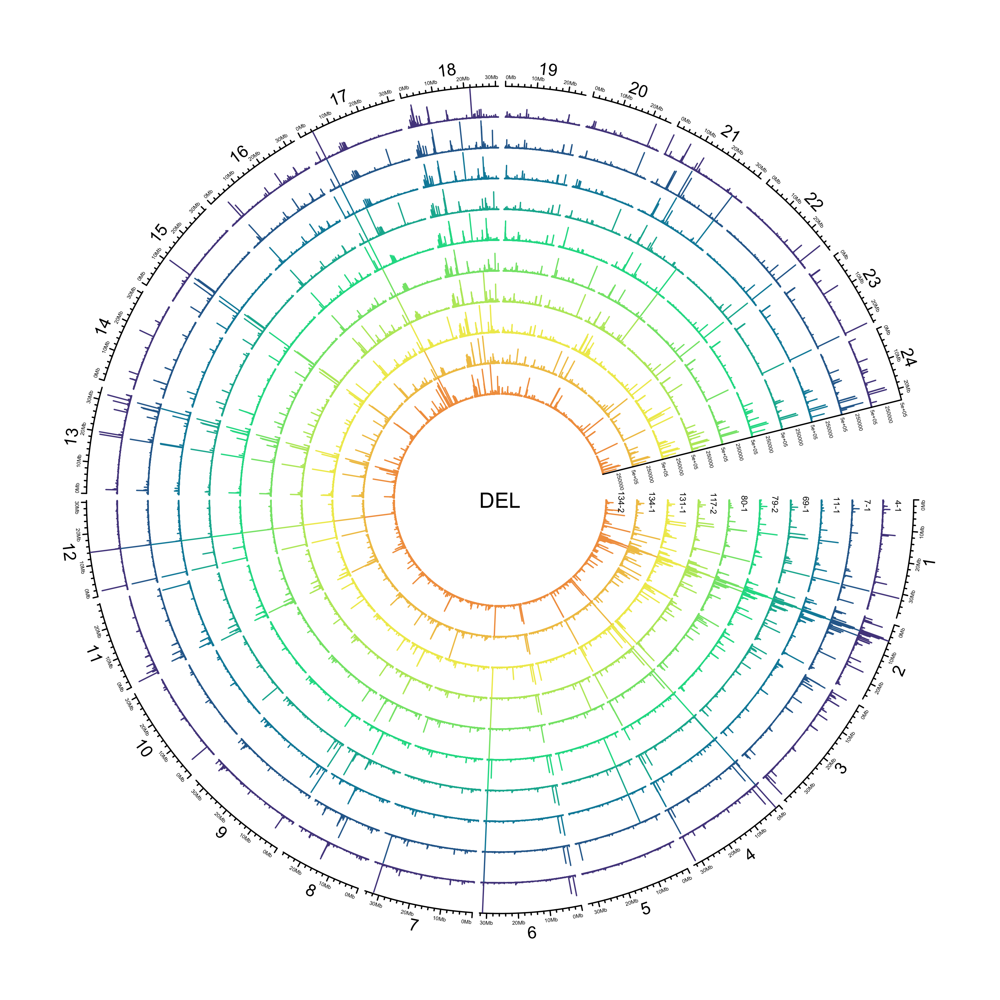

Email from Tom, 18 January:

[1.]{color="purple"} “Polish” SV calls using Illumina data:
<https://github.com/smehringer/SViper>

Please explore the above - get install and tested.

Nanopore VCF files:

* [WITH SEQUENCES]{color="red"}:
`ll /hps/research1/birney/users/adrien/indigene/analyses/indigene_nanopore_DNA/brain_run2/DNA_analysis/results/SV/sniffles_all_OLD/merged.vcf`
* [WITHOUT SEQUENCES]{color="red"}:`/hps/research1/birney/users/adrien/indigene/analyses/indigene_nanopore_DNA/brain_run2/DNA_analysis/results/SV/sniffles_all/merged.vcf`

`SViper` says:
>The vcf file must be a structural variant format (tags instead of sequences, e.g. \<DEL\>). Also the INFO field must include the END tag, giving the end position of the variant, as well as the SVLEN tag in case of insertions.

Then we need to map Illumina ID to the Nanopore VCF and figure out how to run the polishing.

Once done we need to summarise and describe the SV’s a little with some annotations etc - I will make a start with doing this part and we catchup once you have looked at the polishing

[2.]{color="purple"} catchup with Jack on repeats (both MIKK panel and Nanopore assemblies).
  - create one plot for each paper

[3.] Fecundity - I will send you the data and a description of what exactly it is later today.
  - we will need a general description of the data, descriptive stats and a heritability estimate - plus a single plot or table (for MIKK panel paper)

[4.] Add to txt within the two documents - we can catch-up on this later in the week.

# Polish SV calls with Illumina data

## Setup

Working directory on EBI cluster: `/hps/research1/birney/users/ian/mikk_paper/mikk_genome/sv_analysis`
GitHub repo: <https://github.com/brettellebi/mikk_genome>

### `conda` envs

#### `sv_env`


```bash
# Make conda env
mamba create -n sv_env
conda activate sv_env
# Install packages
mamba install -c bioconda bcftools sniffles
mamba install -c conda-forge r-base r-tidyverse
# Export to file
conda env export > envs/sv_env/sv_env.yaml
```

#### `baseR`


```bash
# Activate
conda activate baseR
# Export
conda env export > envs/baseR/baseR.yaml
```

### `renv`


```r
# Initiate
renv::init()
# Snapshot
renv::snapshot()
# Restore
renv::restore()
```

#### Source


```r
library(here)
source(here::here("code", "scripts", "sv_analysis", "source.R"))
```

### Nanopore VCF

`/hps/research1/birney/users/adrien/analyses/medaka_DNA_promethion/brain_run2/DNA_analysis/results/SV/sniffles_all/merged.vcf`

Created with:

```bash
# First used:
sniffles \
  --min_support 3 \
  --max_num_splits 7 \
  --max_distance 1000 \
  --min_length 50 \
  --minmapping_qual 20 \
  --min_seq_size 1000 \
  --allelefreq 0.1 \
  -t {threads} \
  -m {input_bam} \
  -v {output_vcf}

```

Adrien:
>Then I filtered and merged all the variants from the different samples together with survivor and recalled variants a second time in forced mode using the merged set with sniffles again using the same options.

#### Copy to working directory


```bash
# With sequences
nano_raw=/hps/research1/birney/users/adrien/indigene/analyses/indigene_nanopore_DNA/brain_run2/DNA_analysis/results/SV/sniffles_all_OLD/merged.vcf
out_path=../sv_analysis/vcfs/ont_raw_with_seq.vcf
## Copy
cp $nano_raw $out_path

# Without sequences
nano_raw=/hps/research1/birney/users/adrien/indigene/analyses/indigene_nanopore_DNA/brain_run2/DNA_analysis/results/SV/sniffles_all/merged.vcf
out_path=../sv_analysis/vcfs/ont_raw.vcf
## Copy
cp $nano_raw $out_path
```

#### Rename samples

##### With sequences


```bash
conda activate sv_env

in_vcf=../sv_analysis/vcfs/ont_raw_with_seq.vcf
sample_file=data/sv_analysis/20210205_ont_raw_samples_file.txt
out_vcf=../sv_analysis/vcfs/ont_raw_with_seq_rehead.vcf

# Make samples key file
bcftools query -l $in_vcf \
  > tmp1
cut -f4 -d'/' tmp1 | cut -f1 -d'_' \
  > tmp2
paste -d' ' tmp1 tmp2 > $sample_file
rm tmp1 tmp2

# Rename VCF
bcftools reheader \
  --samples $sample_file \
  --output $out_vcf \
  $in_vcf
```

##### Without sequences


```bash
conda activate sv_env

in_vcf=../sv_analysis/vcfs/ont_raw.vcf
sample_file=data/sv_analysis/20210212_ont_raw_samples_file.txt
out_vcf=../sv_analysis/vcfs/ont_raw_rehead.vcf

# Make samples key file
bcftools query -l $in_vcf \
  > tmp1
cut -f4 -d'/' tmp1 | cut -f1 -d'_' \
  > tmp2
paste -d' ' tmp1 tmp2 > $sample_file
rm tmp1 tmp2

# Rename VCF
bcftools reheader \
  --samples $sample_file \
  --output $out_vcf \
  $in_vcf
```

#### Get stats

##### With sequences


```bash
conda activate sv_mikk

in_vcf=../sv_analysis/vcfs/ont_raw_with_seq.vcf
stats_out=../sv_analysis/vcfs/ont_raw_with_seq.stats

# Get stats
bcftools stats \
  $in_vcf \
    > $stats_out
```

##### Without sequences


```bash
conda activate sv_mikk

in_vcf=../sv_analysis/vcfs/ont_raw.vcf
stats_out=../sv_analysis/vcfs/ont_raw.stats

# Get stats
bcftools stats \
  $in_vcf \
    > $stats_out
```

#### Split per sample

##### With sequences


```bash
conda activate sv_mikk

in_vcf=../sv_analysis/vcfs/ont_raw_with_seq_rehead.vcf
out_dir=../sv_analysis/vcfs/ont_raw_with_seq_rehead_per_sample

mkdir -p $out_dir

# Split by sample
bcftools +split \
  $in_vcf \
  --output $out_dir
```

##### Without sequences


```bash
conda activate sv_mikk

in_vcf=../sv_analysis/vcfs/ont_raw_rehead.vcf
out_dir=../sv_analysis/vcfs/ont_raw_rehead_per_sample

mkdir -p $out_dir

# Split by sample
bcftools +split \
  $in_vcf \
  --output $out_dir
```

### Illumina VCF

#### Copy to working directory


```bash
conda activate sv_env

in_vcf=/nfs/research1/birney/projects/medaka/inbred_panel/medaka-alignments-release-94/vcf/medaka_inbred_panel_ensembl_new_reference_release_94.vcf
out_vcf=../sv_analysis/vcfs/ill_raw.vcf.gz

# Compress and copy
bsub \
  -M 30000 \
  -o ../log/20210208_comp_ill.out \
  -e ../log/20210208_comp_ill.err \
bsub -Is bash \
  """
  conda activate sv_env ;
  bcftools view \
    --output-type z \
    --output $out_vcf \
    $in_vcf
  """  
```

#### Rename and filter for ONT samples

##### Pull out IDs for relevant samples


```r
ont_samples = here::here("data", "sv_analysis", "20210205_ont_raw_samples_file.txt")
ill_samples = here::here("data","20200206_cram_id_to_line_id.txt")
out_file = here::here("data", "sv_analysis", "20210205_ill_key_ont_samples.txt")
out_samples = here::here("data", "sv_analysis", "20210205_ont_samples_only.txt")

# Read in tables

ont_key = read.table(ont_samples)
ill_key = read.table(ill_samples, comment.char = "\"", header = T) %>% 
  dplyr::mutate(line = gsub("_", "-", line))

# Find matches
out = ill_key[ill_key$line %in% ont_key$V2, ]

# Write to files
## Key file
readr::write_delim(out, out_file, delim = " ", col_names = F)
## Just samples
readr::write_lines(out$cram_file, out_samples)
```

##### Rename and filter


```bash
in_vcf=../sv_analysis/vcfs/ill_raw.vcf.gz
samples_file=data/sv_analysis/20210205_ont_samples_only.txt
samples_key=data/sv_analysis/20210205_ill_key_ont_samples.txt
out_vcf=../sv_analysis/vcfs/ill_raw_rehead.vcf.gz
out_dir=../sv_analysis/vcfs/ill_raw_rehead_per_sample

mkdir -p $out_dir

# Filter for target samples and rehead
bcftools view \
  --samples-file $samples_file \
  --output-type u \
  $in_vcf |\
    bcftools reheader \
      --samples $samples_key \
      --output $out_vcf

# Split by sample
bcftools +split \
  $out_vcf \
  --output $out_dir
```

### BAMs

#### Illumina `.bam` files

Copy to local.


```bash
sample_key=data/sv_analysis/20210205_ill_key_ont_samples.txt
ill_bam_dir=/nfs/research1/birney/projects/medaka/inbred_panel/medaka-alignments-release-94/bam
out_dir=../sv_analysis/bams

mkdir -p $out_dir 

# Copy over
for sample in $(cut -f1 -d' ' $sample_key ) ; do
  cp $ill_bam_dir/$sample.bai $out_dir ;
done  

# SViper needs bams in .bam.bai format. Original {sample}.bai files need to be copied to {sample}.bam.bai
for file in $( find $out_dir/*.bai ) ; do
  new_filename=$( echo $file | sed 's/.bai/.bam.bai/g' ) ;
  mv $file $new_filename ;
done
```

```
## cut: data/sv_analysis/20210205_ill_key_ont_samples.txt: No such file or directory
## find: ../sv_analysis/bams/*.bai: No such file or directory
```

#### Nanopore `.bam` files

Sit here: `/hps/research1/birney/users/adrien/indigene/analyses/indigene_nanopore_DNA/brain_run2/DNA_analysis/results/SV/ngmlr_alignments/`

## Polish Nanopore reads with `SViper`

### Create Singularity container

```bash
module load singularity

# Build
singularity build \
  --remote ../sing_conts/sviper.sif \
  envs/sviper/20210204_sviper.def
  
# Open interactive shell
bsub -Is "singularity shell ../sing_conts/sviper.sif"
# Works! 
```

### Test


```bash
# Load singularity
module load singularity
# Pull image built with `envs/sviper/20210204_sviper.def`
bsub -M 30000 -n 4 -Is "singularity shell ../sing_conts/sviper.sif"

#######################
# Variables
#######################
## Container
container=../sing_conts/sviper.sif
## Sample
sample=11-1
sample_key=data/sv_analysis/20210205_ill_key_ont_samples.txt
## VCF to polish
ont_vcf=../sv_analysis/vcfs/ont_raw_rehead_per_sample/$sample.vcf
## Illumina BAM
ill_cram_id=$(grep $sample $sample_key | cut -f1 -d' ')
ill_bam_dir=../sv_analysis/bams
ill_bam=$ill_bam_dir/$ill_cram_id.bam
## Nanopore BAM
ont_bam_dir=/hps/research1/birney/users/adrien/indigene/analyses/indigene_nanopore_DNA/brain_run2/DNA_analysis/results/SV/ngmlr_alignments
ont_bam=$(find $ont_bam_dir/$sample*.bam)
## Reference
ref=../refs/Oryzias_latipes.ASM223467v1.dna.toplevel.fa
## Output directory
out_dir=../sv_analysis/vcfs/sviper
mkdir -p $out_dir

#######################
# TEST call sviper 
#######################
sviper \
  --candidate-vcf $ont_vcf \
  --short-read-bam $ill_bam \
  --long-read-bam $ont_bam \
  --reference $ref \
  --output-prefix $out_dir/$sample

```

### True


```bash
# Load singularity
module load singularity
# Pull image built with `envs/sviper/20210204_sviper.def`
bsub -M 30000 -n 4 -Is "singularity shell ../sing_conts/sviper.sif"

#######################
# Variables
#######################
## Sample
sample=11-1
sample_key=data/sv_analysis/20210205_ill_key_ont_samples.txt
## VCF to polish
ont_vcf=../sv_analysis/vcfs/ont_raw_rehead_per_sample/$sample.vcf
## Illumina BAM
ill_cram_id=$(grep $sample $sample_key | cut -f1 -d' ')
ill_bam_dir=../sv_analysis/bams
ill_bam=$ill_bam_dir/$ill_cram_id.bam
## Nanopore BAM
ont_bam_dir=/hps/research1/birney/users/adrien/indigene/analyses/indigene_nanopore_DNA/brain_run2/DNA_analysis/results/SV/ngmlr_alignments
ont_bam=$(find $ont_bam_dir/$sample*.bam)
## Reference
ref=../refs/Oryzias_latipes.ASM223467v1.dna.toplevel.fa
## Container
container=../sing_conts/sviper.sif
## Output directory
out_dir=../sv_analysis/vcfs/sviper
mkdir -p $out_dir

#######################
# TEST call sviper 
#######################
sviper \
  --candidate-vcf $ont_vcf \
  --short-read-bam $ill_bam \
  --long-read-bam $ont_bam \
  --reference $ref \
  --output-prefix $out_dir/$sample
  
#######################
# TRUE call sviper 
####################### 
module load singularity

# Global variables
## Sample key
sample_key=data/sv_analysis/20210205_ill_key_ont_samples.txt
## BAM dirs
ill_bam_dir=../sv_analysis/bams
ont_bam_dir=/hps/research1/birney/users/adrien/indigene/analyses/indigene_nanopore_DNA/brain_run2/DNA_analysis/results/SV/ngmlr_alignments
## Reference
ref=../refs/Oryzias_latipes.ASM223467v1.dna.toplevel.fa
## Container
container=../sing_conts/sviper.sif
## Output directory
out_dir=../sv_analysis/vcfs/sviper
mkdir -p $out_dir

for sample in $(cut -f2 -d' ' $sample_key | tail -n+2 ) ; do
  # Set variables
  
  ## VCF to polish
  ont_vcf=../sv_analysis/vcfs/ont_raw_rehead_per_sample/$sample.vcf
  ## Illumina BAM
  ill_cram_id=$(grep " $sample" $sample_key | cut -f1 -d' ')
  ill_bam=$ill_bam_dir/$ill_cram_id.bam
  ## Nanopore BAM
  ont_bam=$(find $ont_bam_dir/$sample*.bam)

  # Run SViper
  bsub \
    -M 30000 \
    -n 16 \
    -o ../log/20210212_sviper_$sample.out \
    -e ../log/20210212_sviper_$sample.err \
    """
    singularity exec $container \
      sviper \
        --candidate-vcf $ont_vcf \
        --short-read-bam $ill_bam \
        --long-read-bam $ont_bam \
        --reference $ref \
        --output-prefix $out_dir/$sample
    """
done

# 4-2 and 7-2 failed with no error message
```

### Merge


```bash
# Get list of vcf paths
in_dir=../sv_analysis/vcfs/sviper
out_dir=$in_dir/merged
mkdir -p $out_dir
in_vcfs=$(find $in_dir/*.vcf | tr '\n' ' ')

bcftools merge \
  --output $out_dir/all.vcf\
  $in_vcfs
  
# Requires them to be bgzipped

# Try with Picard
in_dir=../sv_analysis/vcfs/sviper
out_dir=$in_dir/merged
mkdir -p $out_dir
find $in_dir/*.vcf > tmp.list

picard MergeVcfs \
  I=tmp.list \
  O=$out_dir/merged.vcf.gz

rm tmp.list
#Exception in thread "main" java.lang.IllegalArgumentException: Input file /hps/research1/birney/users/ian/mikk_paper/mikk_genome/../sv_analysis/vcfs/sviper/117-2.vcf has sample entries that don't match the other files.
```

### Get data from `SViper`


```bash
in_dir=../sv_analysis/vcfs/sviper
out_dir=data/sv_analysis/20210217_sviper_filter_pass

mkdir -p $out_dir

for in_vcf in $(find $in_dir/*vcf) ; do
  sample=$(basename $in_vcf | cut -f1 -d'.' ) ;
  bcftools query \
    --include 'FILTER="PASS"' \
    --exclude 'GT~"\."' \
    --format '%CHROM,%POS,%ALT,%INFO/SVLEN,%INFO/SVTYPE,%INFO/CHR2,%INFO/END,[%GT],[%LN],[%ST]\n' \
  --output $out_dir/$sample.csv \
  $in_vcf ;
done
```

### Get data from original VCF


```bash
in_dir=../sv_analysis/vcfs/ont_raw_rehead_per_sample
out_dir=data/sv_analysis/20210217_raw_ont_filter_pass

mkdir -p $out_dir

for in_vcf in $(find $in_dir/*vcf) ; do
  sample=$(basename $in_vcf | cut -f1 -d'.' ) ;
  bcftools query \
    --include 'FILTER="PASS"' \
    --exclude 'GT~"\."' \
    --format '%CHROM,%POS,%ALT,%INFO/SVLEN,%INFO/SVTYPE,%INFO/CHR2,%INFO/END,[%GT],[%LN],[%ST]\n' \
  --output $out_dir/$sample.csv \
  $in_vcf ;
done
```

### Get polish stats 


```bash
in_dir=../sv_analysis/vcfs/sviper
out_dir=data/sv_analysis/20210226_polish_stats

mkdir -p $out_dir

for in_vcf in $(find $in_dir/*vcf) ; do
  sample=$(basename $in_vcf | cut -f1 -d'.' ) ;
  bcftools query \
    --include 'FILTER="PASS"' \
    --exclude 'GT~"\."' \
    --format '%CHROM,%POS,%FILTER,%INFO/SVTYPE,[%LN]\n' \
  --output $out_dir/$sample.csv \
  $in_vcf ;
done
```

# Analysis

## Read in SV data

### SViper polished


```r
in_dir = here::here("data", "sv_analysis/20210217_sviper_filter_pass")

in_files = list.files(in_dir, full.names = T)
names(in_files) = basename(in_files) %>% 
  str_remove(".csv")

sv_df_pol = lapply(in_files, function(in_file){
  df = readr::read_csv(in_file,
                       col_names = c("CHROM", "POS", "ALT", "SVLEN", "SVTYPE", "CHR2", "END", "GT", "LN", "ST"),
                       col_types = c("ciciccicic"))
  
  return(df)
}) %>% 
  dplyr::bind_rows(.id = "SAMPLE") %>% 
  # add "chr" to beginning of CHROM column
  dplyr::mutate(CHROM = paste("chr", CHROM, sep = ""))
```

### ONT raw


```r
in_dir = here::here("data", "sv_analysis/20210217_raw_ont_filter_pass")

in_files = list.files(in_dir, full.names = T)
names(in_files) = basename(in_files) %>% 
  str_remove(".csv")

sv_df_raw = lapply(in_files, function(in_file){
  df = readr::read_csv(in_file,
                       col_names = c("CHROM", "POS", "ALT", "SVLEN", "SVTYPE", "CHR2", "END", "GT", "LN", "ST"),
                       col_types = c("ciciccicic"))
  
  return(df)
}) %>% 
  dplyr::bind_rows(.id = "SAMPLE") %>% 
  # add "chr" to beginning of CHROM column
  dplyr::mutate(CHROM = paste("chr", CHROM, sep = ""))
```

### Combine into single df


```r
sv_df = list("polished" = sv_df_pol,
             "raw" = sv_df_raw) %>% 
  dplyr::bind_rows(.id = "DATASET") %>% 
  # factor samples and dataset
  dplyr::mutate(SAMPLE = factor(SAMPLE, levels = ont_samples),
                DATASET = factor(DATASET, levels = c("raw", "polished")))
```

## Plot counts of SV types (total)


```r
svtype_hist_pal = colorRampPalette(pal_paddle)(5)[c(1:2, 4:5)]

# Histogram of LN
svtype_distinct_df = sv_df %>% 
  dplyr::filter(DATASET == "polished",
                SVTYPE != "TRA") %>% 
  dplyr::mutate(SVTYPE = factor(SVTYPE, levels = c("DEL", "INS", "DUP", "INV"))) %>% 
  dplyr::select(SVTYPE, CHROM, POS, END, LN) %>% 
  dplyr::distinct()
  
svlen_counts_plot = svtype_distinct_df %>% 
  ggplot(aes(x = log10(LN),
             y = ifelse(log10(..count..) < 0,
                        0,
                        log10(..count..)),
             fill = SVTYPE,
             colour = SVTYPE)) +
    geom_area(stat = "bin",
              bins = 100) +
    scale_fill_manual(values = svtype_hist_pal) +
    scale_colour_manual(values = karyoploteR::darker(svtype_hist_pal)) +
    guides(fill = F) +
    guides(colour = F) +
    scale_x_continuous(breaks = seq(1, 6, 1),
                       limits = c(1, 6)) +
    facet_wrap(~SVTYPE, nrow = 2, ncol = 2) +
    xlab(expression(log[10](length))) +
    ylab(expression(log[10](count))) +
    theme_cowplot() +
    theme(axis.text.x = element_text(size = 6),
          strip.text = element_text(face = "bold"),
          strip.background = element_blank()
          )  

svlen_counts_plot
```

<!-- -->

## Plot counts of SV types (per sample)

Get order of SV type by frequency


```r
# Get order
type_order = dplyr::count(sv_df, SVTYPE) %>% 
  dplyr::arrange(desc(n)) %>% 
  dplyr::pull(SVTYPE)

# Set palette
pal_svtype = grDevices::colorRampPalette(pal_brainbow)(length(ont_samples_pol))
names(pal_svtype) = ont_samples_pol
```

### All


```r
sv_counts_all = sv_df %>% 
  dplyr::filter(DATASET == "polished") %>%
  group_by(SAMPLE, SVTYPE) %>% 
  summarise(N = n()) %>% 
  dplyr::mutate(FACET = "TOTAL") %>% 
  dplyr::ungroup()
```

```
## `summarise()` has grouped output by 'SAMPLE'. You can override using the `.groups` argument.
```

### Singletons


```r
# Create DF with SAMPLE for binding later
sv_df_pol_samps = sv_df %>% 
  # exclude raw data, take only polished
  dplyr::filter(DATASET == "polished") %>% 
  # select only target cols
  dplyr::select(CHROM, POS, SVTYPE, LN, SAMPLE)

# Create DF without SAMPLE for detecting duplicates
sv_df_pol_dupes = sv_df %>% 
  # exclude raw data, take only polished
  dplyr::filter(DATASET == "polished") %>% 
  # select only target cols
  dplyr::select(CHROM, POS, SVTYPE, LN)

## Get unique rows
uq_svs = sv_df_pol_dupes[!(duplicated(sv_df_pol_dupes) | duplicated(sv_df_pol_dupes, fromLast = T)), ]

# Join back with other variables
sv_sings = dplyr::right_join(sv_df_pol_samps, uq_svs)
```

```
## Joining, by = c("CHROM", "POS", "SVTYPE", "LN")
```

```r
knitr::kable(head(sv_sings))
```


|CHROM |    POS|SVTYPE |  LN|SAMPLE |
|:-----|------:|:------|---:|:------|
|chr1  |  15558|TRA    |   1|11-1   |
|chr1  | 116343|DEL    | 530|11-1   |
|chr1  | 131785|INS    |  56|11-1   |
|chr1  | 230567|TRA    |   1|11-1   |
|chr1  | 231887|DEL    | 103|11-1   |
|chr1  | 231872|TRA    |   1|11-1   |


```r
# Get singleton counts
sv_counts_sings = sv_sings %>%
  dplyr::group_by(SAMPLE, SVTYPE) %>% 
  dplyr::summarise(N = n()) %>% 
  dplyr::mutate(FACET = "SINGLETONS") %>% 
  dplyr::ungroup()
```

```
## `summarise()` has grouped output by 'SAMPLE'. You can override using the `.groups` argument.
```

### Bind together and plot


```r
# Bind DFs
sv_counts = dplyr::bind_rows(sv_counts_all,
                             sv_counts_sings) %>% 
  dplyr::mutate(FACET = factor(FACET, levels = c("TOTAL", "SINGLETONS")),
                SVTYPE = factor(SVTYPE, levels = type_order))

# Set palette
pal_svcounts = grDevices::colorRampPalette(pal_smrarvo)(length(ont_samples))
names(pal_svcounts) = ont_samples

# Plot
svtype_counts_plot = sv_counts %>% 
  ggplot() +
    geom_col(aes(SAMPLE, N, fill = SAMPLE)) +
    facet_grid(rows = vars(FACET),
               cols = vars(SVTYPE),scales = "free_y") +
    scale_fill_manual(values = pal_svcounts) +
    theme_cowplot() +
    theme(strip.background = element_blank(),
          axis.text.x = element_text(size = 5,angle = 45,hjust = 1),
          strip.text.x = element_text(face = "bold")) +
    guides(fill = F) +
    xlab("Sample") +
    ylab("Count")
```


```r
ggplotly(svtype_counts_plot)
```

```{=html}
<div id="htmlwidget-88e53b29a27dbe3883f3" style="width:672px;height:480px;" class="plotly html-widget"></div>
<script type="application/json" data-for="htmlwidget-88e53b29a27dbe3883f3">{"x":{"data":[{"orientation":"v","width":0.9,"base":0,"x":[1],"y":[39976],"text":"SAMPLE: 4-1<br />N: 39976<br />SAMPLE: 4-1","type":"bar","marker":{"autocolorscale":false,"color":"rgba(84,71,140,1)","line":{"width":1.88976377952756,"color":"transparent"}},"name":"4-1","legendgroup":"4-1","showlegend":true,"xaxis":"x","yaxis":"y","hoverinfo":"text","frame":null},{"orientation":"v","width":0.9,"base":0,"x":[1],"y":[33715],"text":"SAMPLE: 4-1<br />N: 33715<br />SAMPLE: 4-1","type":"bar","marker":{"autocolorscale":false,"color":"rgba(84,71,140,1)","line":{"width":1.88976377952756,"color":"transparent"}},"name":"4-1","legendgroup":"4-1","showlegend":false,"xaxis":"x2","yaxis":"y","hoverinfo":"text","frame":null},{"orientation":"v","width":0.9,"base":0,"x":[1],"y":[3582],"text":"SAMPLE: 4-1<br />N:  3582<br />SAMPLE: 4-1","type":"bar","marker":{"autocolorscale":false,"color":"rgba(84,71,140,1)","line":{"width":1.88976377952756,"color":"transparent"}},"name":"4-1","legendgroup":"4-1","showlegend":false,"xaxis":"x3","yaxis":"y","hoverinfo":"text","frame":null},{"orientation":"v","width":0.9,"base":0,"x":[1],"y":[2707],"text":"SAMPLE: 4-1<br />N:  2707<br />SAMPLE: 4-1","type":"bar","marker":{"autocolorscale":false,"color":"rgba(84,71,140,1)","line":{"width":1.88976377952756,"color":"transparent"}},"name":"4-1","legendgroup":"4-1","showlegend":false,"xaxis":"x4","yaxis":"y","hoverinfo":"text","frame":null},{"orientation":"v","width":0.9,"base":0,"x":[1],"y":[630],"text":"SAMPLE: 4-1<br />N:   630<br />SAMPLE: 4-1","type":"bar","marker":{"autocolorscale":false,"color":"rgba(84,71,140,1)","line":{"width":1.88976377952756,"color":"transparent"}},"name":"4-1","legendgroup":"4-1","showlegend":false,"xaxis":"x5","yaxis":"y","hoverinfo":"text","frame":null},{"orientation":"v","width":0.9,"base":0,"x":[1],"y":[4609],"text":"SAMPLE: 4-1<br />N:  4609<br />SAMPLE: 4-1","type":"bar","marker":{"autocolorscale":false,"color":"rgba(84,71,140,1)","line":{"width":1.88976377952756,"color":"transparent"}},"name":"4-1","legendgroup":"4-1","showlegend":false,"xaxis":"x","yaxis":"y2","hoverinfo":"text","frame":null},{"orientation":"v","width":0.9,"base":0,"x":[1],"y":[4673],"text":"SAMPLE: 4-1<br />N:  4673<br />SAMPLE: 4-1","type":"bar","marker":{"autocolorscale":false,"color":"rgba(84,71,140,1)","line":{"width":1.88976377952756,"color":"transparent"}},"name":"4-1","legendgroup":"4-1","showlegend":false,"xaxis":"x2","yaxis":"y2","hoverinfo":"text","frame":null},{"orientation":"v","width":0.9,"base":0,"x":[1],"y":[337],"text":"SAMPLE: 4-1<br />N:   337<br />SAMPLE: 4-1","type":"bar","marker":{"autocolorscale":false,"color":"rgba(84,71,140,1)","line":{"width":1.88976377952756,"color":"transparent"}},"name":"4-1","legendgroup":"4-1","showlegend":false,"xaxis":"x3","yaxis":"y2","hoverinfo":"text","frame":null},{"orientation":"v","width":0.9,"base":0,"x":[1],"y":[210],"text":"SAMPLE: 4-1<br />N:   210<br />SAMPLE: 4-1","type":"bar","marker":{"autocolorscale":false,"color":"rgba(84,71,140,1)","line":{"width":1.88976377952756,"color":"transparent"}},"name":"4-1","legendgroup":"4-1","showlegend":false,"xaxis":"x4","yaxis":"y2","hoverinfo":"text","frame":null},{"orientation":"v","width":0.9,"base":0,"x":[1],"y":[44],"text":"SAMPLE: 4-1<br />N:    44<br />SAMPLE: 4-1","type":"bar","marker":{"autocolorscale":false,"color":"rgba(84,71,140,1)","line":{"width":1.88976377952756,"color":"transparent"}},"name":"4-1","legendgroup":"4-1","showlegend":false,"xaxis":"x5","yaxis":"y2","hoverinfo":"text","frame":null},{"orientation":"v","width":0.9,"base":0,"x":[2],"y":[39471],"text":"SAMPLE: 7-1<br />N: 39471<br />SAMPLE: 7-1","type":"bar","marker":{"autocolorscale":false,"color":"rgba(18,126,162,1)","line":{"width":1.88976377952756,"color":"transparent"}},"name":"7-1","legendgroup":"7-1","showlegend":true,"xaxis":"x","yaxis":"y","hoverinfo":"text","frame":null},{"orientation":"v","width":0.9,"base":0,"x":[2],"y":[33466],"text":"SAMPLE: 7-1<br />N: 33466<br />SAMPLE: 7-1","type":"bar","marker":{"autocolorscale":false,"color":"rgba(18,126,162,1)","line":{"width":1.88976377952756,"color":"transparent"}},"name":"7-1","legendgroup":"7-1","showlegend":false,"xaxis":"x2","yaxis":"y","hoverinfo":"text","frame":null},{"orientation":"v","width":0.9,"base":0,"x":[2],"y":[3540],"text":"SAMPLE: 7-1<br />N:  3540<br />SAMPLE: 7-1","type":"bar","marker":{"autocolorscale":false,"color":"rgba(18,126,162,1)","line":{"width":1.88976377952756,"color":"transparent"}},"name":"7-1","legendgroup":"7-1","showlegend":false,"xaxis":"x3","yaxis":"y","hoverinfo":"text","frame":null},{"orientation":"v","width":0.9,"base":0,"x":[2],"y":[2635],"text":"SAMPLE: 7-1<br />N:  2635<br />SAMPLE: 7-1","type":"bar","marker":{"autocolorscale":false,"color":"rgba(18,126,162,1)","line":{"width":1.88976377952756,"color":"transparent"}},"name":"7-1","legendgroup":"7-1","showlegend":false,"xaxis":"x4","yaxis":"y","hoverinfo":"text","frame":null},{"orientation":"v","width":0.9,"base":0,"x":[2],"y":[626],"text":"SAMPLE: 7-1<br />N:   626<br />SAMPLE: 7-1","type":"bar","marker":{"autocolorscale":false,"color":"rgba(18,126,162,1)","line":{"width":1.88976377952756,"color":"transparent"}},"name":"7-1","legendgroup":"7-1","showlegend":false,"xaxis":"x5","yaxis":"y","hoverinfo":"text","frame":null},{"orientation":"v","width":0.9,"base":0,"x":[2],"y":[4184],"text":"SAMPLE: 7-1<br />N:  4184<br />SAMPLE: 7-1","type":"bar","marker":{"autocolorscale":false,"color":"rgba(18,126,162,1)","line":{"width":1.88976377952756,"color":"transparent"}},"name":"7-1","legendgroup":"7-1","showlegend":false,"xaxis":"x","yaxis":"y2","hoverinfo":"text","frame":null},{"orientation":"v","width":0.9,"base":0,"x":[2],"y":[4343],"text":"SAMPLE: 7-1<br />N:  4343<br />SAMPLE: 7-1","type":"bar","marker":{"autocolorscale":false,"color":"rgba(18,126,162,1)","line":{"width":1.88976377952756,"color":"transparent"}},"name":"7-1","legendgroup":"7-1","showlegend":false,"xaxis":"x2","yaxis":"y2","hoverinfo":"text","frame":null},{"orientation":"v","width":0.9,"base":0,"x":[2],"y":[323],"text":"SAMPLE: 7-1<br />N:   323<br />SAMPLE: 7-1","type":"bar","marker":{"autocolorscale":false,"color":"rgba(18,126,162,1)","line":{"width":1.88976377952756,"color":"transparent"}},"name":"7-1","legendgroup":"7-1","showlegend":false,"xaxis":"x3","yaxis":"y2","hoverinfo":"text","frame":null},{"orientation":"v","width":0.9,"base":0,"x":[2],"y":[166],"text":"SAMPLE: 7-1<br />N:   166<br />SAMPLE: 7-1","type":"bar","marker":{"autocolorscale":false,"color":"rgba(18,126,162,1)","line":{"width":1.88976377952756,"color":"transparent"}},"name":"7-1","legendgroup":"7-1","showlegend":false,"xaxis":"x4","yaxis":"y2","hoverinfo":"text","frame":null},{"orientation":"v","width":0.9,"base":0,"x":[2],"y":[35],"text":"SAMPLE: 7-1<br />N:    35<br />SAMPLE: 7-1","type":"bar","marker":{"autocolorscale":false,"color":"rgba(18,126,162,1)","line":{"width":1.88976377952756,"color":"transparent"}},"name":"7-1","legendgroup":"7-1","showlegend":false,"xaxis":"x5","yaxis":"y2","hoverinfo":"text","frame":null},{"orientation":"v","width":0.9,"base":0,"x":[3],"y":[40297],"text":"SAMPLE: 11-1<br />N: 40297<br />SAMPLE: 11-1","type":"bar","marker":{"autocolorscale":false,"color":"rgba(15,189,155,1)","line":{"width":1.88976377952756,"color":"transparent"}},"name":"11-1","legendgroup":"11-1","showlegend":true,"xaxis":"x","yaxis":"y","hoverinfo":"text","frame":null},{"orientation":"v","width":0.9,"base":0,"x":[3],"y":[34057],"text":"SAMPLE: 11-1<br />N: 34057<br />SAMPLE: 11-1","type":"bar","marker":{"autocolorscale":false,"color":"rgba(15,189,155,1)","line":{"width":1.88976377952756,"color":"transparent"}},"name":"11-1","legendgroup":"11-1","showlegend":false,"xaxis":"x2","yaxis":"y","hoverinfo":"text","frame":null},{"orientation":"v","width":0.9,"base":0,"x":[3],"y":[3341],"text":"SAMPLE: 11-1<br />N:  3341<br />SAMPLE: 11-1","type":"bar","marker":{"autocolorscale":false,"color":"rgba(15,189,155,1)","line":{"width":1.88976377952756,"color":"transparent"}},"name":"11-1","legendgroup":"11-1","showlegend":false,"xaxis":"x3","yaxis":"y","hoverinfo":"text","frame":null},{"orientation":"v","width":0.9,"base":0,"x":[3],"y":[2657],"text":"SAMPLE: 11-1<br />N:  2657<br />SAMPLE: 11-1","type":"bar","marker":{"autocolorscale":false,"color":"rgba(15,189,155,1)","line":{"width":1.88976377952756,"color":"transparent"}},"name":"11-1","legendgroup":"11-1","showlegend":false,"xaxis":"x4","yaxis":"y","hoverinfo":"text","frame":null},{"orientation":"v","width":0.9,"base":0,"x":[3],"y":[598],"text":"SAMPLE: 11-1<br />N:   598<br />SAMPLE: 11-1","type":"bar","marker":{"autocolorscale":false,"color":"rgba(15,189,155,1)","line":{"width":1.88976377952756,"color":"transparent"}},"name":"11-1","legendgroup":"11-1","showlegend":false,"xaxis":"x5","yaxis":"y","hoverinfo":"text","frame":null},{"orientation":"v","width":0.9,"base":0,"x":[3],"y":[4414],"text":"SAMPLE: 11-1<br />N:  4414<br />SAMPLE: 11-1","type":"bar","marker":{"autocolorscale":false,"color":"rgba(15,189,155,1)","line":{"width":1.88976377952756,"color":"transparent"}},"name":"11-1","legendgroup":"11-1","showlegend":false,"xaxis":"x","yaxis":"y2","hoverinfo":"text","frame":null},{"orientation":"v","width":0.9,"base":0,"x":[3],"y":[4337],"text":"SAMPLE: 11-1<br />N:  4337<br />SAMPLE: 11-1","type":"bar","marker":{"autocolorscale":false,"color":"rgba(15,189,155,1)","line":{"width":1.88976377952756,"color":"transparent"}},"name":"11-1","legendgroup":"11-1","showlegend":false,"xaxis":"x2","yaxis":"y2","hoverinfo":"text","frame":null},{"orientation":"v","width":0.9,"base":0,"x":[3],"y":[195],"text":"SAMPLE: 11-1<br />N:   195<br />SAMPLE: 11-1","type":"bar","marker":{"autocolorscale":false,"color":"rgba(15,189,155,1)","line":{"width":1.88976377952756,"color":"transparent"}},"name":"11-1","legendgroup":"11-1","showlegend":false,"xaxis":"x3","yaxis":"y2","hoverinfo":"text","frame":null},{"orientation":"v","width":0.9,"base":0,"x":[3],"y":[175],"text":"SAMPLE: 11-1<br />N:   175<br />SAMPLE: 11-1","type":"bar","marker":{"autocolorscale":false,"color":"rgba(15,189,155,1)","line":{"width":1.88976377952756,"color":"transparent"}},"name":"11-1","legendgroup":"11-1","showlegend":false,"xaxis":"x4","yaxis":"y2","hoverinfo":"text","frame":null},{"orientation":"v","width":0.9,"base":0,"x":[3],"y":[44],"text":"SAMPLE: 11-1<br />N:    44<br />SAMPLE: 11-1","type":"bar","marker":{"autocolorscale":false,"color":"rgba(15,189,155,1)","line":{"width":1.88976377952756,"color":"transparent"}},"name":"11-1","legendgroup":"11-1","showlegend":false,"xaxis":"x5","yaxis":"y2","hoverinfo":"text","frame":null},{"orientation":"v","width":0.9,"base":0,"x":[4],"y":[38764],"text":"SAMPLE: 69-1<br />N: 38764<br />SAMPLE: 69-1","type":"bar","marker":{"autocolorscale":false,"color":"rgba(31,219,144,1)","line":{"width":1.88976377952756,"color":"transparent"}},"name":"69-1","legendgroup":"69-1","showlegend":true,"xaxis":"x","yaxis":"y","hoverinfo":"text","frame":null},{"orientation":"v","width":0.9,"base":0,"x":[4],"y":[32614],"text":"SAMPLE: 69-1<br />N: 32614<br />SAMPLE: 69-1","type":"bar","marker":{"autocolorscale":false,"color":"rgba(31,219,144,1)","line":{"width":1.88976377952756,"color":"transparent"}},"name":"69-1","legendgroup":"69-1","showlegend":false,"xaxis":"x2","yaxis":"y","hoverinfo":"text","frame":null},{"orientation":"v","width":0.9,"base":0,"x":[4],"y":[3331],"text":"SAMPLE: 69-1<br />N:  3331<br />SAMPLE: 69-1","type":"bar","marker":{"autocolorscale":false,"color":"rgba(31,219,144,1)","line":{"width":1.88976377952756,"color":"transparent"}},"name":"69-1","legendgroup":"69-1","showlegend":false,"xaxis":"x3","yaxis":"y","hoverinfo":"text","frame":null},{"orientation":"v","width":0.9,"base":0,"x":[4],"y":[2583],"text":"SAMPLE: 69-1<br />N:  2583<br />SAMPLE: 69-1","type":"bar","marker":{"autocolorscale":false,"color":"rgba(31,219,144,1)","line":{"width":1.88976377952756,"color":"transparent"}},"name":"69-1","legendgroup":"69-1","showlegend":false,"xaxis":"x4","yaxis":"y","hoverinfo":"text","frame":null},{"orientation":"v","width":0.9,"base":0,"x":[4],"y":[614],"text":"SAMPLE: 69-1<br />N:   614<br />SAMPLE: 69-1","type":"bar","marker":{"autocolorscale":false,"color":"rgba(31,219,144,1)","line":{"width":1.88976377952756,"color":"transparent"}},"name":"69-1","legendgroup":"69-1","showlegend":false,"xaxis":"x5","yaxis":"y","hoverinfo":"text","frame":null},{"orientation":"v","width":0.9,"base":0,"x":[4],"y":[3799],"text":"SAMPLE: 69-1<br />N:  3799<br />SAMPLE: 69-1","type":"bar","marker":{"autocolorscale":false,"color":"rgba(31,219,144,1)","line":{"width":1.88976377952756,"color":"transparent"}},"name":"69-1","legendgroup":"69-1","showlegend":false,"xaxis":"x","yaxis":"y2","hoverinfo":"text","frame":null},{"orientation":"v","width":0.9,"base":0,"x":[4],"y":[3703],"text":"SAMPLE: 69-1<br />N:  3703<br />SAMPLE: 69-1","type":"bar","marker":{"autocolorscale":false,"color":"rgba(31,219,144,1)","line":{"width":1.88976377952756,"color":"transparent"}},"name":"69-1","legendgroup":"69-1","showlegend":false,"xaxis":"x2","yaxis":"y2","hoverinfo":"text","frame":null},{"orientation":"v","width":0.9,"base":0,"x":[4],"y":[247],"text":"SAMPLE: 69-1<br />N:   247<br />SAMPLE: 69-1","type":"bar","marker":{"autocolorscale":false,"color":"rgba(31,219,144,1)","line":{"width":1.88976377952756,"color":"transparent"}},"name":"69-1","legendgroup":"69-1","showlegend":false,"xaxis":"x3","yaxis":"y2","hoverinfo":"text","frame":null},{"orientation":"v","width":0.9,"base":0,"x":[4],"y":[152],"text":"SAMPLE: 69-1<br />N:   152<br />SAMPLE: 69-1","type":"bar","marker":{"autocolorscale":false,"color":"rgba(31,219,144,1)","line":{"width":1.88976377952756,"color":"transparent"}},"name":"69-1","legendgroup":"69-1","showlegend":false,"xaxis":"x4","yaxis":"y2","hoverinfo":"text","frame":null},{"orientation":"v","width":0.9,"base":0,"x":[4],"y":[43],"text":"SAMPLE: 69-1<br />N:    43<br />SAMPLE: 69-1","type":"bar","marker":{"autocolorscale":false,"color":"rgba(31,219,144,1)","line":{"width":1.88976377952756,"color":"transparent"}},"name":"69-1","legendgroup":"69-1","showlegend":false,"xaxis":"x5","yaxis":"y2","hoverinfo":"text","frame":null},{"orientation":"v","width":0.9,"base":0,"x":[5],"y":[39577],"text":"SAMPLE: 79-2<br />N: 39577<br />SAMPLE: 79-2","type":"bar","marker":{"autocolorscale":false,"color":"rgba(121,226,121,1)","line":{"width":1.88976377952756,"color":"transparent"}},"name":"79-2","legendgroup":"79-2","showlegend":true,"xaxis":"x","yaxis":"y","hoverinfo":"text","frame":null},{"orientation":"v","width":0.9,"base":0,"x":[5],"y":[33408],"text":"SAMPLE: 79-2<br />N: 33408<br />SAMPLE: 79-2","type":"bar","marker":{"autocolorscale":false,"color":"rgba(121,226,121,1)","line":{"width":1.88976377952756,"color":"transparent"}},"name":"79-2","legendgroup":"79-2","showlegend":false,"xaxis":"x2","yaxis":"y","hoverinfo":"text","frame":null},{"orientation":"v","width":0.9,"base":0,"x":[5],"y":[3460],"text":"SAMPLE: 79-2<br />N:  3460<br />SAMPLE: 79-2","type":"bar","marker":{"autocolorscale":false,"color":"rgba(121,226,121,1)","line":{"width":1.88976377952756,"color":"transparent"}},"name":"79-2","legendgroup":"79-2","showlegend":false,"xaxis":"x3","yaxis":"y","hoverinfo":"text","frame":null},{"orientation":"v","width":0.9,"base":0,"x":[5],"y":[2603],"text":"SAMPLE: 79-2<br />N:  2603<br />SAMPLE: 79-2","type":"bar","marker":{"autocolorscale":false,"color":"rgba(121,226,121,1)","line":{"width":1.88976377952756,"color":"transparent"}},"name":"79-2","legendgroup":"79-2","showlegend":false,"xaxis":"x4","yaxis":"y","hoverinfo":"text","frame":null},{"orientation":"v","width":0.9,"base":0,"x":[5],"y":[613],"text":"SAMPLE: 79-2<br />N:   613<br />SAMPLE: 79-2","type":"bar","marker":{"autocolorscale":false,"color":"rgba(121,226,121,1)","line":{"width":1.88976377952756,"color":"transparent"}},"name":"79-2","legendgroup":"79-2","showlegend":false,"xaxis":"x5","yaxis":"y","hoverinfo":"text","frame":null},{"orientation":"v","width":0.9,"base":0,"x":[5],"y":[4019],"text":"SAMPLE: 79-2<br />N:  4019<br />SAMPLE: 79-2","type":"bar","marker":{"autocolorscale":false,"color":"rgba(121,226,121,1)","line":{"width":1.88976377952756,"color":"transparent"}},"name":"79-2","legendgroup":"79-2","showlegend":false,"xaxis":"x","yaxis":"y2","hoverinfo":"text","frame":null},{"orientation":"v","width":0.9,"base":0,"x":[5],"y":[4023],"text":"SAMPLE: 79-2<br />N:  4023<br />SAMPLE: 79-2","type":"bar","marker":{"autocolorscale":false,"color":"rgba(121,226,121,1)","line":{"width":1.88976377952756,"color":"transparent"}},"name":"79-2","legendgroup":"79-2","showlegend":false,"xaxis":"x2","yaxis":"y2","hoverinfo":"text","frame":null},{"orientation":"v","width":0.9,"base":0,"x":[5],"y":[251],"text":"SAMPLE: 79-2<br />N:   251<br />SAMPLE: 79-2","type":"bar","marker":{"autocolorscale":false,"color":"rgba(121,226,121,1)","line":{"width":1.88976377952756,"color":"transparent"}},"name":"79-2","legendgroup":"79-2","showlegend":false,"xaxis":"x3","yaxis":"y2","hoverinfo":"text","frame":null},{"orientation":"v","width":0.9,"base":0,"x":[5],"y":[155],"text":"SAMPLE: 79-2<br />N:   155<br />SAMPLE: 79-2","type":"bar","marker":{"autocolorscale":false,"color":"rgba(121,226,121,1)","line":{"width":1.88976377952756,"color":"transparent"}},"name":"79-2","legendgroup":"79-2","showlegend":false,"xaxis":"x4","yaxis":"y2","hoverinfo":"text","frame":null},{"orientation":"v","width":0.9,"base":0,"x":[5],"y":[25],"text":"SAMPLE: 79-2<br />N:    25<br />SAMPLE: 79-2","type":"bar","marker":{"autocolorscale":false,"color":"rgba(121,226,121,1)","line":{"width":1.88976377952756,"color":"transparent"}},"name":"79-2","legendgroup":"79-2","showlegend":false,"xaxis":"x5","yaxis":"y2","hoverinfo":"text","frame":null},{"orientation":"v","width":0.9,"base":0,"x":[6],"y":[40676],"text":"SAMPLE: 80-1<br />N: 40676<br />SAMPLE: 80-1","type":"bar","marker":{"autocolorscale":false,"color":"rgba(170,229,108,1)","line":{"width":1.88976377952756,"color":"transparent"}},"name":"80-1","legendgroup":"80-1","showlegend":true,"xaxis":"x","yaxis":"y","hoverinfo":"text","frame":null},{"orientation":"v","width":0.9,"base":0,"x":[6],"y":[34453],"text":"SAMPLE: 80-1<br />N: 34453<br />SAMPLE: 80-1","type":"bar","marker":{"autocolorscale":false,"color":"rgba(170,229,108,1)","line":{"width":1.88976377952756,"color":"transparent"}},"name":"80-1","legendgroup":"80-1","showlegend":false,"xaxis":"x2","yaxis":"y","hoverinfo":"text","frame":null},{"orientation":"v","width":0.9,"base":0,"x":[6],"y":[3311],"text":"SAMPLE: 80-1<br />N:  3311<br />SAMPLE: 80-1","type":"bar","marker":{"autocolorscale":false,"color":"rgba(170,229,108,1)","line":{"width":1.88976377952756,"color":"transparent"}},"name":"80-1","legendgroup":"80-1","showlegend":false,"xaxis":"x3","yaxis":"y","hoverinfo":"text","frame":null},{"orientation":"v","width":0.9,"base":0,"x":[6],"y":[2588],"text":"SAMPLE: 80-1<br />N:  2588<br />SAMPLE: 80-1","type":"bar","marker":{"autocolorscale":false,"color":"rgba(170,229,108,1)","line":{"width":1.88976377952756,"color":"transparent"}},"name":"80-1","legendgroup":"80-1","showlegend":false,"xaxis":"x4","yaxis":"y","hoverinfo":"text","frame":null},{"orientation":"v","width":0.9,"base":0,"x":[6],"y":[590],"text":"SAMPLE: 80-1<br />N:   590<br />SAMPLE: 80-1","type":"bar","marker":{"autocolorscale":false,"color":"rgba(170,229,108,1)","line":{"width":1.88976377952756,"color":"transparent"}},"name":"80-1","legendgroup":"80-1","showlegend":false,"xaxis":"x5","yaxis":"y","hoverinfo":"text","frame":null},{"orientation":"v","width":0.9,"base":0,"x":[6],"y":[4402],"text":"SAMPLE: 80-1<br />N:  4402<br />SAMPLE: 80-1","type":"bar","marker":{"autocolorscale":false,"color":"rgba(170,229,108,1)","line":{"width":1.88976377952756,"color":"transparent"}},"name":"80-1","legendgroup":"80-1","showlegend":false,"xaxis":"x","yaxis":"y2","hoverinfo":"text","frame":null},{"orientation":"v","width":0.9,"base":0,"x":[6],"y":[4543],"text":"SAMPLE: 80-1<br />N:  4543<br />SAMPLE: 80-1","type":"bar","marker":{"autocolorscale":false,"color":"rgba(170,229,108,1)","line":{"width":1.88976377952756,"color":"transparent"}},"name":"80-1","legendgroup":"80-1","showlegend":false,"xaxis":"x2","yaxis":"y2","hoverinfo":"text","frame":null},{"orientation":"v","width":0.9,"base":0,"x":[6],"y":[199],"text":"SAMPLE: 80-1<br />N:   199<br />SAMPLE: 80-1","type":"bar","marker":{"autocolorscale":false,"color":"rgba(170,229,108,1)","line":{"width":1.88976377952756,"color":"transparent"}},"name":"80-1","legendgroup":"80-1","showlegend":false,"xaxis":"x3","yaxis":"y2","hoverinfo":"text","frame":null},{"orientation":"v","width":0.9,"base":0,"x":[6],"y":[174],"text":"SAMPLE: 80-1<br />N:   174<br />SAMPLE: 80-1","type":"bar","marker":{"autocolorscale":false,"color":"rgba(170,229,108,1)","line":{"width":1.88976377952756,"color":"transparent"}},"name":"80-1","legendgroup":"80-1","showlegend":false,"xaxis":"x4","yaxis":"y2","hoverinfo":"text","frame":null},{"orientation":"v","width":0.9,"base":0,"x":[6],"y":[29],"text":"SAMPLE: 80-1<br />N:    29<br />SAMPLE: 80-1","type":"bar","marker":{"autocolorscale":false,"color":"rgba(170,229,108,1)","line":{"width":1.88976377952756,"color":"transparent"}},"name":"80-1","legendgroup":"80-1","showlegend":false,"xaxis":"x5","yaxis":"y2","hoverinfo":"text","frame":null},{"orientation":"v","width":0.9,"base":0,"x":[7],"y":[40117],"text":"SAMPLE: 117-2<br />N: 40117<br />SAMPLE: 117-2","type":"bar","marker":{"autocolorscale":false,"color":"rgba(214,232,96,1)","line":{"width":1.88976377952756,"color":"transparent"}},"name":"117-2","legendgroup":"117-2","showlegend":true,"xaxis":"x","yaxis":"y","hoverinfo":"text","frame":null},{"orientation":"v","width":0.9,"base":0,"x":[7],"y":[34167],"text":"SAMPLE: 117-2<br />N: 34167<br />SAMPLE: 117-2","type":"bar","marker":{"autocolorscale":false,"color":"rgba(214,232,96,1)","line":{"width":1.88976377952756,"color":"transparent"}},"name":"117-2","legendgroup":"117-2","showlegend":false,"xaxis":"x2","yaxis":"y","hoverinfo":"text","frame":null},{"orientation":"v","width":0.9,"base":0,"x":[7],"y":[3520],"text":"SAMPLE: 117-2<br />N:  3520<br />SAMPLE: 117-2","type":"bar","marker":{"autocolorscale":false,"color":"rgba(214,232,96,1)","line":{"width":1.88976377952756,"color":"transparent"}},"name":"117-2","legendgroup":"117-2","showlegend":false,"xaxis":"x3","yaxis":"y","hoverinfo":"text","frame":null},{"orientation":"v","width":0.9,"base":0,"x":[7],"y":[2745],"text":"SAMPLE: 117-2<br />N:  2745<br />SAMPLE: 117-2","type":"bar","marker":{"autocolorscale":false,"color":"rgba(214,232,96,1)","line":{"width":1.88976377952756,"color":"transparent"}},"name":"117-2","legendgroup":"117-2","showlegend":false,"xaxis":"x4","yaxis":"y","hoverinfo":"text","frame":null},{"orientation":"v","width":0.9,"base":0,"x":[7],"y":[634],"text":"SAMPLE: 117-2<br />N:   634<br />SAMPLE: 117-2","type":"bar","marker":{"autocolorscale":false,"color":"rgba(214,232,96,1)","line":{"width":1.88976377952756,"color":"transparent"}},"name":"117-2","legendgroup":"117-2","showlegend":false,"xaxis":"x5","yaxis":"y","hoverinfo":"text","frame":null},{"orientation":"v","width":0.9,"base":0,"x":[7],"y":[4285],"text":"SAMPLE: 117-2<br />N:  4285<br />SAMPLE: 117-2","type":"bar","marker":{"autocolorscale":false,"color":"rgba(214,232,96,1)","line":{"width":1.88976377952756,"color":"transparent"}},"name":"117-2","legendgroup":"117-2","showlegend":false,"xaxis":"x","yaxis":"y2","hoverinfo":"text","frame":null},{"orientation":"v","width":0.9,"base":0,"x":[7],"y":[4372],"text":"SAMPLE: 117-2<br />N:  4372<br />SAMPLE: 117-2","type":"bar","marker":{"autocolorscale":false,"color":"rgba(214,232,96,1)","line":{"width":1.88976377952756,"color":"transparent"}},"name":"117-2","legendgroup":"117-2","showlegend":false,"xaxis":"x2","yaxis":"y2","hoverinfo":"text","frame":null},{"orientation":"v","width":0.9,"base":0,"x":[7],"y":[333],"text":"SAMPLE: 117-2<br />N:   333<br />SAMPLE: 117-2","type":"bar","marker":{"autocolorscale":false,"color":"rgba(214,232,96,1)","line":{"width":1.88976377952756,"color":"transparent"}},"name":"117-2","legendgroup":"117-2","showlegend":false,"xaxis":"x3","yaxis":"y2","hoverinfo":"text","frame":null},{"orientation":"v","width":0.9,"base":0,"x":[7],"y":[175],"text":"SAMPLE: 117-2<br />N:   175<br />SAMPLE: 117-2","type":"bar","marker":{"autocolorscale":false,"color":"rgba(214,232,96,1)","line":{"width":1.88976377952756,"color":"transparent"}},"name":"117-2","legendgroup":"117-2","showlegend":false,"xaxis":"x4","yaxis":"y2","hoverinfo":"text","frame":null},{"orientation":"v","width":0.9,"base":0,"x":[7],"y":[40],"text":"SAMPLE: 117-2<br />N:    40<br />SAMPLE: 117-2","type":"bar","marker":{"autocolorscale":false,"color":"rgba(214,232,96,1)","line":{"width":1.88976377952756,"color":"transparent"}},"name":"117-2","legendgroup":"117-2","showlegend":false,"xaxis":"x5","yaxis":"y2","hoverinfo":"text","frame":null},{"orientation":"v","width":0.899999999999999,"base":0,"x":[8],"y":[55913],"text":"SAMPLE: 131-1<br />N: 55913<br />SAMPLE: 131-1","type":"bar","marker":{"autocolorscale":false,"color":"rgba(239,220,87,1)","line":{"width":1.88976377952756,"color":"transparent"}},"name":"131-1","legendgroup":"131-1","showlegend":true,"xaxis":"x","yaxis":"y","hoverinfo":"text","frame":null},{"orientation":"v","width":0.899999999999999,"base":0,"x":[8],"y":[47023],"text":"SAMPLE: 131-1<br />N: 47023<br />SAMPLE: 131-1","type":"bar","marker":{"autocolorscale":false,"color":"rgba(239,220,87,1)","line":{"width":1.88976377952756,"color":"transparent"}},"name":"131-1","legendgroup":"131-1","showlegend":false,"xaxis":"x2","yaxis":"y","hoverinfo":"text","frame":null},{"orientation":"v","width":0.899999999999999,"base":0,"x":[8],"y":[4012],"text":"SAMPLE: 131-1<br />N:  4012<br />SAMPLE: 131-1","type":"bar","marker":{"autocolorscale":false,"color":"rgba(239,220,87,1)","line":{"width":1.88976377952756,"color":"transparent"}},"name":"131-1","legendgroup":"131-1","showlegend":false,"xaxis":"x3","yaxis":"y","hoverinfo":"text","frame":null},{"orientation":"v","width":0.899999999999999,"base":0,"x":[8],"y":[2832],"text":"SAMPLE: 131-1<br />N:  2832<br />SAMPLE: 131-1","type":"bar","marker":{"autocolorscale":false,"color":"rgba(239,220,87,1)","line":{"width":1.88976377952756,"color":"transparent"}},"name":"131-1","legendgroup":"131-1","showlegend":false,"xaxis":"x4","yaxis":"y","hoverinfo":"text","frame":null},{"orientation":"v","width":0.899999999999999,"base":0,"x":[8],"y":[731],"text":"SAMPLE: 131-1<br />N:   731<br />SAMPLE: 131-1","type":"bar","marker":{"autocolorscale":false,"color":"rgba(239,220,87,1)","line":{"width":1.88976377952756,"color":"transparent"}},"name":"131-1","legendgroup":"131-1","showlegend":false,"xaxis":"x5","yaxis":"y","hoverinfo":"text","frame":null},{"orientation":"v","width":0.899999999999999,"base":0,"x":[8],"y":[22023],"text":"SAMPLE: 131-1<br />N: 22023<br />SAMPLE: 131-1","type":"bar","marker":{"autocolorscale":false,"color":"rgba(239,220,87,1)","line":{"width":1.88976377952756,"color":"transparent"}},"name":"131-1","legendgroup":"131-1","showlegend":false,"xaxis":"x","yaxis":"y2","hoverinfo":"text","frame":null},{"orientation":"v","width":0.899999999999999,"base":0,"x":[8],"y":[19100],"text":"SAMPLE: 131-1<br />N: 19100<br />SAMPLE: 131-1","type":"bar","marker":{"autocolorscale":false,"color":"rgba(239,220,87,1)","line":{"width":1.88976377952756,"color":"transparent"}},"name":"131-1","legendgroup":"131-1","showlegend":false,"xaxis":"x2","yaxis":"y2","hoverinfo":"text","frame":null},{"orientation":"v","width":0.899999999999999,"base":0,"x":[8],"y":[950],"text":"SAMPLE: 131-1<br />N:   950<br />SAMPLE: 131-1","type":"bar","marker":{"autocolorscale":false,"color":"rgba(239,220,87,1)","line":{"width":1.88976377952756,"color":"transparent"}},"name":"131-1","legendgroup":"131-1","showlegend":false,"xaxis":"x3","yaxis":"y2","hoverinfo":"text","frame":null},{"orientation":"v","width":0.899999999999999,"base":0,"x":[8],"y":[431],"text":"SAMPLE: 131-1<br />N:   431<br />SAMPLE: 131-1","type":"bar","marker":{"autocolorscale":false,"color":"rgba(239,220,87,1)","line":{"width":1.88976377952756,"color":"transparent"}},"name":"131-1","legendgroup":"131-1","showlegend":false,"xaxis":"x4","yaxis":"y2","hoverinfo":"text","frame":null},{"orientation":"v","width":0.899999999999999,"base":0,"x":[8],"y":[164],"text":"SAMPLE: 131-1<br />N:   164<br />SAMPLE: 131-1","type":"bar","marker":{"autocolorscale":false,"color":"rgba(239,220,87,1)","line":{"width":1.88976377952756,"color":"transparent"}},"name":"131-1","legendgroup":"131-1","showlegend":false,"xaxis":"x5","yaxis":"y2","hoverinfo":"text","frame":null},{"orientation":"v","width":0.899999999999999,"base":0,"x":[9],"y":[40850],"text":"SAMPLE: 134-1<br />N: 40850<br />SAMPLE: 134-1","type":"bar","marker":{"autocolorscale":false,"color":"rgba(241,189,81,1)","line":{"width":1.88976377952756,"color":"transparent"}},"name":"134-1","legendgroup":"134-1","showlegend":true,"xaxis":"x","yaxis":"y","hoverinfo":"text","frame":null},{"orientation":"v","width":0.899999999999999,"base":0,"x":[9],"y":[34787],"text":"SAMPLE: 134-1<br />N: 34787<br />SAMPLE: 134-1","type":"bar","marker":{"autocolorscale":false,"color":"rgba(241,189,81,1)","line":{"width":1.88976377952756,"color":"transparent"}},"name":"134-1","legendgroup":"134-1","showlegend":false,"xaxis":"x2","yaxis":"y","hoverinfo":"text","frame":null},{"orientation":"v","width":0.899999999999999,"base":0,"x":[9],"y":[3584],"text":"SAMPLE: 134-1<br />N:  3584<br />SAMPLE: 134-1","type":"bar","marker":{"autocolorscale":false,"color":"rgba(241,189,81,1)","line":{"width":1.88976377952756,"color":"transparent"}},"name":"134-1","legendgroup":"134-1","showlegend":false,"xaxis":"x3","yaxis":"y","hoverinfo":"text","frame":null},{"orientation":"v","width":0.899999999999999,"base":0,"x":[9],"y":[2777],"text":"SAMPLE: 134-1<br />N:  2777<br />SAMPLE: 134-1","type":"bar","marker":{"autocolorscale":false,"color":"rgba(241,189,81,1)","line":{"width":1.88976377952756,"color":"transparent"}},"name":"134-1","legendgroup":"134-1","showlegend":false,"xaxis":"x4","yaxis":"y","hoverinfo":"text","frame":null},{"orientation":"v","width":0.899999999999999,"base":0,"x":[9],"y":[620],"text":"SAMPLE: 134-1<br />N:   620<br />SAMPLE: 134-1","type":"bar","marker":{"autocolorscale":false,"color":"rgba(241,189,81,1)","line":{"width":1.88976377952756,"color":"transparent"}},"name":"134-1","legendgroup":"134-1","showlegend":false,"xaxis":"x5","yaxis":"y","hoverinfo":"text","frame":null},{"orientation":"v","width":0.899999999999999,"base":0,"x":[9],"y":[4371],"text":"SAMPLE: 134-1<br />N:  4371<br />SAMPLE: 134-1","type":"bar","marker":{"autocolorscale":false,"color":"rgba(241,189,81,1)","line":{"width":1.88976377952756,"color":"transparent"}},"name":"134-1","legendgroup":"134-1","showlegend":false,"xaxis":"x","yaxis":"y2","hoverinfo":"text","frame":null},{"orientation":"v","width":0.899999999999999,"base":0,"x":[9],"y":[4309],"text":"SAMPLE: 134-1<br />N:  4309<br />SAMPLE: 134-1","type":"bar","marker":{"autocolorscale":false,"color":"rgba(241,189,81,1)","line":{"width":1.88976377952756,"color":"transparent"}},"name":"134-1","legendgroup":"134-1","showlegend":false,"xaxis":"x2","yaxis":"y2","hoverinfo":"text","frame":null},{"orientation":"v","width":0.899999999999999,"base":0,"x":[9],"y":[232],"text":"SAMPLE: 134-1<br />N:   232<br />SAMPLE: 134-1","type":"bar","marker":{"autocolorscale":false,"color":"rgba(241,189,81,1)","line":{"width":1.88976377952756,"color":"transparent"}},"name":"134-1","legendgroup":"134-1","showlegend":false,"xaxis":"x3","yaxis":"y2","hoverinfo":"text","frame":null},{"orientation":"v","width":0.899999999999999,"base":0,"x":[9],"y":[157],"text":"SAMPLE: 134-1<br />N:   157<br />SAMPLE: 134-1","type":"bar","marker":{"autocolorscale":false,"color":"rgba(241,189,81,1)","line":{"width":1.88976377952756,"color":"transparent"}},"name":"134-1","legendgroup":"134-1","showlegend":false,"xaxis":"x4","yaxis":"y2","hoverinfo":"text","frame":null},{"orientation":"v","width":0.899999999999999,"base":0,"x":[9],"y":[36],"text":"SAMPLE: 134-1<br />N:    36<br />SAMPLE: 134-1","type":"bar","marker":{"autocolorscale":false,"color":"rgba(241,189,81,1)","line":{"width":1.88976377952756,"color":"transparent"}},"name":"134-1","legendgroup":"134-1","showlegend":false,"xaxis":"x5","yaxis":"y2","hoverinfo":"text","frame":null},{"orientation":"v","width":0.899999999999999,"base":0,"x":[10],"y":[40234],"text":"SAMPLE: 134-2<br />N: 40234<br />SAMPLE: 134-2","type":"bar","marker":{"autocolorscale":false,"color":"rgba(242,158,76,1)","line":{"width":1.88976377952756,"color":"transparent"}},"name":"134-2","legendgroup":"134-2","showlegend":true,"xaxis":"x","yaxis":"y","hoverinfo":"text","frame":null},{"orientation":"v","width":0.899999999999999,"base":0,"x":[10],"y":[34276],"text":"SAMPLE: 134-2<br />N: 34276<br />SAMPLE: 134-2","type":"bar","marker":{"autocolorscale":false,"color":"rgba(242,158,76,1)","line":{"width":1.88976377952756,"color":"transparent"}},"name":"134-2","legendgroup":"134-2","showlegend":false,"xaxis":"x2","yaxis":"y","hoverinfo":"text","frame":null},{"orientation":"v","width":0.899999999999999,"base":0,"x":[10],"y":[3713],"text":"SAMPLE: 134-2<br />N:  3713<br />SAMPLE: 134-2","type":"bar","marker":{"autocolorscale":false,"color":"rgba(242,158,76,1)","line":{"width":1.88976377952756,"color":"transparent"}},"name":"134-2","legendgroup":"134-2","showlegend":false,"xaxis":"x3","yaxis":"y","hoverinfo":"text","frame":null},{"orientation":"v","width":0.899999999999999,"base":0,"x":[10],"y":[2696],"text":"SAMPLE: 134-2<br />N:  2696<br />SAMPLE: 134-2","type":"bar","marker":{"autocolorscale":false,"color":"rgba(242,158,76,1)","line":{"width":1.88976377952756,"color":"transparent"}},"name":"134-2","legendgroup":"134-2","showlegend":false,"xaxis":"x4","yaxis":"y","hoverinfo":"text","frame":null},{"orientation":"v","width":0.899999999999999,"base":0,"x":[10],"y":[624],"text":"SAMPLE: 134-2<br />N:   624<br />SAMPLE: 134-2","type":"bar","marker":{"autocolorscale":false,"color":"rgba(242,158,76,1)","line":{"width":1.88976377952756,"color":"transparent"}},"name":"134-2","legendgroup":"134-2","showlegend":false,"xaxis":"x5","yaxis":"y","hoverinfo":"text","frame":null},{"orientation":"v","width":0.899999999999999,"base":0,"x":[10],"y":[4105],"text":"SAMPLE: 134-2<br />N:  4105<br />SAMPLE: 134-2","type":"bar","marker":{"autocolorscale":false,"color":"rgba(242,158,76,1)","line":{"width":1.88976377952756,"color":"transparent"}},"name":"134-2","legendgroup":"134-2","showlegend":false,"xaxis":"x","yaxis":"y2","hoverinfo":"text","frame":null},{"orientation":"v","width":0.899999999999999,"base":0,"x":[10],"y":[3947],"text":"SAMPLE: 134-2<br />N:  3947<br />SAMPLE: 134-2","type":"bar","marker":{"autocolorscale":false,"color":"rgba(242,158,76,1)","line":{"width":1.88976377952756,"color":"transparent"}},"name":"134-2","legendgroup":"134-2","showlegend":false,"xaxis":"x2","yaxis":"y2","hoverinfo":"text","frame":null},{"orientation":"v","width":0.899999999999999,"base":0,"x":[10],"y":[273],"text":"SAMPLE: 134-2<br />N:   273<br />SAMPLE: 134-2","type":"bar","marker":{"autocolorscale":false,"color":"rgba(242,158,76,1)","line":{"width":1.88976377952756,"color":"transparent"}},"name":"134-2","legendgroup":"134-2","showlegend":false,"xaxis":"x3","yaxis":"y2","hoverinfo":"text","frame":null},{"orientation":"v","width":0.899999999999999,"base":0,"x":[10],"y":[138],"text":"SAMPLE: 134-2<br />N:   138<br />SAMPLE: 134-2","type":"bar","marker":{"autocolorscale":false,"color":"rgba(242,158,76,1)","line":{"width":1.88976377952756,"color":"transparent"}},"name":"134-2","legendgroup":"134-2","showlegend":false,"xaxis":"x4","yaxis":"y2","hoverinfo":"text","frame":null},{"orientation":"v","width":0.899999999999999,"base":0,"x":[10],"y":[23],"text":"SAMPLE: 134-2<br />N:    23<br />SAMPLE: 134-2","type":"bar","marker":{"autocolorscale":false,"color":"rgba(242,158,76,1)","line":{"width":1.88976377952756,"color":"transparent"}},"name":"134-2","legendgroup":"134-2","showlegend":false,"xaxis":"x5","yaxis":"y2","hoverinfo":"text","frame":null}],"layout":{"margin":{"t":44.9580738895807,"r":25.2386882523869,"b":45.6585985441101,"l":72.3951847239519},"font":{"color":"rgba(0,0,0,1)","family":"","size":18.5969281859693},"xaxis":{"domain":[0,0.18616299986163],"automargin":true,"type":"linear","autorange":false,"range":[0.4,10.6],"tickmode":"array","ticktext":["4-1","7-1","11-1","69-1","79-2","80-1","117-2","131-1","134-1","134-2"],"tickvals":[1,2,3,4,5,6,7,8,9,10],"categoryorder":"array","categoryarray":["4-1","7-1","11-1","69-1","79-2","80-1","117-2","131-1","134-1","134-2"],"nticks":null,"ticks":"outside","tickcolor":"rgba(0,0,0,1)","ticklen":4.64923204649232,"tickwidth":0.66417600664176,"showticklabels":true,"tickfont":{"color":"rgba(0,0,0,1)","family":"","size":6.6417600664176},"tickangle":-45,"showline":true,"linecolor":"rgba(0,0,0,1)","linewidth":0.66417600664176,"showgrid":false,"gridcolor":null,"gridwidth":0,"zeroline":false,"anchor":"y2","title":"","hoverformat":".2f"},"annotations":[{"text":"Sample","x":0.5,"y":-0.0486297598353061,"showarrow":false,"ax":0,"ay":0,"font":{"color":"rgba(0,0,0,1)","family":"","size":18.5969281859693},"xref":"paper","yref":"paper","textangle":-0,"xanchor":"center","yanchor":"top","annotationType":"axis"},{"text":"Count","x":-0.0800569293719979,"y":0.5,"showarrow":false,"ax":0,"ay":0,"font":{"color":"rgba(0,0,0,1)","family":"","size":18.5969281859693},"xref":"paper","yref":"paper","textangle":-90,"xanchor":"right","yanchor":"center","annotationType":"axis"},{"text":"DEL","x":0.093081499930815,"y":1,"showarrow":false,"ax":0,"ay":0,"font":{"color":"rgba(0,0,0,1)","family":"","size":15.9402241594022},"xref":"paper","yref":"paper","textangle":-0,"xanchor":"center","yanchor":"bottom"},{"text":"INS","x":0.3,"y":1,"showarrow":false,"ax":0,"ay":0,"font":{"color":"rgba(0,0,0,1)","family":"","size":15.9402241594022},"xref":"paper","yref":"paper","textangle":-0,"xanchor":"center","yanchor":"bottom"},{"text":"TRA","x":0.5,"y":1,"showarrow":false,"ax":0,"ay":0,"font":{"color":"rgba(0,0,0,1)","family":"","size":15.9402241594022},"xref":"paper","yref":"paper","textangle":-0,"xanchor":"center","yanchor":"bottom"},{"text":"DUP","x":0.7,"y":1,"showarrow":false,"ax":0,"ay":0,"font":{"color":"rgba(0,0,0,1)","family":"","size":15.9402241594022},"xref":"paper","yref":"paper","textangle":-0,"xanchor":"center","yanchor":"bottom"},{"text":"INV","x":0.906918500069185,"y":1,"showarrow":false,"ax":0,"ay":0,"font":{"color":"rgba(0,0,0,1)","family":"","size":15.9402241594022},"xref":"paper","yref":"paper","textangle":-0,"xanchor":"center","yanchor":"bottom"},{"text":"TOTAL","x":1,"y":0.759685900096859,"showarrow":false,"ax":0,"ay":0,"font":{"color":"rgba(0,0,0,1)","family":"","size":15.9402241594022},"xref":"paper","yref":"paper","textangle":90,"xanchor":"left","yanchor":"middle"},{"text":"SINGLETONS","x":1,"y":0.240314099903141,"showarrow":false,"ax":0,"ay":0,"font":{"color":"rgba(0,0,0,1)","family":"","size":15.9402241594022},"xref":"paper","yref":"paper","textangle":90,"xanchor":"left","yanchor":"middle"}],"yaxis":{"domain":[0.519371800193718,1],"automargin":true,"type":"linear","autorange":false,"range":[-2795.65,58708.65],"tickmode":"array","ticktext":["0","20000","40000"],"tickvals":[0,20000,40000],"categoryorder":"array","categoryarray":["0","20000","40000"],"nticks":null,"ticks":"outside","tickcolor":"rgba(0,0,0,1)","ticklen":4.64923204649232,"tickwidth":0.66417600664176,"showticklabels":true,"tickfont":{"color":"rgba(0,0,0,1)","family":"","size":15.9402241594022},"tickangle":-0,"showline":true,"linecolor":"rgba(0,0,0,1)","linewidth":0.66417600664176,"showgrid":false,"gridcolor":null,"gridwidth":0,"zeroline":false,"anchor":"x","title":"","hoverformat":".2f"},"shapes":[{"type":"rect","fillcolor":null,"line":{"color":null,"width":0,"linetype":[]},"yref":"paper","xref":"paper","x0":0,"x1":0.18616299986163,"y0":0.519371800193718,"y1":1},{"type":"rect","fillcolor":null,"line":{"color":null,"width":0,"linetype":[]},"yref":"paper","xref":"paper","x0":0,"x1":0.18616299986163,"y0":0,"y1":25.2386882523869,"yanchor":1,"ysizemode":"pixel"},{"type":"rect","fillcolor":null,"line":{"color":null,"width":0,"linetype":[]},"yref":"paper","xref":"paper","x0":0.21383700013837,"x1":0.38616299986163,"y0":0.519371800193718,"y1":1},{"type":"rect","fillcolor":null,"line":{"color":null,"width":0,"linetype":[]},"yref":"paper","xref":"paper","x0":0.21383700013837,"x1":0.38616299986163,"y0":0,"y1":25.2386882523869,"yanchor":1,"ysizemode":"pixel"},{"type":"rect","fillcolor":null,"line":{"color":null,"width":0,"linetype":[]},"yref":"paper","xref":"paper","x0":0.41383700013837,"x1":0.58616299986163,"y0":0.519371800193718,"y1":1},{"type":"rect","fillcolor":null,"line":{"color":null,"width":0,"linetype":[]},"yref":"paper","xref":"paper","x0":0.41383700013837,"x1":0.58616299986163,"y0":0,"y1":25.2386882523869,"yanchor":1,"ysizemode":"pixel"},{"type":"rect","fillcolor":null,"line":{"color":null,"width":0,"linetype":[]},"yref":"paper","xref":"paper","x0":0.61383700013837,"x1":0.78616299986163,"y0":0.519371800193718,"y1":1},{"type":"rect","fillcolor":null,"line":{"color":null,"width":0,"linetype":[]},"yref":"paper","xref":"paper","x0":0.61383700013837,"x1":0.78616299986163,"y0":0,"y1":25.2386882523869,"yanchor":1,"ysizemode":"pixel"},{"type":"rect","fillcolor":null,"line":{"color":null,"width":0,"linetype":[]},"yref":"paper","xref":"paper","x0":0.81383700013837,"x1":1,"y0":0.519371800193718,"y1":1},{"type":"rect","fillcolor":null,"line":{"color":null,"width":0,"linetype":[]},"yref":"paper","xref":"paper","x0":0.81383700013837,"x1":1,"y0":0,"y1":25.2386882523869,"yanchor":1,"ysizemode":"pixel"},{"type":"rect","fillcolor":null,"line":{"color":null,"width":0,"linetype":[]},"yref":"paper","xref":"paper","y0":0.519371800193718,"y1":1,"x0":0,"x1":25.2386882523869,"xanchor":1,"xsizemode":"pixel"},{"type":"rect","fillcolor":null,"line":{"color":null,"width":0,"linetype":[]},"yref":"paper","xref":"paper","x0":0,"x1":0.18616299986163,"y0":0,"y1":0.480628199806282},{"type":"rect","fillcolor":null,"line":{"color":null,"width":0,"linetype":[]},"yref":"paper","xref":"paper","x0":0.21383700013837,"x1":0.38616299986163,"y0":0,"y1":0.480628199806282},{"type":"rect","fillcolor":null,"line":{"color":null,"width":0,"linetype":[]},"yref":"paper","xref":"paper","x0":0.41383700013837,"x1":0.58616299986163,"y0":0,"y1":0.480628199806282},{"type":"rect","fillcolor":null,"line":{"color":null,"width":0,"linetype":[]},"yref":"paper","xref":"paper","x0":0.61383700013837,"x1":0.78616299986163,"y0":0,"y1":0.480628199806282},{"type":"rect","fillcolor":null,"line":{"color":null,"width":0,"linetype":[]},"yref":"paper","xref":"paper","x0":0.81383700013837,"x1":1,"y0":0,"y1":0.480628199806282},{"type":"rect","fillcolor":null,"line":{"color":null,"width":0,"linetype":[]},"yref":"paper","xref":"paper","y0":0,"y1":0.480628199806282,"x0":0,"x1":25.2386882523869,"xanchor":1,"xsizemode":"pixel"}],"xaxis2":{"type":"linear","autorange":false,"range":[0.4,10.6],"tickmode":"array","ticktext":["4-1","7-1","11-1","69-1","79-2","80-1","117-2","131-1","134-1","134-2"],"tickvals":[1,2,3,4,5,6,7,8,9,10],"categoryorder":"array","categoryarray":["4-1","7-1","11-1","69-1","79-2","80-1","117-2","131-1","134-1","134-2"],"nticks":null,"ticks":"outside","tickcolor":"rgba(0,0,0,1)","ticklen":4.64923204649232,"tickwidth":0.66417600664176,"showticklabels":true,"tickfont":{"color":"rgba(0,0,0,1)","family":"","size":6.6417600664176},"tickangle":-45,"showline":true,"linecolor":"rgba(0,0,0,1)","linewidth":0.66417600664176,"showgrid":false,"domain":[0.21383700013837,0.38616299986163],"gridcolor":null,"gridwidth":0,"zeroline":false,"anchor":"y2","title":"","hoverformat":".2f"},"xaxis3":{"type":"linear","autorange":false,"range":[0.4,10.6],"tickmode":"array","ticktext":["4-1","7-1","11-1","69-1","79-2","80-1","117-2","131-1","134-1","134-2"],"tickvals":[1,2,3,4,5,6,7,8,9,10],"categoryorder":"array","categoryarray":["4-1","7-1","11-1","69-1","79-2","80-1","117-2","131-1","134-1","134-2"],"nticks":null,"ticks":"outside","tickcolor":"rgba(0,0,0,1)","ticklen":4.64923204649232,"tickwidth":0.66417600664176,"showticklabels":true,"tickfont":{"color":"rgba(0,0,0,1)","family":"","size":6.6417600664176},"tickangle":-45,"showline":true,"linecolor":"rgba(0,0,0,1)","linewidth":0.66417600664176,"showgrid":false,"domain":[0.41383700013837,0.58616299986163],"gridcolor":null,"gridwidth":0,"zeroline":false,"anchor":"y2","title":"","hoverformat":".2f"},"xaxis4":{"type":"linear","autorange":false,"range":[0.4,10.6],"tickmode":"array","ticktext":["4-1","7-1","11-1","69-1","79-2","80-1","117-2","131-1","134-1","134-2"],"tickvals":[1,2,3,4,5,6,7,8,9,10],"categoryorder":"array","categoryarray":["4-1","7-1","11-1","69-1","79-2","80-1","117-2","131-1","134-1","134-2"],"nticks":null,"ticks":"outside","tickcolor":"rgba(0,0,0,1)","ticklen":4.64923204649232,"tickwidth":0.66417600664176,"showticklabels":true,"tickfont":{"color":"rgba(0,0,0,1)","family":"","size":6.6417600664176},"tickangle":-45,"showline":true,"linecolor":"rgba(0,0,0,1)","linewidth":0.66417600664176,"showgrid":false,"domain":[0.61383700013837,0.78616299986163],"gridcolor":null,"gridwidth":0,"zeroline":false,"anchor":"y2","title":"","hoverformat":".2f"},"xaxis5":{"type":"linear","autorange":false,"range":[0.4,10.6],"tickmode":"array","ticktext":["4-1","7-1","11-1","69-1","79-2","80-1","117-2","131-1","134-1","134-2"],"tickvals":[1,2,3,4,5,6,7,8,9,10],"categoryorder":"array","categoryarray":["4-1","7-1","11-1","69-1","79-2","80-1","117-2","131-1","134-1","134-2"],"nticks":null,"ticks":"outside","tickcolor":"rgba(0,0,0,1)","ticklen":4.64923204649232,"tickwidth":0.66417600664176,"showticklabels":true,"tickfont":{"color":"rgba(0,0,0,1)","family":"","size":6.6417600664176},"tickangle":-45,"showline":true,"linecolor":"rgba(0,0,0,1)","linewidth":0.66417600664176,"showgrid":false,"domain":[0.81383700013837,1],"gridcolor":null,"gridwidth":0,"zeroline":false,"anchor":"y2","title":"","hoverformat":".2f"},"yaxis2":{"type":"linear","autorange":false,"range":[-1101.15,23124.15],"tickmode":"array","ticktext":["0","5000","10000","15000","20000"],"tickvals":[0,5000,10000,15000,20000],"categoryorder":"array","categoryarray":["0","5000","10000","15000","20000"],"nticks":null,"ticks":"outside","tickcolor":"rgba(0,0,0,1)","ticklen":4.64923204649232,"tickwidth":0.66417600664176,"showticklabels":true,"tickfont":{"color":"rgba(0,0,0,1)","family":"","size":15.9402241594022},"tickangle":-0,"showline":true,"linecolor":"rgba(0,0,0,1)","linewidth":0.66417600664176,"showgrid":false,"domain":[0,0.480628199806282],"gridcolor":null,"gridwidth":0,"zeroline":false,"anchor":"x","title":"","hoverformat":".2f"},"showlegend":true,"legend":{"bgcolor":null,"bordercolor":null,"borderwidth":0,"font":{"color":"rgba(0,0,0,1)","family":"","size":15.9402241594022},"y":1},"hovermode":"closest","barmode":"relative"},"config":{"doubleClick":"reset","showSendToCloud":false},"source":"A","attrs":{"3857736faa9c":{"x":{},"y":{},"fill":{},"type":"bar"}},"cur_data":"3857736faa9c","visdat":{"3857736faa9c":["function (y) ","x"]},"highlight":{"on":"plotly_click","persistent":false,"dynamic":false,"selectize":false,"opacityDim":0.2,"selected":{"opacity":1},"debounce":0},"shinyEvents":["plotly_hover","plotly_click","plotly_selected","plotly_relayout","plotly_brushed","plotly_brushing","plotly_clickannotation","plotly_doubleclick","plotly_deselect","plotly_afterplot","plotly_sunburstclick"],"base_url":"https://plot.ly"},"evals":[],"jsHooks":[]}</script>
```


## Circos plots

SVGs become very large (~80 MB). Hence PNG.

Create scaffold


```r
# Read in chromosome data
chroms = read.table(here::here("data/Oryzias_latipes.ASM223467v1.dna.toplevel.fa_chr_counts.txt")) %>% 
  dplyr::select(chr = V1, end = V2) %>% 
  dplyr::mutate(chr = paste("chr", chr, sep = ""),
                start = 0,
                end = as.numeric(end)) %>% 
  dplyr::select(chr, start, end)
```

### DEL


```r
sv_dels = sv_df %>% 
  dplyr::filter(DATASET == "polished",
                SVTYPE == "DEL") %>% 
  dplyr::select(CHROM, POS, END, SAMPLE, LN) %>%
  dplyr::mutate(SAMPLE = factor(SAMPLE, levels = ont_samples_pol)) %>% 
  split(., f = .$SAMPLE)
```


```r
out_plot = here::here("plots", "sv_analysis", "20210224_sv_dels_lines.png")
```


```r
png(out_plot,
    width = 20,
    height = 20,
    units = "cm",
    res = 400)

# Get max value for `ylim`
max_len = max(sapply(sv_dels, function(sample) max(sample$LN)))
max_len = round.choose(max_len, 1e5, dir = 1)

# Choose palette
pal = grDevices::colorRampPalette(pal_smrarvo)(length(sv_dels))

# Set parameters
## Decrease cell padding from default c(0.02, 1.00, 0.02, 1.00)
circos.par(cell.padding = c(0, 0, 0, 0),
           track.margin = c(0, 0),
           gap.degree = c(rep(1, nrow(chroms) - 1), 14))
# Initialize plot
circos.initializeWithIdeogram(chroms,
                              plotType = c("axis", "labels"),
                              major.by = 1e7,
                              axis.labels.cex = 0.25*par("cex"))

# Print label in center
text(0, 0, "DEL")

counter = 0
lapply(sv_dels, function(sample) {
  # Set counter
  counter <<- counter + 1
  # Create track
  circos.genomicTrack(sample,
    panel.fun = function(region, value, ...) {
      circos.genomicLines(region,
                          value,
                          type = "h",
                          col = pal[counter],
                          cex = 0.05)
  },
  track.height = 0.07,
  bg.border = NA,
  ylim = c(0, max_len))
  
  # Add SV length y-axis label
  circos.yaxis(side = "right",
             at = c(2.5e5, max_len),
             labels.cex = 0.25*par("cex"),
             tick.length = 2
             )
  

  # Add SAMPLE y-axis label
  circos.text(2e6, 2.5e5,
              labels = names(sv_dels)[counter],
              sector.index = "chr1",
              cex = 0.4*par("cex"))
})


circos.clear()

dev.off()
```


```r
knitr::include_graphics(basename(out_plot))
```



### INS

[NOTE]{color="red"}: 25982/351996 insertions have an END that is less than POS. Make the END the same as POS for the purposes of plotting their location.


```r
sv_ins = sv_df %>% 
  dplyr::filter(DATASET == "polished",
                SVTYPE == "INS") %>% 
  dplyr::select(CHROM, POS, END, SAMPLE, LN) %>%
  # Factorise SAMPLE to order
  dplyr::mutate(SAMPLE = factor(SAMPLE, levels = ont_samples_pol)) %>% 
  # if END is less than POS, make it the same as POS
  dplyr::mutate(END = dplyr::if_else(END < POS, POS, END)) %>% 
#  dplyr::slice_sample(n = 10000) %>% 
  split(., f = .$SAMPLE)
```


```r
out_plot = here::here("plots", "sv_analysis", "20210224_sv_ins_lines.png")
```


```r
png(out_plot,
    width = 20,
    height = 20,
    units = "cm",
    res = 400)

# Get max value for `ylim`
max_len = max(sapply(sv_ins, function(sample) max(sample$LN)))
max_len = round.choose(max_len, 1e5, dir = 1)

# Choose palette
pal = fishualize::fish(n = length(sv_ins), option = "Cirrhilabrus_solorensis")

# Set parameters
## Decrease cell padding from default c(0.02, 1.00, 0.02, 1.00)
circos.par(cell.padding = c(0, 0, 0, 0),
           track.margin = c(0, 0),
           gap.degree = c(rep(1, nrow(chroms) - 1), 14))
# Initialize plot
circos.initializeWithIdeogram(chroms,
                              plotType = c("axis", "labels"),
                              major.by = 1e7,
                              axis.labels.cex = 0.25*par("cex"))

counter = 0
lapply(sv_ins, function(sample) {
  # Set counter
  counter <<- counter + 1
  # Create track
  circos.genomicTrack(sample,
    panel.fun = function(region, value, ...) {
      circos.genomicLines(region,
                          value,
                          type = "h",
                          col = pal[counter],
                          cex = 0.05)
  },
  track.height = 0.07,
  bg.border = NA,
  ylim = c(0, max_len))
  
  # Add SV length y-axis label
  circos.yaxis(side = "right",
             at = c(2.5e5, max_len),
             labels.cex = 0.25*par("cex"),
             tick.length = 2
             )
  

  # Add SAMPLE y-axis label
  circos.text(2e6, 2.5e5,
              labels = names(sv_ins)[counter],
              sector.index = "chr1",
              cex = 0.4*par("cex"))
})


circos.clear()

dev.off()
```


```r
knitr::include_graphics(basename(out_plot))
```


### DUP

[NOTE]{color="red"}: 307/26823 duplications have an END that is less than POS. Make the END the same as POS.


```r
sv_dups = sv_df %>% 
  dplyr::filter(DATASET == "polished",
                SVTYPE == "DUP") %>% 
  dplyr::select(CHROM, POS, END, SAMPLE, LN) %>%
  dplyr::mutate(SAMPLE = factor(SAMPLE, levels = ont_samples_pol)) %>% 
  # if END is less than POS, make it the same as POS
  dplyr::mutate(END = dplyr::if_else(END < POS, POS, END)) %>% 
#  dplyr::slice_sample(n = 10000) %>% 
  split(., f = .$SAMPLE)
```


```r
out_plot = here::here("plots", "sv_analysis", "20210224_sv_dups_lines.png")
```


```r
png(out_plot,
    width = 20,
    height = 20,
    units = "cm",
    res = 400)

# Get max value for `ylim`
max_len = max(sapply(sv_dups, function(sample) max(sample$LN)))
max_len = round.choose(max_len, 1e5, dir = 1)

# Choose palette
pal = fishualize::fish(n = length(sv_dups), option = "Gramma_loreto")

# Set parameters
## Decrease cell padding from default c(0.02, 1.00, 0.02, 1.00)
circos.par(cell.padding = c(0, 0, 0, 0),
           track.margin = c(0, 0),
           gap.degree = c(rep(1, nrow(chroms) - 1), 14))
# Initialize plot
circos.initializeWithIdeogram(chroms,
                              plotType = c("axis", "labels"),
                              major.by = 1e7,
                              axis.labels.cex = 0.25*par("cex"))

# Print label in center
text(0, 0, "DUP")

counter = 0
lapply(sv_dups, function(sample) {
  # Set counter
  counter <<- counter + 1
  # Create track
  circos.genomicTrack(sample,
    panel.fun = function(region, value, ...) {
      circos.genomicLines(region,
                          value,
                          type = "h",
                          col = pal[counter],
                          cex = 0.05)
  },
  track.height = 0.07,
  bg.border = NA,
  ylim = c(0, max_len))
  
  # Add SV length y-axis label
  circos.yaxis(side = "right",
             at = c(2.5e5, max_len),
             labels.cex = 0.25*par("cex"),
             tick.length = 2
             )
  

  # Add SAMPLE y-axis label
  circos.text(2e6, 2.5e5,
              labels = names(sv_dups)[counter],
              sector.index = "chr1",
              cex = 0.4*par("cex"))
})


circos.clear()

dev.off()
```


```r
knitr::include_graphics(basename(out_plot))
```


### INV


```r
sv_invs = sv_df %>% 
  dplyr::filter(DATASET == "polished",
                SVTYPE == "INV") %>% 
  dplyr::select(CHROM, POS, END, SAMPLE, LN) %>%
  dplyr::mutate(SAMPLE = factor(SAMPLE, levels = ont_samples_pol)) %>% 
  # if END is less than POS, make it the same as POS
#  dplyr::mutate(END = dplyr::if_else(END < POS, POS, END)) %>% 
#  dplyr::slice_sample(n = 10000) %>% 
  split(., f = .$SAMPLE)
```


```r
out_plot = here::here("plots", "sv_analysis", "20210224_sv_invs_lines.png")
```


```r
png(out_plot,
    width = 20,
    height = 20,
    units = "cm",
    res = 400)

# Get max value for `ylim`
max_len = max(sapply(sv_invs, function(sample) max(sample$LN)))
max_len = round.choose(max_len, 1e5, dir = 1)

# Choose palette
pal = fishualize::fish(n = length(sv_invs), option = "Lepomis_megalotis")

# Set parameters
## Decrease cell padding from default c(0.02, 1.00, 0.02, 1.00)
circos.par(cell.padding = c(0, 0, 0, 0),
           track.margin = c(0, 0),
           gap.degree = c(rep(1, nrow(chroms) - 1), 14))
# Initialize plot
circos.initializeWithIdeogram(chroms,
                              plotType = c("axis", "labels"),
                              major.by = 1e7,
                              axis.labels.cex = 0.25*par("cex"))

counter = 0
lapply(sv_invs, function(sample) {
  # Set counter
  counter <<- counter + 1
  # Create track
  circos.genomicTrack(sample,
    panel.fun = function(region, value, ...) {
      circos.genomicLines(region,
                          value,
                          type = "h",
                          col = pal[counter],
                          cex = 0.05)
  },
  track.height = 0.07,
  bg.border = NA,
  ylim = c(0, max_len))
  
  # Add SV length y-axis label
  circos.yaxis(side = "right",
             at = c(2.5e5, max_len),
             labels.cex = 0.25*par("cex"),
             tick.length = 2
             )
  

  # Add SAMPLE y-axis label
  circos.text(2e6, 2.5e5,
              labels = names(sv_invs)[counter],
              sector.index = "chr1",
              cex = 0.4*par("cex"))
})


circos.clear()

dev.off()
```


```r
knitr::include_graphics(basename(out_plot))
```


# Final figure


```r
final_svtype = ggdraw() +
  draw_image(here::here("plots", "sv_analysis", "20210224_sv_dels_lines.png"),
           x = 0, y = 0, width = 1, height = .7, scale = 1.12) +
  draw_plot(svtype_counts_plot,
            x = 0, y = .7, width = .5, height = .3) +
  draw_plot(svlen_counts_plot,
            x = .5, y = .7, width =.5, height = .3) +
  draw_plot_label(label = c("A", "B", "C"), size = 25,
                  x = c(0, .5, 0), y = c(1, 1, .7),color = "#4f0943")

final_svtype
```

<!-- -->


```r
ggsave(here::here("plots", "sv_analysis", "20210319_sv_main.png"),
       device = "png",
       dpi = 400,
       units = "cm",
       width = 30,
       height = 42)
```

