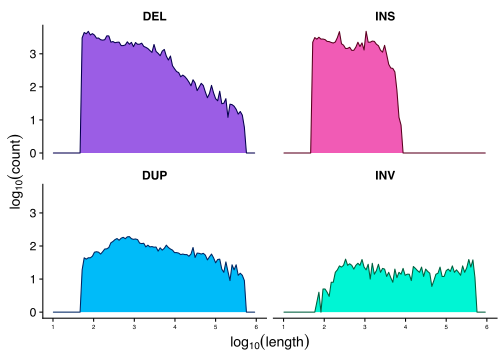
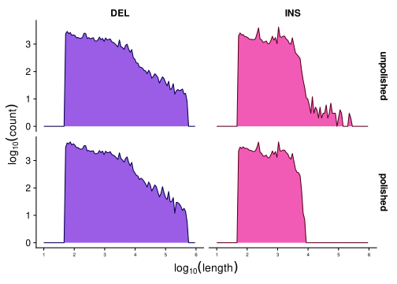
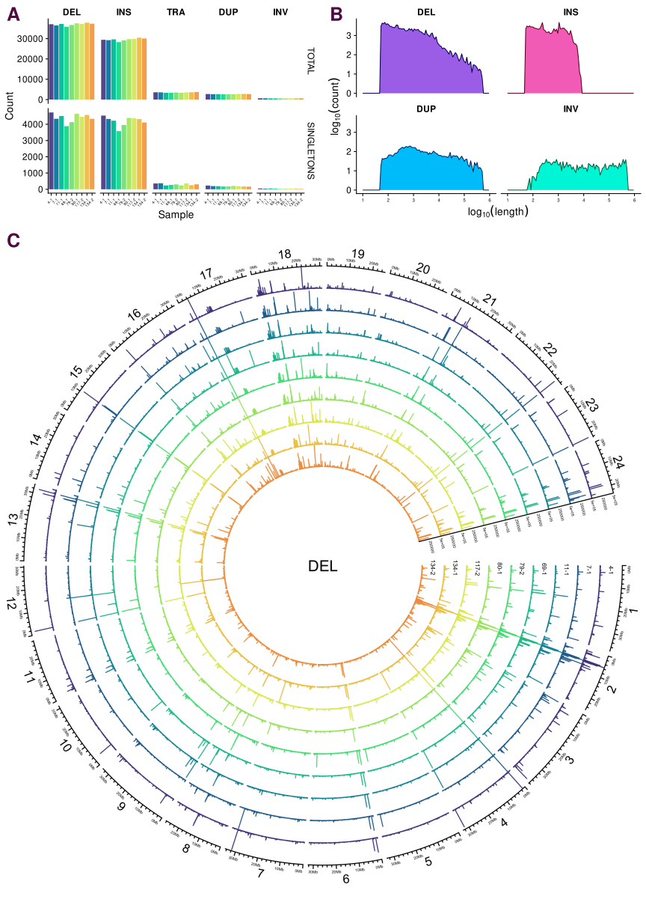
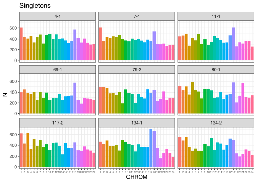
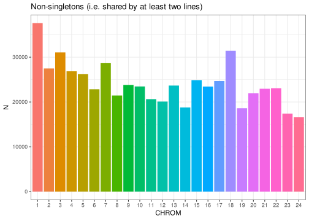
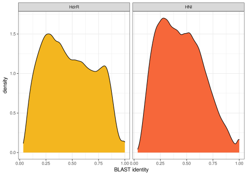
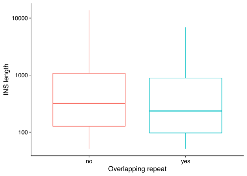
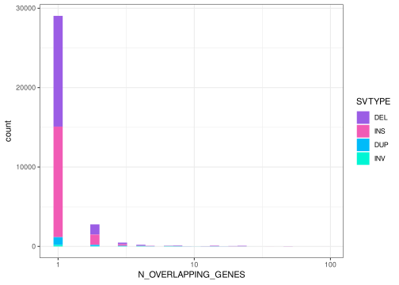
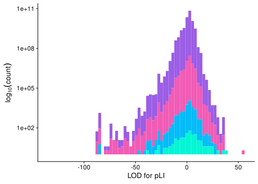

Email from Tom, 18 January:

[1.]{color="purple"} “Polish” SV calls using Illumina data:
<https://github.com/smehringer/SViper>

Please explore the above - get install and tested.

Nanopore VCF files:

* [WITH SEQUENCES]{color="red"}:
`ll /hps/research1/birney/users/adrien/indigene/analyses/indigene_nanopore_DNA/brain_run2/DNA_analysis/results/SV/sniffles_all_OLD/merged.vcf`
* [WITHOUT SEQUENCES]{color="red"}:`/hps/research1/birney/users/adrien/indigene/analyses/indigene_nanopore_DNA/brain_run2/DNA_analysis/results/SV/sniffles_all/merged.vcf`

`SViper` says:
>The vcf file must be a structural variant format (tags instead of sequences, e.g. \<DEL\>). Also the INFO field must include the END tag, giving the end position of the variant, as well as the SVLEN tag in case of insertions.

Then we need to map Illumina ID to the Nanopore VCF and figure out how to run the polishing.

Once done we need to summarise and describe the SV’s a little with some annotations etc - I will make a start with doing this part and we catchup once you have looked at the polishing

[2.]{color="purple"} catchup with Jack on repeats (both MIKK panel and Nanopore assemblies).
  - create one plot for each paper

[3.]{color="purple"} Fecundity - I will send you the data and a description of what exactly it is later today.
  - we will need a general description of the data, descriptive stats and a heritability estimate - plus a single plot or table (for MIKK panel paper)

[4.]{color="purple"} Add to txt within the two documents - we can catch-up on this later in the week.

# Polish SV calls with Illumina data

## Setup

Working directory on EBI cluster: `/hps/research1/birney/users/ian/mikk_paper/mikk_genome/sv_analysis`
GitHub repo: <https://github.com/brettellebi/mikk_genome>

### `conda` envs

#### `sv_env`


```bash
# Make conda env
mamba create -n sv_env
conda activate sv_env
# Install packages
mamba install -c bioconda bcftools sniffles
mamba install -c conda-forge r-base r-tidyverse
# Export to file
conda env export > envs/sv_env/sv_env.yaml
```

#### `baseR`


```bash
# Activate
conda activate baseR
# Export
conda env export > envs/baseR/baseR.yaml
```

### `renv`


```r
# Initiate
renv::init()
# Snapshot
renv::snapshot()
# Restore
renv::restore()
```

#### Source


```r
library(here)
source(here::here("code", "scripts", "sv_analysis", "source.R"))
```

### Nanopore VCF

`/hps/research1/birney/users/adrien/analyses/medaka_DNA_promethion/brain_run2/DNA_analysis/results/SV/sniffles_all/merged.vcf`

Created with:

```bash
# First used:
sniffles \
  --min_support 3 \
  --max_num_splits 7 \
  --max_distance 1000 \
  --min_length 50 \
  --minmapping_qual 20 \
  --min_seq_size 1000 \
  --allelefreq 0.1 \
  -t {threads} \
  -m {input_bam} \
  -v {output_vcf}

```

Adrien:
>Then I filtered and merged all the variants from the different samples together with survivor and recalled variants a second time in forced mode using the merged set with sniffles again using the same options.

#### Copy to working directory


```bash
# With sequences
nano_raw=/hps/research1/birney/users/adrien/indigene/analyses/indigene_nanopore_DNA/brain_run2/DNA_analysis/results/SV/sniffles_all_OLD/merged.vcf
out_path=../sv_analysis/vcfs/ont_raw_with_seq.vcf
## Copy
cp $nano_raw $out_path

# Without sequences
nano_raw=/hps/research1/birney/users/adrien/indigene/analyses/indigene_nanopore_DNA/brain_run2/DNA_analysis/results/SV/sniffles_all/merged.vcf
out_path=../sv_analysis/vcfs/ont_raw.vcf
## Copy
cp $nano_raw $out_path
```

#### Rename samples

##### With sequences


```bash
conda activate sv_env

in_vcf=../sv_analysis/vcfs/ont_raw_with_seq.vcf
sample_file=data/sv_analysis/20210205_ont_raw_samples_file.txt
out_vcf=../sv_analysis/vcfs/ont_raw_with_seq_rehead.vcf

# Make samples key file
bcftools query -l $in_vcf \
  > tmp1
cut -f4 -d'/' tmp1 | cut -f1 -d'_' \
  > tmp2
paste -d' ' tmp1 tmp2 > $sample_file
rm tmp1 tmp2

# Rename VCF
bcftools reheader \
  --samples $sample_file \
  --output $out_vcf \
  $in_vcf
```

##### Without sequences


```bash
conda activate sv_env

in_vcf=../sv_analysis/vcfs/ont_raw.vcf
sample_file=data/sv_analysis/20210212_ont_raw_samples_file.txt
out_vcf=../sv_analysis/vcfs/ont_raw_rehead.vcf

# Make samples key file
bcftools query -l $in_vcf \
  > tmp1
cut -f4 -d'/' tmp1 | cut -f1 -d'_' \
  > tmp2
paste -d' ' tmp1 tmp2 > $sample_file
rm tmp1 tmp2

# Rename VCF
bcftools reheader \
  --samples $sample_file \
  --output $out_vcf \
  $in_vcf
```

#### Get stats

##### With sequences


```bash
conda activate sv_mikk

in_vcf=../sv_analysis/vcfs/ont_raw_with_seq.vcf
stats_out=../sv_analysis/vcfs/ont_raw_with_seq.stats

# Get stats
bcftools stats \
  $in_vcf \
    > $stats_out
```

##### Without sequences


```bash
conda activate sv_mikk

in_vcf=../sv_analysis/vcfs/ont_raw.vcf
stats_out=../sv_analysis/vcfs/ont_raw.stats

# Get stats
bcftools stats \
  $in_vcf \
    > $stats_out
```

#### Split per sample

##### With sequences


```bash
conda activate sv_mikk

in_vcf=../sv_analysis/vcfs/ont_raw_with_seq_rehead.vcf
out_dir=../sv_analysis/vcfs/ont_raw_with_seq_rehead_per_sample

mkdir -p $out_dir

# Split by sample
bcftools +split \
  $in_vcf \
  --output $out_dir
```

##### Without sequences


```bash
conda activate sv_mikk

in_vcf=../sv_analysis/vcfs/ont_raw_rehead.vcf
out_dir=../sv_analysis/vcfs/ont_raw_rehead_per_sample

mkdir -p $out_dir

# Split by sample
bcftools +split \
  $in_vcf \
  --output $out_dir
```

### Illumina VCF

#### Copy to working directory


```bash
conda activate sv_env

in_vcf=/nfs/research1/birney/projects/medaka/inbred_panel/medaka-alignments-release-94/vcf/medaka_inbred_panel_ensembl_new_reference_release_94.vcf
out_vcf=../sv_analysis/vcfs/ill_raw.vcf.gz

# Compress and copy
bsub \
  -M 30000 \
  -o ../log/20210208_comp_ill.out \
  -e ../log/20210208_comp_ill.err \
bsub -Is bash \
  """
  conda activate sv_env ;
  bcftools view \
    --output-type z \
    --output $out_vcf \
    $in_vcf
  """
```

#### Rename and filter for ONT samples

##### Pull out IDs for relevant samples


```r
ont_samples = here::here("data", "sv_analysis", "20210205_ont_raw_samples_file.txt")
ill_samples = here::here("data","20200206_cram_id_to_line_id.txt")
out_file = here::here("data", "sv_analysis", "20210205_ill_key_ont_samples.txt")
out_samples = here::here("data", "sv_analysis", "20210205_ont_samples_only.txt")

# Read in tables

ont_key = read.table(ont_samples)
ill_key = read.table(ill_samples, comment.char = "\"", header = T) %>%
  dplyr::mutate(line = gsub("_", "-", line))

# Find matches
out = ill_key[ill_key$line %in% ont_key$V2, ]

# Write to files
## Key file
readr::write_delim(out, out_file, delim = " ", col_names = F)
## Just samples
readr::write_lines(out$cram_file, out_samples)
```

##### Rename and filter


```bash
in_vcf=../sv_analysis/vcfs/ill_raw.vcf.gz
samples_file=data/sv_analysis/20210205_ont_samples_only.txt
samples_key=data/sv_analysis/20210205_ill_key_ont_samples.txt
out_vcf=../sv_analysis/vcfs/ill_raw_rehead.vcf.gz
out_dir=../sv_analysis/vcfs/ill_raw_rehead_per_sample

mkdir -p $out_dir

# Filter for target samples and rehead
bcftools view \
  --samples-file $samples_file \
  --output-type u \
  $in_vcf |\
    bcftools reheader \
      --samples $samples_key \
      --output $out_vcf

# Split by sample
bcftools +split \
  $out_vcf \
  --output $out_dir
```

### BAMs

#### Illumina `.bam` files

Copy to local.


```bash
sample_key=data/sv_analysis/20210205_ill_key_ont_samples.txt
ill_bam_dir=/nfs/research1/birney/projects/medaka/inbred_panel/medaka-alignments-release-94/bam
out_dir=../sv_analysis/bams

mkdir -p $out_dir

# Copy over
for sample in $(cut -f1 -d' ' $sample_key ) ; do
  cp $ill_bam_dir/$sample.bai $out_dir ;
done

# SViper needs bams in .bam.bai format. Original {sample}.bai files need to be copied to {sample}.bam.bai
for file in $( find $out_dir/*.bai ) ; do
  new_filename=$( echo $file | sed 's/.bai/.bam.bai/g' ) ;
  mv $file $new_filename ;
done
```

#### Nanopore `.bam` files

Sit here: `/hps/research1/birney/users/adrien/indigene/analyses/indigene_nanopore_DNA/brain_run2/DNA_analysis/results/SV/ngmlr_alignments/`

## Polish Nanopore reads with `SViper`

### Create Singularity container

```bash
module load singularity

# Build
singularity build \
  --remote ../sing_conts/sviper.sif \
  envs/sviper/20210204_sviper.def

# Open interactive shell
bsub -Is "singularity shell ../sing_conts/sviper.sif"
# Works!
```

### Test


```bash
# Load singularity
module load singularity
# Pull image built with `envs/sviper/20210204_sviper.def`
bsub -M 30000 -n 4 -Is "singularity shell ../sing_conts/sviper.sif"

#######################
# Variables
#######################
## Container
container=../sing_conts/sviper.sif
## Sample
sample=11-1
sample_key=data/sv_analysis/20210205_ill_key_ont_samples.txt
## VCF to polish
ont_vcf=../sv_analysis/vcfs/ont_raw_rehead_per_sample/$sample.vcf
## Illumina BAM
ill_cram_id=$(grep $sample $sample_key | cut -f1 -d' ')
ill_bam_dir=../sv_analysis/bams
ill_bam=$ill_bam_dir/$ill_cram_id.bam
## Nanopore BAM
ont_bam_dir=/hps/research1/birney/users/adrien/indigene/analyses/indigene_nanopore_DNA/brain_run2/DNA_analysis/results/SV/ngmlr_alignments
ont_bam=$(find $ont_bam_dir/$sample*.bam)
## Reference
ref=../refs/Oryzias_latipes.ASM223467v1.dna.toplevel.fa
## Output directory
out_dir=../sv_analysis/vcfs/sviper
mkdir -p $out_dir

#######################
# TEST call sviper
#######################
sviper \
  --candidate-vcf $ont_vcf \
  --short-read-bam $ill_bam \
  --long-read-bam $ont_bam \
  --reference $ref \
  --output-prefix $out_dir/$sample

```

### True


```bash
# Load singularity
module load singularity
# Pull image built with `envs/sviper/20210204_sviper.def`
bsub -M 30000 -n 4 -Is "singularity shell ../sing_conts/sviper.sif"

#######################
# Variables
#######################
## Sample
sample=11-1
sample_key=data/sv_analysis/20210205_ill_key_ont_samples.txt
## VCF to polish
ont_vcf=../sv_analysis/vcfs/ont_raw_rehead_per_sample/$sample.vcf
## Illumina BAM
ill_cram_id=$(grep $sample $sample_key | cut -f1 -d' ')
ill_bam_dir=../sv_analysis/bams
ill_bam=$ill_bam_dir/$ill_cram_id.bam
## Nanopore BAM
ont_bam_dir=/hps/research1/birney/users/adrien/indigene/analyses/indigene_nanopore_DNA/brain_run2/DNA_analysis/results/SV/ngmlr_alignments
ont_bam=$(find $ont_bam_dir/$sample*.bam)
## Reference
ref=../refs/Oryzias_latipes.ASM223467v1.dna.toplevel.fa
## Container
container=../sing_conts/sviper.sif
## Output directory
out_dir=../sv_analysis/vcfs/sviper
mkdir -p $out_dir

#######################
# TEST call sviper
#######################
sviper \
  --candidate-vcf $ont_vcf \
  --short-read-bam $ill_bam \
  --long-read-bam $ont_bam \
  --reference $ref \
  --output-prefix $out_dir/$sample

#######################
# TRUE call sviper
#######################
module load singularity

# Global variables
## Sample key
sample_key=data/sv_analysis/20210205_ill_key_ont_samples.txt
## BAM dirs
ill_bam_dir=../sv_analysis/bams
ont_bam_dir=/hps/research1/birney/users/adrien/indigene/analyses/indigene_nanopore_DNA/brain_run2/DNA_analysis/results/SV/ngmlr_alignments
## Reference
ref=../refs/Oryzias_latipes.ASM223467v1.dna.toplevel.fa
## Container
container=../sing_conts/sviper.sif
## Output directory
out_dir=../sv_analysis/vcfs/sviper
mkdir -p $out_dir

for sample in $(cut -f2 -d' ' $sample_key | tail -n+2 ) ; do
  # Set variables

  ## VCF to polish
  ont_vcf=../sv_analysis/vcfs/ont_raw_rehead_per_sample/$sample.vcf
  ## Illumina BAM
  ill_cram_id=$(grep " $sample" $sample_key | cut -f1 -d' ')
  ill_bam=$ill_bam_dir/$ill_cram_id.bam
  ## Nanopore BAM
  ont_bam=$(find $ont_bam_dir/$sample*.bam)

  # Run SViper
  bsub \
    -M 30000 \
    -n 16 \
    -o ../log/20210212_sviper_$sample.out \
    -e ../log/20210212_sviper_$sample.err \
    """
    singularity exec $container \
      sviper \
        --candidate-vcf $ont_vcf \
        --short-read-bam $ill_bam \
        --long-read-bam $ont_bam \
        --reference $ref \
        --output-prefix $out_dir/$sample
    """
done

# 4-2 and 7-2 failed with no error message
```

### Merge


```bash
# Get list of vcf paths
in_dir=../sv_analysis/vcfs/sviper
out_dir=$in_dir/merged
mkdir -p $out_dir
in_vcfs=$(find $in_dir/*.vcf | tr '\n' ' ')

bcftools merge \
  --output $out_dir/all.vcf\
  $in_vcfs

# Requires them to be bgzipped

# Try with Picard
in_dir=../sv_analysis/vcfs/sviper
out_dir=$in_dir/merged
mkdir -p $out_dir
find $in_dir/*.vcf > tmp.list

picard MergeVcfs \
  I=tmp.list \
  O=$out_dir/merged.vcf.gz

rm tmp.list
#Exception in thread "main" java.lang.IllegalArgumentException: Input file /hps/research1/birney/users/ian/mikk_paper/mikk_genome/../sv_analysis/vcfs/sviper/117-2.vcf has sample entries that don't match the other files.
```

### Get data from `SViper`


```bash
in_dir=../sv_analysis/vcfs/sviper
out_dir=data/sv_analysis/20210217_sviper_filter_pass

mkdir -p $out_dir

for in_vcf in $(find $in_dir/*vcf) ; do
  sample=$(basename $in_vcf | cut -f1 -d'.' ) ;
  bcftools query \
    --exclude 'GT~"\."' \
    --format '%CHROM,%POS,%ID,%ALT,%FILTER,%INFO/SVLEN,%INFO/SVTYPE,%INFO/CHR2,%INFO/END,[%GT],[%LN],[%ST]\n' \
  --output $out_dir/$sample.csv \
  $in_vcf ;
done
```

### Get data from original VCF


```bash
in_dir=../sv_analysis/vcfs/ont_raw_rehead_per_sample
out_dir=data/sv_analysis/20210217_raw_ont_filter_pass

mkdir -p $out_dir

for in_vcf in $(find $in_dir/*vcf) ; do
  sample=$(basename $in_vcf | cut -f1 -d'.' ) ;
  bcftools query \
    --include 'FILTER="PASS"' \
    --exclude 'GT~"\."' \
    --format '%CHROM,%POS,%ID,%ALT,%FILTER,%INFO/SVLEN,%INFO/SVTYPE,%INFO/CHR2,%INFO/END,[%GT],[%LN],[%ST]\n' \
  --output $out_dir/$sample.csv \
  $in_vcf ;
done
```

# Analysis

## Read in SV data

### SViper polished


```r
in_dir = here::here("data", "sv_analysis/20210217_sviper_filter_pass")

in_files = list.files(in_dir, full.names = T)
names(in_files) = basename(in_files) %>%
  str_remove(".csv")

sv_df_pol = lapply(in_files, function(in_file){
  df = readr::read_csv(in_file,
                       col_names = c("CHROM", "POS", "ID", "ALT", "FILTER", "SVLEN", "SVTYPE", "CHR2", "END", "GT", "LN", "ST"),
                       col_types = c("ciicciccicic"))

  return(df)
}) %>%
  dplyr::bind_rows(.id = "SAMPLE") %>%
  # add "chr" to beginning of CHROM column
  dplyr::mutate(CHROM = paste("chr", CHROM, sep = ""))
```

Counts for FILTER by SVTYPE


```r
sv_df_pol %>%
  # Remove 131-1
  dplyr::filter(SAMPLE %in% ont_samples_pol) %>%
  dplyr::group_by(SVTYPE, FILTER) %>%
  dplyr::count()
```

```
## # A tibble: 14 x 3
## # Groups:   SVTYPE, FILTER [14]
##    SVTYPE FILTER      n
##    <chr>  <chr>   <int>
##  1 DEL    FAIL1     182
##  2 DEL    FAIL2   16638
##  3 DEL    FAIL4      49
##  4 DEL    FAIL5    9720
##  5 DEL    PASS   333373
##  6 DUP    SKIP    23991
##  7 INS    FAIL1     430
##  8 INS    FAIL2   30286
##  9 INS    FAIL4      71
## 10 INS    FAIL5    8297
## 11 INS    PASS   265857
## 12 INS    SKIP        2
## 13 INV    SKIP     5549
## 14 TRA    SKIP    31382
```
**`SViper` only polishes insertions and deletions! Actually says that in the first line of the README. Will have to conditionally filter.

### How many DUP and INS filtered out?


```r
sv_df_pol %>%
  dplyr::filter(SAMPLE %in% ont_samples_pol) %>%
  dplyr::filter(SVTYPE %in% c("DEL", "INS")) %>%
  dplyr::group_by(SVTYPE, FILTER) %>%
  dplyr::count() %>%
  dplyr::ungroup() %>%
  split(., f = .$SVTYPE) %>%
  purrr::map(function(x) {
    data.frame(TOTAL = sum(x$n),
               TOTAL_FAILED = sum(x %>%
                                    dplyr::filter(FILTER != "PASS") %>%
                                    dplyr::select(n)),
               TOTAL_PASSED = x %>%
                 dplyr::filter(FILTER == "PASS") %>%
                 dplyr::pull(n)) %>%
      dplyr::mutate(PROP_FAILED = TOTAL_FAILED / TOTAL)
    }) %>%
  dplyr::bind_rows(.id = "SVTYPE")
```

```
##   SVTYPE  TOTAL TOTAL_FAILED TOTAL_PASSED PROP_FAILED
## 1    DEL 359962        26589       333373  0.07386613
## 2    INS 304943        39086       265857  0.12817477
```
### Plot frequency of different types of fails


```r
sv_filter_desc = sv_df_pol %>%
  # remove 131-1
  dplyr::filter(SAMPLE %in% ont_samples_pol) %>%
  dplyr::group_by(SVTYPE, FILTER) %>%
  dplyr::mutate(FILTER = factor(FILTER, levels = names(filter_recode)),
                FILTER_DESC = dplyr::recode(FILTER, !!!filter_recode)) %>%
  dplyr::filter(SVTYPE %in% c("DEL", "INS")) %>%
  ggplot() +
    geom_bar(aes(FILTER_DESC, fill = SVTYPE)) +
    theme_bw() +
    theme(axis.text.x = element_text(size = 5)) +
    facet_wrap(~SVTYPE) +
    scale_fill_manual(values = svtype_hist_pal) +
    xlab("Filter description") +
    guides(fill = F)
```


```r
ggsave(here::here("plots", "sv_analysis", "20210325_sv_filter.png"),
       device = "png",
       width = 20,
       height = 9.375,
       units = "cm",
       dpi = 400)
```


```r
ggplotly(sv_filter_desc)
```

```{=html}
<div id="htmlwidget-e74608b916db0b43640e" style="width:672px;height:480px;" class="plotly html-widget"></div>
<script type="application/json" data-for="htmlwidget-e74608b916db0b43640e">{"x":{"data":[{"orientation":"v","width":[0.9,0.9,0.9,0.9,0.9],"base":[0,0,0,0,0],"x":[1,2,3,4,6],"y":[182,16638,49,9720,333373],"text":["count:    182<br />FILTER_DESC: No long reads<br />in variant region<br />SVTYPE: DEL","count:  16638<br />FILTER_DESC: No long reads<br />support the variant<br />SVTYPE: DEL","count:     49<br />FILTER_DESC: Not enough<br />short reads<br />SVTYPE: DEL","count:   9720<br />FILTER_DESC: The variant<br />was polished away<br />SVTYPE: DEL","count: 333373<br />FILTER_DESC: All filters<br />passed<br />SVTYPE: DEL"],"type":"bar","marker":{"autocolorscale":false,"color":"rgba(155,93,229,1)","line":{"width":1.88976377952756,"color":"transparent"}},"name":"DEL","legendgroup":"DEL","showlegend":true,"xaxis":"x","yaxis":"y","hoverinfo":"text","frame":null},{"orientation":"v","width":[0.9,0.9,0.9,0.9,0.9,0.9],"base":[0,0,0,0,0,0],"x":[1,2,3,4,5,6],"y":[430,30286,71,8297,2,265857],"text":["count:    430<br />FILTER_DESC: No long reads<br />in variant region<br />SVTYPE: INS","count:  30286<br />FILTER_DESC: No long reads<br />support the variant<br />SVTYPE: INS","count:     71<br />FILTER_DESC: Not enough<br />short reads<br />SVTYPE: INS","count:   8297<br />FILTER_DESC: The variant<br />was polished away<br />SVTYPE: INS","count:      2<br />FILTER_DESC: Skipped<br />SVTYPE: INS","count: 265857<br />FILTER_DESC: All filters<br />passed<br />SVTYPE: INS"],"type":"bar","marker":{"autocolorscale":false,"color":"rgba(241,91,181,1)","line":{"width":1.88976377952756,"color":"transparent"}},"name":"INS","legendgroup":"INS","showlegend":true,"xaxis":"x2","yaxis":"y","hoverinfo":"text","frame":null}],"layout":{"margin":{"t":37.9178082191781,"r":7.30593607305936,"b":35.1349107513491,"l":54.7945205479452},"plot_bgcolor":"rgba(255,255,255,1)","paper_bgcolor":"rgba(255,255,255,1)","font":{"color":"rgba(0,0,0,1)","family":"","size":14.6118721461187},"xaxis":{"domain":[0,0.489128071319852],"automargin":true,"type":"linear","autorange":false,"range":[0.4,6.6],"tickmode":"array","ticktext":["No long reads<br />in variant region","No long reads<br />support the variant","Not enough<br />short reads","The variant<br />was polished away","Skipped","All filters<br />passed"],"tickvals":[1,2,3,4,5,6],"categoryorder":"array","categoryarray":["No long reads<br />in variant region","No long reads<br />support the variant","Not enough<br />short reads","The variant<br />was polished away","Skipped","All filters<br />passed"],"nticks":null,"ticks":"outside","tickcolor":"rgba(51,51,51,1)","ticklen":3.65296803652968,"tickwidth":0.66417600664176,"showticklabels":true,"tickfont":{"color":"rgba(77,77,77,1)","family":"","size":6.6417600664176},"tickangle":-0,"showline":false,"linecolor":null,"linewidth":0,"showgrid":true,"gridcolor":"rgba(235,235,235,1)","gridwidth":0.66417600664176,"zeroline":false,"anchor":"y","title":"","hoverformat":".2f"},"annotations":[{"text":"Filter description","x":0.5,"y":-0.0366680503666805,"showarrow":false,"ax":0,"ay":0,"font":{"color":"rgba(0,0,0,1)","family":"","size":14.6118721461187},"xref":"paper","yref":"paper","textangle":-0,"xanchor":"center","yanchor":"top","annotationType":"axis"},{"text":"count","x":-0.0597956077408132,"y":0.5,"showarrow":false,"ax":0,"ay":0,"font":{"color":"rgba(0,0,0,1)","family":"","size":14.6118721461187},"xref":"paper","yref":"paper","textangle":-90,"xanchor":"right","yanchor":"center","annotationType":"axis"},{"text":"DEL","x":0.244564035659926,"y":1,"showarrow":false,"ax":0,"ay":0,"font":{"color":"rgba(26,26,26,1)","family":"","size":11.689497716895},"xref":"paper","yref":"paper","textangle":-0,"xanchor":"center","yanchor":"bottom"},{"text":"INS","x":0.755435964340074,"y":1,"showarrow":false,"ax":0,"ay":0,"font":{"color":"rgba(26,26,26,1)","family":"","size":11.689497716895},"xref":"paper","yref":"paper","textangle":-0,"xanchor":"center","yanchor":"bottom"}],"yaxis":{"domain":[0,1],"automargin":true,"type":"linear","autorange":false,"range":[-16668.65,350041.65],"tickmode":"array","ticktext":["0e+00","1e+05","2e+05","3e+05"],"tickvals":[0,100000,200000,300000],"categoryorder":"array","categoryarray":["0e+00","1e+05","2e+05","3e+05"],"nticks":null,"ticks":"outside","tickcolor":"rgba(51,51,51,1)","ticklen":3.65296803652968,"tickwidth":0.66417600664176,"showticklabels":true,"tickfont":{"color":"rgba(77,77,77,1)","family":"","size":11.689497716895},"tickangle":-0,"showline":false,"linecolor":null,"linewidth":0,"showgrid":true,"gridcolor":"rgba(235,235,235,1)","gridwidth":0.66417600664176,"zeroline":false,"anchor":"x","title":"","hoverformat":".2f"},"shapes":[{"type":"rect","fillcolor":"transparent","line":{"color":"rgba(51,51,51,1)","width":0.66417600664176,"linetype":"solid"},"yref":"paper","xref":"paper","x0":0,"x1":0.489128071319852,"y0":0,"y1":1},{"type":"rect","fillcolor":"rgba(217,217,217,1)","line":{"color":"rgba(51,51,51,1)","width":0.66417600664176,"linetype":"solid"},"yref":"paper","xref":"paper","x0":0,"x1":0.489128071319852,"y0":0,"y1":23.37899543379,"yanchor":1,"ysizemode":"pixel"},{"type":"rect","fillcolor":"transparent","line":{"color":"rgba(51,51,51,1)","width":0.66417600664176,"linetype":"solid"},"yref":"paper","xref":"paper","x0":0.510871928680148,"x1":1,"y0":0,"y1":1},{"type":"rect","fillcolor":"rgba(217,217,217,1)","line":{"color":"rgba(51,51,51,1)","width":0.66417600664176,"linetype":"solid"},"yref":"paper","xref":"paper","x0":0.510871928680148,"x1":1,"y0":0,"y1":23.37899543379,"yanchor":1,"ysizemode":"pixel"}],"xaxis2":{"type":"linear","autorange":false,"range":[0.4,6.6],"tickmode":"array","ticktext":["No long reads<br />in variant region","No long reads<br />support the variant","Not enough<br />short reads","The variant<br />was polished away","Skipped","All filters<br />passed"],"tickvals":[1,2,3,4,5,6],"categoryorder":"array","categoryarray":["No long reads<br />in variant region","No long reads<br />support the variant","Not enough<br />short reads","The variant<br />was polished away","Skipped","All filters<br />passed"],"nticks":null,"ticks":"outside","tickcolor":"rgba(51,51,51,1)","ticklen":3.65296803652968,"tickwidth":0.66417600664176,"showticklabels":true,"tickfont":{"color":"rgba(77,77,77,1)","family":"","size":6.6417600664176},"tickangle":-0,"showline":false,"linecolor":null,"linewidth":0,"showgrid":true,"domain":[0.510871928680148,1],"gridcolor":"rgba(235,235,235,1)","gridwidth":0.66417600664176,"zeroline":false,"anchor":"y","title":"","hoverformat":".2f"},"showlegend":true,"legend":{"bgcolor":"rgba(255,255,255,1)","bordercolor":"transparent","borderwidth":1.88976377952756,"font":{"color":"rgba(0,0,0,1)","family":"","size":11.689497716895},"y":1},"hovermode":"closest","barmode":"relative"},"config":{"doubleClick":"reset","showSendToCloud":false},"source":"A","attrs":{"422855e5a6cd":{"x":{},"fill":{},"type":"bar"}},"cur_data":"422855e5a6cd","visdat":{"422855e5a6cd":["function (y) ","x"]},"highlight":{"on":"plotly_click","persistent":false,"dynamic":false,"selectize":false,"opacityDim":0.2,"selected":{"opacity":1},"debounce":0},"shinyEvents":["plotly_hover","plotly_click","plotly_selected","plotly_relayout","plotly_brushed","plotly_brushing","plotly_clickannotation","plotly_doubleclick","plotly_deselect","plotly_afterplot","plotly_sunburstclick"],"base_url":"https://plot.ly"},"evals":[],"jsHooks":[]}</script>
```


```r
# Make copy of full polished DF
sv_df_pol_all = sv_df_pol

# Filter out non-passes for DEL and INS STYPEs
sv_df_pol = sv_df_pol %>%
  dplyr::filter(SAMPLE %in% ont_samples_pol) %>%
  dplyr::filter(!(SVTYPE %in% c("DEL", "INS") & FILTER != "PASS"))


sv_df_pol %>%
  dplyr::group_by(SVTYPE, FILTER) %>%
  dplyr::count()
```

```
## # A tibble: 5 x 3
## # Groups:   SVTYPE, FILTER [5]
##   SVTYPE FILTER      n
##   <chr>  <chr>   <int>
## 1 DEL    PASS   333373
## 2 DUP    SKIP    23991
## 3 INS    PASS   265857
## 4 INV    SKIP     5549
## 5 TRA    SKIP    31382
```


### ONT unpolished


```r
in_dir = here::here("data", "sv_analysis/20210217_raw_ont_filter_pass")

in_files = list.files(in_dir, full.names = T)
names(in_files) = basename(in_files) %>%
  str_remove(".csv")

sv_df_raw = lapply(in_files, function(in_file){
  df = readr::read_csv(in_file,
                       col_names = c("CHROM", "POS", "ID", "ALT", "FILTER", "SVLEN", "SVTYPE", "CHR2", "END", "GT", "LN", "ST"),
                       col_types = c("ciicciccicic"))

  return(df)
}) %>%
  dplyr::bind_rows(.id = "SAMPLE") %>%
  # add "chr" to beginning of CHROM column
  dplyr::mutate(CHROM = paste("chr", CHROM, sep = ""))
```

### Combine into single df


```r
# All
sv_df_all = list("polished" = sv_df_pol_all,
             "unpolished" = sv_df_raw) %>%
  dplyr::bind_rows(.id = "DATASET") %>%
  # factor samples and dataset
  dplyr::mutate(SAMPLE = factor(SAMPLE, levels = ont_samples),
                DATASET = factor(DATASET, levels = c("unpolished", "polished")))

# Filtered
sv_df = list("polished" = sv_df_pol,
             "unpolished" = sv_df_raw) %>%
  dplyr::bind_rows(.id = "DATASET") %>%
  # factor samples and dataset
  dplyr::mutate(SAMPLE = factor(SAMPLE, levels = ont_samples),
                DATASET = factor(DATASET, levels = c("unpolished", "polished")))
```

## How many SVs did polishing change?

[NOTE]{color="red"}: there is a small number of SV IDs that are duplicated, e.g.:


```r
sv_df_all %>% dplyr::filter(SAMPLE == "4-1" & ID == 78181)
```

```
## # A tibble: 4 x 14
##   DATASET    SAMPLE CHROM      POS    ID ALT   FILTER SVLEN SVTYPE CHR2       END GT       LN ST   
##   <fct>      <fct>  <chr>    <int> <int> <chr> <chr>  <int> <chr>  <chr>    <int> <chr> <int> <chr>
## 1 polished   4-1    chr9  29694756 78181 <INS> PASS    1215 INS    9     29694755 0/1    1215 +-   
## 2 polished   4-1    chr9  29694756 78181 <INS> PASS    1218 INS    9     29694755 0/0    1218 +-   
## 3 unpolished 4-1    chr9  29694756 78181 <INS> PASS    1215 INS    9     29694755 0/1    1215 +-   
## 4 unpolished 4-1    chr9  29694756 78181 <INS> PASS    1218 INS    9     29694755 0/0    1218 +-
```

```r
# How many duplicates?
sv_df_all %>%
  dplyr::filter(SVTYPE %in% c("DEL", "INS") & FILTER == "PASS") %>%
  group_by(DATASET, SAMPLE) %>%
  summarise(length(which(duplicated(ID))))
```

```
## `summarise()` has grouped output by 'DATASET'. You can override using the `.groups` argument.
```

```
## # A tibble: 22 x 3
## # Groups:   DATASET [2]
##    DATASET    SAMPLE `length(which(duplicated(ID)))`
##    <fct>      <fct>                            <int>
##  1 unpolished 4-1                                  5
##  2 unpolished 4-2                                  3
##  3 unpolished 7-1                                  1
##  4 unpolished 7-2                                  3
##  5 unpolished 11-1                                 0
##  6 unpolished 69-1                                 1
##  7 unpolished 79-2                                 2
##  8 unpolished 80-1                                 0
##  9 unpolished 117-2                                0
## 10 unpolished 131-1                                4
## # … with 12 more rows
```

Exclude duplicates and get percentages of amended POS, END, and LN


```r
polish_comp_list = sv_df_all %>%
  # Refactorise to exclude unpolished ONT samples
  dplyr::mutate(SAMPLE = factor(SAMPLE, levels = ont_samples_pol)) %>%
  # Take only polished samples
  dplyr::filter(SAMPLE %in% ont_samples_pol) %>%
  # Take only DEL and INS that passed the filter
  dplyr::filter(SVTYPE %in% c("DEL", "INS") & FILTER == "PASS") %>%
  # Remove duplicates
  dplyr::group_by(DATASET, SAMPLE) %>%
  dplyr::filter(!duplicated(ID)) %>%
  dplyr::ungroup() %>%
  # Take target columns
  dplyr::select(DATASET, SAMPLE, ID, CHROM, POS, END, LN) %>%
  # Split by sample and run following on each
  split(., .$SAMPLE) %>%
  purrr::map(., function(sample) sample %>%
    # Pivot wider by DATASET to compare POS, END and LN
    tidyr::pivot_wider(id_cols = c(DATASET, ID),
                       names_from = DATASET,
                       values_from = c(POS, END, LN),
                       ) %>%
    # Get proportions of SVs where unpolished and polished differ in POS, END, or LN
    dplyr::mutate(POS_diff = abs(POS_polished - POS_unpolished),
                  END_diff = abs(END_polished - END_unpolished),
                  LN_diff = abs(LN_polished - LN_unpolished)) #%>%
#    dplyr::summarise(TOTAL = n(),
#                     dplyr::across(ends_with("_diff"), ~sum(.x > 0, na.rm = T)/TOTAL))
  ) #%>%
  #dplyr::bind_rows(.id = "SAMPLE")

polish_comp_list %>%
  purrr::map(., function(sample) sample %>%
    dplyr::summarise(TOTAL = n(),
                     dplyr::across(tidyselect::ends_with("_diff"),
                                   ~sum(.x, na.rm = T)/TOTAL))
  ) %>%
  dplyr::bind_rows(.id = "SAMPLE")
```

```
## # A tibble: 9 x 5
##   SAMPLE TOTAL POS_diff END_diff  LN_diff
##   <chr>  <int>    <dbl>    <dbl>    <dbl>
## 1 4-1    73686     21.7     27.4 0.00919 
## 2 7-1    72936     20.3     26.5 0       
## 3 11-1   74354     20.9     26.2 0       
## 4 69-1   71377     21.5     29.3 0       
## 5 79-2   72983     20.8     27.1 0.00134 
## 6 80-1   75129     18.5     24.1 0       
## 7 117-2  74284     20.4     29.0 0       
## 8 134-1  75632     20.6     29.7 0.000423
## 9 134-2  74508     21.7     26.1 0
```
Average difference in breakpoints


```r
# Per sample
polish_comp_list %>%
  purrr::map(., function(sample) sample %>%
    dplyr::summarise(TOTAL = n(),
                     dplyr::across(ends_with("_diff"), ~mean(.x, na.rm = T)))
  ) %>%
  dplyr::bind_rows(.id = "SAMPLE")
```

```
## # A tibble: 9 x 5
##   SAMPLE TOTAL POS_diff END_diff  LN_diff
##   <chr>  <int>    <dbl>    <dbl>    <dbl>
## 1 4-1    73686     24.0     30.4 0.0102  
## 2 7-1    72936     22.5     29.4 0       
## 3 11-1   74354     23.2     29.1 0       
## 4 69-1   71377     23.9     32.6 0       
## 5 79-2   72983     23.0     30.1 0.00149 
## 6 80-1   75129     20.7     26.9 0       
## 7 117-2  74284     22.6     32.2 0       
## 8 134-1  75632     22.8     32.9 0.000469
## 9 134-2  74508     24.0     28.9 0
```

```r
# Mean of means
polish_comp_list %>%
  purrr::map(., function(sample) sample %>%
    dplyr::summarise(TOTAL = n(),
                     dplyr::across(ends_with("_diff"), ~mean(.x, na.rm = T)))
  ) %>%
  dplyr::bind_rows(.id = "SAMPLE") %>%
  dplyr::summarise(dplyr::across(ends_with("_diff"), ~mean(.x)))
```

```
## # A tibble: 1 x 3
##   POS_diff END_diff LN_diff
##      <dbl>    <dbl>   <dbl>
## 1     23.0     30.3 0.00135
```

## Plot counts of polished SV types


```r
# Histogram of LN
svtype_distinct_df = sv_df %>%
  # Extract polished data and remove TRA
  dplyr::filter(DATASET == "polished",
                SVTYPE != "TRA") %>%
  # Remove polish-filter fails
  dplyr::filter(!(SVTYPE %in% c("DEL", "INS") & FILTER != "PASS")) %>%
  dplyr::mutate(SVTYPE = factor(SVTYPE, levels = c("DEL", "INS", "DUP", "INV"))) %>%
  dplyr::select(SVTYPE, CHROM, POS, END, LN) %>%
  dplyr::distinct()

svlen_counts_plot = svtype_distinct_df %>%
  ggplot(aes(x = log10(LN),
             y = ifelse(log10(..count..) < 0,
                        0,
                        log10(..count..)),
             fill = SVTYPE,
             colour = SVTYPE)) +
    geom_area(stat = "bin",
              bins = 100) +
    scale_fill_manual(values = svtype_hist_pal) +
    scale_colour_manual(values = karyoploteR::darker(svtype_hist_pal)) +
    guides(fill = F) +
    guides(colour = F) +
    scale_x_continuous(breaks = seq(1, 6, 1),
                       limits = c(1, 6)) +
    facet_wrap(~SVTYPE, nrow = 2, ncol = 2) +
    xlab(expression(log[10](length))) +
    ylab(expression(log[10](count))) +
    theme_cowplot() +
    theme(axis.text.x = element_text(size = 6),
          strip.text = element_text(face = "bold"),
          strip.background = element_blank()
          )

svlen_counts_plot
```

<!-- -->

### Compare counts of DEL and INS before and after polishing


```r
# Histogram of LN
polish_comp_plot = sv_df %>%
  # take only the samples in the polished dataset
  dplyr::filter(SAMPLE %in% ont_samples_pol) %>%
  dplyr::filter(SVTYPE %in% c("DEL", "INS")) %>%
  # order by SVTYPE
  dplyr::mutate(SVTYPE = factor(SVTYPE, levels = c("DEL", "INS", "DUP", "INV"))) %>%
  dplyr::select(DATASET, CHROM, POS, END, SVTYPE, LN) %>%
  dplyr::distinct() %>%
  ggplot(aes(x = log10(LN),
             y = ifelse(log10(..count..) < 0,
                        0,
                        log10(..count..)),
             fill = SVTYPE,
             colour = SVTYPE)) +
    geom_area(stat = "bin",
              bins = 100) +
    scale_fill_manual(values = svtype_hist_pal) +
    scale_colour_manual(values = karyoploteR::darker(svtype_hist_pal)) +
    guides(fill = F) +
    guides(colour = F) +
    scale_x_continuous(breaks = seq(1, 6, 1),
                       limits = c(1, 6)) +
    facet_grid(rows = vars(DATASET),
               cols = vars(SVTYPE)) +
    xlab(expression(log[10](length))) +
    ylab(expression(log[10](count))) +
    theme_cowplot() +
    theme(axis.text.x = element_text(size = 6),
          strip.text = element_text(face = "bold"),
          strip.background = element_blank()
          )

polish_comp_plot
```

<!-- -->


```r
ggsave(here::here("plots", "sv_analysis", "20210325_polish_count_comparison.png"),
       device = "png",
       width = 15,
       height = 9.375,
       units = "cm",
       dpi = 400)
```

## Plot counts of SV types (per sample)

Get order of SV type by frequency


```r
# Get order
type_order = dplyr::count(sv_df, SVTYPE) %>%
  dplyr::arrange(desc(n)) %>%
  dplyr::pull(SVTYPE)

# Set palette
pal_svtype = grDevices::colorRampPalette(pal_brainbow)(length(ont_samples_pol))
names(pal_svtype) = ont_samples_pol
```

### All


```r
sv_counts_all = sv_df %>%
  dplyr::filter(DATASET == "polished") %>%
  group_by(SAMPLE, SVTYPE) %>%
  summarise(N = n()) %>%
  dplyr::mutate(FACET = "TOTAL") %>%
  dplyr::ungroup()
```

```
## `summarise()` has grouped output by 'SAMPLE'. You can override using the `.groups` argument.
```

### Singletons


```r
# Create DF with SAMPLE for binding later
sv_df_pol_samps = sv_df %>%
  # exclude raw data, take only polished
  dplyr::filter(DATASET == "polished") %>%
  # select only target cols
  dplyr::select(CHROM, POS, SVTYPE, LN, SAMPLE)

# Create DF without SAMPLE for detecting duplicates
sv_df_pol_dupes = sv_df %>%
  # exclude raw data, take only polished
  dplyr::filter(DATASET == "polished") %>%
  # select only target cols
  dplyr::select(CHROM, POS, SVTYPE, LN)

## Get unique rows
uq_svs = sv_df_pol_dupes[!(duplicated(sv_df_pol_dupes) | duplicated(sv_df_pol_dupes, fromLast = T)), ]

# Join back with other variables
sv_sings = dplyr::right_join(sv_df_pol_samps, uq_svs)
```

```
## Joining, by = c("CHROM", "POS", "SVTYPE", "LN")
```

```r
knitr::kable(head(sv_sings))
```


|CHROM |    POS|SVTYPE |  LN|SAMPLE |
|:-----|------:|:------|---:|:------|
|chr1  |  15558|TRA    |   1|11-1   |
|chr1  | 116343|DEL    | 530|11-1   |
|chr1  | 131785|INS    |  56|11-1   |
|chr1  | 230567|TRA    |   1|11-1   |
|chr1  | 231887|DEL    | 103|11-1   |
|chr1  | 231872|TRA    |   1|11-1   |


```r
# Get singleton counts
sv_counts_sings = sv_sings %>%
  dplyr::group_by(SAMPLE, SVTYPE) %>%
  dplyr::summarise(N = n()) %>%
  dplyr::mutate(FACET = "SINGLETONS") %>%
  dplyr::ungroup()
```

```
## `summarise()` has grouped output by 'SAMPLE'. You can override using the `.groups` argument.
```

### Bind together and plot


```r
# Bind DFs
sv_counts = dplyr::bind_rows(sv_counts_all,
                             sv_counts_sings) %>%
  dplyr::mutate(FACET = factor(FACET, levels = c("TOTAL", "SINGLETONS")),
                SVTYPE = factor(SVTYPE, levels = type_order))

# Set palette
pal_svcounts = grDevices::colorRampPalette(pal_smrarvo)(length(ont_samples))
names(pal_svcounts) = ont_samples

# Plot
svtype_counts_plot = sv_counts %>%
  ggplot() +
    geom_col(aes(SAMPLE, N, fill = SAMPLE)) +
    facet_grid(rows = vars(FACET),
               cols = vars(SVTYPE),scales = "free_y") +
    scale_fill_manual(values = pal_svcounts) +
    theme_cowplot() +
    theme(strip.background = element_blank(),
          axis.text.x = element_text(size = 5,angle = 45,hjust = 1),
          strip.text.x = element_text(face = "bold")) +
    guides(fill = F) +
    xlab("Sample") +
    ylab("Count")
```


```r
ggplotly(svtype_counts_plot)
```

```{=html}
<div id="htmlwidget-843c53a5ef339e170cee" style="width:672px;height:480px;" class="plotly html-widget"></div>
<script type="application/json" data-for="htmlwidget-843c53a5ef339e170cee">{"x":{"data":[{"orientation":"v","width":0.9,"base":0,"x":[1],"y":[37098],"text":"SAMPLE: 4-1<br />N: 37098<br />SAMPLE: 4-1","type":"bar","marker":{"autocolorscale":false,"color":"rgba(84,71,140,1)","line":{"width":1.88976377952756,"color":"transparent"}},"name":"4-1","legendgroup":"4-1","showlegend":true,"xaxis":"x","yaxis":"y","hoverinfo":"text","frame":null},{"orientation":"v","width":0.9,"base":0,"x":[1],"y":[29424],"text":"SAMPLE: 4-1<br />N: 29424<br />SAMPLE: 4-1","type":"bar","marker":{"autocolorscale":false,"color":"rgba(84,71,140,1)","line":{"width":1.88976377952756,"color":"transparent"}},"name":"4-1","legendgroup":"4-1","showlegend":false,"xaxis":"x2","yaxis":"y","hoverinfo":"text","frame":null},{"orientation":"v","width":0.9,"base":0,"x":[1],"y":[3582],"text":"SAMPLE: 4-1<br />N:  3582<br />SAMPLE: 4-1","type":"bar","marker":{"autocolorscale":false,"color":"rgba(84,71,140,1)","line":{"width":1.88976377952756,"color":"transparent"}},"name":"4-1","legendgroup":"4-1","showlegend":false,"xaxis":"x3","yaxis":"y","hoverinfo":"text","frame":null},{"orientation":"v","width":0.9,"base":0,"x":[1],"y":[2707],"text":"SAMPLE: 4-1<br />N:  2707<br />SAMPLE: 4-1","type":"bar","marker":{"autocolorscale":false,"color":"rgba(84,71,140,1)","line":{"width":1.88976377952756,"color":"transparent"}},"name":"4-1","legendgroup":"4-1","showlegend":false,"xaxis":"x4","yaxis":"y","hoverinfo":"text","frame":null},{"orientation":"v","width":0.9,"base":0,"x":[1],"y":[630],"text":"SAMPLE: 4-1<br />N:   630<br />SAMPLE: 4-1","type":"bar","marker":{"autocolorscale":false,"color":"rgba(84,71,140,1)","line":{"width":1.88976377952756,"color":"transparent"}},"name":"4-1","legendgroup":"4-1","showlegend":false,"xaxis":"x5","yaxis":"y","hoverinfo":"text","frame":null},{"orientation":"v","width":0.9,"base":0,"x":[1],"y":[4726],"text":"SAMPLE: 4-1<br />N:  4726<br />SAMPLE: 4-1","type":"bar","marker":{"autocolorscale":false,"color":"rgba(84,71,140,1)","line":{"width":1.88976377952756,"color":"transparent"}},"name":"4-1","legendgroup":"4-1","showlegend":false,"xaxis":"x","yaxis":"y2","hoverinfo":"text","frame":null},{"orientation":"v","width":0.9,"base":0,"x":[1],"y":[4532],"text":"SAMPLE: 4-1<br />N:  4532<br />SAMPLE: 4-1","type":"bar","marker":{"autocolorscale":false,"color":"rgba(84,71,140,1)","line":{"width":1.88976377952756,"color":"transparent"}},"name":"4-1","legendgroup":"4-1","showlegend":false,"xaxis":"x2","yaxis":"y2","hoverinfo":"text","frame":null},{"orientation":"v","width":0.9,"base":0,"x":[1],"y":[357],"text":"SAMPLE: 4-1<br />N:   357<br />SAMPLE: 4-1","type":"bar","marker":{"autocolorscale":false,"color":"rgba(84,71,140,1)","line":{"width":1.88976377952756,"color":"transparent"}},"name":"4-1","legendgroup":"4-1","showlegend":false,"xaxis":"x3","yaxis":"y2","hoverinfo":"text","frame":null},{"orientation":"v","width":0.9,"base":0,"x":[1],"y":[229],"text":"SAMPLE: 4-1<br />N:   229<br />SAMPLE: 4-1","type":"bar","marker":{"autocolorscale":false,"color":"rgba(84,71,140,1)","line":{"width":1.88976377952756,"color":"transparent"}},"name":"4-1","legendgroup":"4-1","showlegend":false,"xaxis":"x4","yaxis":"y2","hoverinfo":"text","frame":null},{"orientation":"v","width":0.9,"base":0,"x":[1],"y":[52],"text":"SAMPLE: 4-1<br />N:    52<br />SAMPLE: 4-1","type":"bar","marker":{"autocolorscale":false,"color":"rgba(84,71,140,1)","line":{"width":1.88976377952756,"color":"transparent"}},"name":"4-1","legendgroup":"4-1","showlegend":false,"xaxis":"x5","yaxis":"y2","hoverinfo":"text","frame":null},{"orientation":"v","width":0.9,"base":0,"x":[2],"y":[36482],"text":"SAMPLE: 7-1<br />N: 36482<br />SAMPLE: 7-1","type":"bar","marker":{"autocolorscale":false,"color":"rgba(18,126,162,1)","line":{"width":1.88976377952756,"color":"transparent"}},"name":"7-1","legendgroup":"7-1","showlegend":true,"xaxis":"x","yaxis":"y","hoverinfo":"text","frame":null},{"orientation":"v","width":0.9,"base":0,"x":[2],"y":[29243],"text":"SAMPLE: 7-1<br />N: 29243<br />SAMPLE: 7-1","type":"bar","marker":{"autocolorscale":false,"color":"rgba(18,126,162,1)","line":{"width":1.88976377952756,"color":"transparent"}},"name":"7-1","legendgroup":"7-1","showlegend":false,"xaxis":"x2","yaxis":"y","hoverinfo":"text","frame":null},{"orientation":"v","width":0.9,"base":0,"x":[2],"y":[3540],"text":"SAMPLE: 7-1<br />N:  3540<br />SAMPLE: 7-1","type":"bar","marker":{"autocolorscale":false,"color":"rgba(18,126,162,1)","line":{"width":1.88976377952756,"color":"transparent"}},"name":"7-1","legendgroup":"7-1","showlegend":false,"xaxis":"x3","yaxis":"y","hoverinfo":"text","frame":null},{"orientation":"v","width":0.9,"base":0,"x":[2],"y":[2635],"text":"SAMPLE: 7-1<br />N:  2635<br />SAMPLE: 7-1","type":"bar","marker":{"autocolorscale":false,"color":"rgba(18,126,162,1)","line":{"width":1.88976377952756,"color":"transparent"}},"name":"7-1","legendgroup":"7-1","showlegend":false,"xaxis":"x4","yaxis":"y","hoverinfo":"text","frame":null},{"orientation":"v","width":0.9,"base":0,"x":[2],"y":[626],"text":"SAMPLE: 7-1<br />N:   626<br />SAMPLE: 7-1","type":"bar","marker":{"autocolorscale":false,"color":"rgba(18,126,162,1)","line":{"width":1.88976377952756,"color":"transparent"}},"name":"7-1","legendgroup":"7-1","showlegend":false,"xaxis":"x5","yaxis":"y","hoverinfo":"text","frame":null},{"orientation":"v","width":0.9,"base":0,"x":[2],"y":[4337],"text":"SAMPLE: 7-1<br />N:  4337<br />SAMPLE: 7-1","type":"bar","marker":{"autocolorscale":false,"color":"rgba(18,126,162,1)","line":{"width":1.88976377952756,"color":"transparent"}},"name":"7-1","legendgroup":"7-1","showlegend":false,"xaxis":"x","yaxis":"y2","hoverinfo":"text","frame":null},{"orientation":"v","width":0.9,"base":0,"x":[2],"y":[4326],"text":"SAMPLE: 7-1<br />N:  4326<br />SAMPLE: 7-1","type":"bar","marker":{"autocolorscale":false,"color":"rgba(18,126,162,1)","line":{"width":1.88976377952756,"color":"transparent"}},"name":"7-1","legendgroup":"7-1","showlegend":false,"xaxis":"x2","yaxis":"y2","hoverinfo":"text","frame":null},{"orientation":"v","width":0.9,"base":0,"x":[2],"y":[371],"text":"SAMPLE: 7-1<br />N:   371<br />SAMPLE: 7-1","type":"bar","marker":{"autocolorscale":false,"color":"rgba(18,126,162,1)","line":{"width":1.88976377952756,"color":"transparent"}},"name":"7-1","legendgroup":"7-1","showlegend":false,"xaxis":"x3","yaxis":"y2","hoverinfo":"text","frame":null},{"orientation":"v","width":0.9,"base":0,"x":[2],"y":[196],"text":"SAMPLE: 7-1<br />N:   196<br />SAMPLE: 7-1","type":"bar","marker":{"autocolorscale":false,"color":"rgba(18,126,162,1)","line":{"width":1.88976377952756,"color":"transparent"}},"name":"7-1","legendgroup":"7-1","showlegend":false,"xaxis":"x4","yaxis":"y2","hoverinfo":"text","frame":null},{"orientation":"v","width":0.9,"base":0,"x":[2],"y":[40],"text":"SAMPLE: 7-1<br />N:    40<br />SAMPLE: 7-1","type":"bar","marker":{"autocolorscale":false,"color":"rgba(18,126,162,1)","line":{"width":1.88976377952756,"color":"transparent"}},"name":"7-1","legendgroup":"7-1","showlegend":false,"xaxis":"x5","yaxis":"y2","hoverinfo":"text","frame":null},{"orientation":"v","width":0.9,"base":0,"x":[3],"y":[37260],"text":"SAMPLE: 11-1<br />N: 37260<br />SAMPLE: 11-1","type":"bar","marker":{"autocolorscale":false,"color":"rgba(15,189,155,1)","line":{"width":1.88976377952756,"color":"transparent"}},"name":"11-1","legendgroup":"11-1","showlegend":true,"xaxis":"x","yaxis":"y","hoverinfo":"text","frame":null},{"orientation":"v","width":0.9,"base":0,"x":[3],"y":[29648],"text":"SAMPLE: 11-1<br />N: 29648<br />SAMPLE: 11-1","type":"bar","marker":{"autocolorscale":false,"color":"rgba(15,189,155,1)","line":{"width":1.88976377952756,"color":"transparent"}},"name":"11-1","legendgroup":"11-1","showlegend":false,"xaxis":"x2","yaxis":"y","hoverinfo":"text","frame":null},{"orientation":"v","width":0.9,"base":0,"x":[3],"y":[3341],"text":"SAMPLE: 11-1<br />N:  3341<br />SAMPLE: 11-1","type":"bar","marker":{"autocolorscale":false,"color":"rgba(15,189,155,1)","line":{"width":1.88976377952756,"color":"transparent"}},"name":"11-1","legendgroup":"11-1","showlegend":false,"xaxis":"x3","yaxis":"y","hoverinfo":"text","frame":null},{"orientation":"v","width":0.9,"base":0,"x":[3],"y":[2657],"text":"SAMPLE: 11-1<br />N:  2657<br />SAMPLE: 11-1","type":"bar","marker":{"autocolorscale":false,"color":"rgba(15,189,155,1)","line":{"width":1.88976377952756,"color":"transparent"}},"name":"11-1","legendgroup":"11-1","showlegend":false,"xaxis":"x4","yaxis":"y","hoverinfo":"text","frame":null},{"orientation":"v","width":0.9,"base":0,"x":[3],"y":[598],"text":"SAMPLE: 11-1<br />N:   598<br />SAMPLE: 11-1","type":"bar","marker":{"autocolorscale":false,"color":"rgba(15,189,155,1)","line":{"width":1.88976377952756,"color":"transparent"}},"name":"11-1","legendgroup":"11-1","showlegend":false,"xaxis":"x5","yaxis":"y","hoverinfo":"text","frame":null},{"orientation":"v","width":0.9,"base":0,"x":[3],"y":[4507],"text":"SAMPLE: 11-1<br />N:  4507<br />SAMPLE: 11-1","type":"bar","marker":{"autocolorscale":false,"color":"rgba(15,189,155,1)","line":{"width":1.88976377952756,"color":"transparent"}},"name":"11-1","legendgroup":"11-1","showlegend":false,"xaxis":"x","yaxis":"y2","hoverinfo":"text","frame":null},{"orientation":"v","width":0.9,"base":0,"x":[3],"y":[4221],"text":"SAMPLE: 11-1<br />N:  4221<br />SAMPLE: 11-1","type":"bar","marker":{"autocolorscale":false,"color":"rgba(15,189,155,1)","line":{"width":1.88976377952756,"color":"transparent"}},"name":"11-1","legendgroup":"11-1","showlegend":false,"xaxis":"x2","yaxis":"y2","hoverinfo":"text","frame":null},{"orientation":"v","width":0.9,"base":0,"x":[3],"y":[236],"text":"SAMPLE: 11-1<br />N:   236<br />SAMPLE: 11-1","type":"bar","marker":{"autocolorscale":false,"color":"rgba(15,189,155,1)","line":{"width":1.88976377952756,"color":"transparent"}},"name":"11-1","legendgroup":"11-1","showlegend":false,"xaxis":"x3","yaxis":"y2","hoverinfo":"text","frame":null},{"orientation":"v","width":0.9,"base":0,"x":[3],"y":[191],"text":"SAMPLE: 11-1<br />N:   191<br />SAMPLE: 11-1","type":"bar","marker":{"autocolorscale":false,"color":"rgba(15,189,155,1)","line":{"width":1.88976377952756,"color":"transparent"}},"name":"11-1","legendgroup":"11-1","showlegend":false,"xaxis":"x4","yaxis":"y2","hoverinfo":"text","frame":null},{"orientation":"v","width":0.9,"base":0,"x":[3],"y":[56],"text":"SAMPLE: 11-1<br />N:    56<br />SAMPLE: 11-1","type":"bar","marker":{"autocolorscale":false,"color":"rgba(15,189,155,1)","line":{"width":1.88976377952756,"color":"transparent"}},"name":"11-1","legendgroup":"11-1","showlegend":false,"xaxis":"x5","yaxis":"y2","hoverinfo":"text","frame":null},{"orientation":"v","width":0.9,"base":0,"x":[4],"y":[35852],"text":"SAMPLE: 69-1<br />N: 35852<br />SAMPLE: 69-1","type":"bar","marker":{"autocolorscale":false,"color":"rgba(31,219,144,1)","line":{"width":1.88976377952756,"color":"transparent"}},"name":"69-1","legendgroup":"69-1","showlegend":true,"xaxis":"x","yaxis":"y","hoverinfo":"text","frame":null},{"orientation":"v","width":0.9,"base":0,"x":[4],"y":[28295],"text":"SAMPLE: 69-1<br />N: 28295<br />SAMPLE: 69-1","type":"bar","marker":{"autocolorscale":false,"color":"rgba(31,219,144,1)","line":{"width":1.88976377952756,"color":"transparent"}},"name":"69-1","legendgroup":"69-1","showlegend":false,"xaxis":"x2","yaxis":"y","hoverinfo":"text","frame":null},{"orientation":"v","width":0.9,"base":0,"x":[4],"y":[3331],"text":"SAMPLE: 69-1<br />N:  3331<br />SAMPLE: 69-1","type":"bar","marker":{"autocolorscale":false,"color":"rgba(31,219,144,1)","line":{"width":1.88976377952756,"color":"transparent"}},"name":"69-1","legendgroup":"69-1","showlegend":false,"xaxis":"x3","yaxis":"y","hoverinfo":"text","frame":null},{"orientation":"v","width":0.9,"base":0,"x":[4],"y":[2583],"text":"SAMPLE: 69-1<br />N:  2583<br />SAMPLE: 69-1","type":"bar","marker":{"autocolorscale":false,"color":"rgba(31,219,144,1)","line":{"width":1.88976377952756,"color":"transparent"}},"name":"69-1","legendgroup":"69-1","showlegend":false,"xaxis":"x4","yaxis":"y","hoverinfo":"text","frame":null},{"orientation":"v","width":0.9,"base":0,"x":[4],"y":[614],"text":"SAMPLE: 69-1<br />N:   614<br />SAMPLE: 69-1","type":"bar","marker":{"autocolorscale":false,"color":"rgba(31,219,144,1)","line":{"width":1.88976377952756,"color":"transparent"}},"name":"69-1","legendgroup":"69-1","showlegend":false,"xaxis":"x5","yaxis":"y","hoverinfo":"text","frame":null},{"orientation":"v","width":0.9,"base":0,"x":[4],"y":[3881],"text":"SAMPLE: 69-1<br />N:  3881<br />SAMPLE: 69-1","type":"bar","marker":{"autocolorscale":false,"color":"rgba(31,219,144,1)","line":{"width":1.88976377952756,"color":"transparent"}},"name":"69-1","legendgroup":"69-1","showlegend":false,"xaxis":"x","yaxis":"y2","hoverinfo":"text","frame":null},{"orientation":"v","width":0.9,"base":0,"x":[4],"y":[3577],"text":"SAMPLE: 69-1<br />N:  3577<br />SAMPLE: 69-1","type":"bar","marker":{"autocolorscale":false,"color":"rgba(31,219,144,1)","line":{"width":1.88976377952756,"color":"transparent"}},"name":"69-1","legendgroup":"69-1","showlegend":false,"xaxis":"x2","yaxis":"y2","hoverinfo":"text","frame":null},{"orientation":"v","width":0.9,"base":0,"x":[4],"y":[271],"text":"SAMPLE: 69-1<br />N:   271<br />SAMPLE: 69-1","type":"bar","marker":{"autocolorscale":false,"color":"rgba(31,219,144,1)","line":{"width":1.88976377952756,"color":"transparent"}},"name":"69-1","legendgroup":"69-1","showlegend":false,"xaxis":"x3","yaxis":"y2","hoverinfo":"text","frame":null},{"orientation":"v","width":0.9,"base":0,"x":[4],"y":[172],"text":"SAMPLE: 69-1<br />N:   172<br />SAMPLE: 69-1","type":"bar","marker":{"autocolorscale":false,"color":"rgba(31,219,144,1)","line":{"width":1.88976377952756,"color":"transparent"}},"name":"69-1","legendgroup":"69-1","showlegend":false,"xaxis":"x4","yaxis":"y2","hoverinfo":"text","frame":null},{"orientation":"v","width":0.9,"base":0,"x":[4],"y":[47],"text":"SAMPLE: 69-1<br />N:    47<br />SAMPLE: 69-1","type":"bar","marker":{"autocolorscale":false,"color":"rgba(31,219,144,1)","line":{"width":1.88976377952756,"color":"transparent"}},"name":"69-1","legendgroup":"69-1","showlegend":false,"xaxis":"x5","yaxis":"y2","hoverinfo":"text","frame":null},{"orientation":"v","width":0.9,"base":0,"x":[5],"y":[36714],"text":"SAMPLE: 79-2<br />N: 36714<br />SAMPLE: 79-2","type":"bar","marker":{"autocolorscale":false,"color":"rgba(121,226,121,1)","line":{"width":1.88976377952756,"color":"transparent"}},"name":"79-2","legendgroup":"79-2","showlegend":true,"xaxis":"x","yaxis":"y","hoverinfo":"text","frame":null},{"orientation":"v","width":0.9,"base":0,"x":[5],"y":[29111],"text":"SAMPLE: 79-2<br />N: 29111<br />SAMPLE: 79-2","type":"bar","marker":{"autocolorscale":false,"color":"rgba(121,226,121,1)","line":{"width":1.88976377952756,"color":"transparent"}},"name":"79-2","legendgroup":"79-2","showlegend":false,"xaxis":"x2","yaxis":"y","hoverinfo":"text","frame":null},{"orientation":"v","width":0.9,"base":0,"x":[5],"y":[3460],"text":"SAMPLE: 79-2<br />N:  3460<br />SAMPLE: 79-2","type":"bar","marker":{"autocolorscale":false,"color":"rgba(121,226,121,1)","line":{"width":1.88976377952756,"color":"transparent"}},"name":"79-2","legendgroup":"79-2","showlegend":false,"xaxis":"x3","yaxis":"y","hoverinfo":"text","frame":null},{"orientation":"v","width":0.9,"base":0,"x":[5],"y":[2603],"text":"SAMPLE: 79-2<br />N:  2603<br />SAMPLE: 79-2","type":"bar","marker":{"autocolorscale":false,"color":"rgba(121,226,121,1)","line":{"width":1.88976377952756,"color":"transparent"}},"name":"79-2","legendgroup":"79-2","showlegend":false,"xaxis":"x4","yaxis":"y","hoverinfo":"text","frame":null},{"orientation":"v","width":0.9,"base":0,"x":[5],"y":[613],"text":"SAMPLE: 79-2<br />N:   613<br />SAMPLE: 79-2","type":"bar","marker":{"autocolorscale":false,"color":"rgba(121,226,121,1)","line":{"width":1.88976377952756,"color":"transparent"}},"name":"79-2","legendgroup":"79-2","showlegend":false,"xaxis":"x5","yaxis":"y","hoverinfo":"text","frame":null},{"orientation":"v","width":0.9,"base":0,"x":[5],"y":[4127],"text":"SAMPLE: 79-2<br />N:  4127<br />SAMPLE: 79-2","type":"bar","marker":{"autocolorscale":false,"color":"rgba(121,226,121,1)","line":{"width":1.88976377952756,"color":"transparent"}},"name":"79-2","legendgroup":"79-2","showlegend":false,"xaxis":"x","yaxis":"y2","hoverinfo":"text","frame":null},{"orientation":"v","width":0.9,"base":0,"x":[5],"y":[3956],"text":"SAMPLE: 79-2<br />N:  3956<br />SAMPLE: 79-2","type":"bar","marker":{"autocolorscale":false,"color":"rgba(121,226,121,1)","line":{"width":1.88976377952756,"color":"transparent"}},"name":"79-2","legendgroup":"79-2","showlegend":false,"xaxis":"x2","yaxis":"y2","hoverinfo":"text","frame":null},{"orientation":"v","width":0.9,"base":0,"x":[5],"y":[298],"text":"SAMPLE: 79-2<br />N:   298<br />SAMPLE: 79-2","type":"bar","marker":{"autocolorscale":false,"color":"rgba(121,226,121,1)","line":{"width":1.88976377952756,"color":"transparent"}},"name":"79-2","legendgroup":"79-2","showlegend":false,"xaxis":"x3","yaxis":"y2","hoverinfo":"text","frame":null},{"orientation":"v","width":0.9,"base":0,"x":[5],"y":[178],"text":"SAMPLE: 79-2<br />N:   178<br />SAMPLE: 79-2","type":"bar","marker":{"autocolorscale":false,"color":"rgba(121,226,121,1)","line":{"width":1.88976377952756,"color":"transparent"}},"name":"79-2","legendgroup":"79-2","showlegend":false,"xaxis":"x4","yaxis":"y2","hoverinfo":"text","frame":null},{"orientation":"v","width":0.9,"base":0,"x":[5],"y":[31],"text":"SAMPLE: 79-2<br />N:    31<br />SAMPLE: 79-2","type":"bar","marker":{"autocolorscale":false,"color":"rgba(121,226,121,1)","line":{"width":1.88976377952756,"color":"transparent"}},"name":"79-2","legendgroup":"79-2","showlegend":false,"xaxis":"x5","yaxis":"y2","hoverinfo":"text","frame":null},{"orientation":"v","width":0.9,"base":0,"x":[6],"y":[37540],"text":"SAMPLE: 80-1<br />N: 37540<br />SAMPLE: 80-1","type":"bar","marker":{"autocolorscale":false,"color":"rgba(170,229,108,1)","line":{"width":1.88976377952756,"color":"transparent"}},"name":"80-1","legendgroup":"80-1","showlegend":true,"xaxis":"x","yaxis":"y","hoverinfo":"text","frame":null},{"orientation":"v","width":0.9,"base":0,"x":[6],"y":[29736],"text":"SAMPLE: 80-1<br />N: 29736<br />SAMPLE: 80-1","type":"bar","marker":{"autocolorscale":false,"color":"rgba(170,229,108,1)","line":{"width":1.88976377952756,"color":"transparent"}},"name":"80-1","legendgroup":"80-1","showlegend":false,"xaxis":"x2","yaxis":"y","hoverinfo":"text","frame":null},{"orientation":"v","width":0.9,"base":0,"x":[6],"y":[3311],"text":"SAMPLE: 80-1<br />N:  3311<br />SAMPLE: 80-1","type":"bar","marker":{"autocolorscale":false,"color":"rgba(170,229,108,1)","line":{"width":1.88976377952756,"color":"transparent"}},"name":"80-1","legendgroup":"80-1","showlegend":false,"xaxis":"x3","yaxis":"y","hoverinfo":"text","frame":null},{"orientation":"v","width":0.9,"base":0,"x":[6],"y":[2588],"text":"SAMPLE: 80-1<br />N:  2588<br />SAMPLE: 80-1","type":"bar","marker":{"autocolorscale":false,"color":"rgba(170,229,108,1)","line":{"width":1.88976377952756,"color":"transparent"}},"name":"80-1","legendgroup":"80-1","showlegend":false,"xaxis":"x4","yaxis":"y","hoverinfo":"text","frame":null},{"orientation":"v","width":0.9,"base":0,"x":[6],"y":[590],"text":"SAMPLE: 80-1<br />N:   590<br />SAMPLE: 80-1","type":"bar","marker":{"autocolorscale":false,"color":"rgba(170,229,108,1)","line":{"width":1.88976377952756,"color":"transparent"}},"name":"80-1","legendgroup":"80-1","showlegend":false,"xaxis":"x5","yaxis":"y","hoverinfo":"text","frame":null},{"orientation":"v","width":0.9,"base":0,"x":[6],"y":[4640],"text":"SAMPLE: 80-1<br />N:  4640<br />SAMPLE: 80-1","type":"bar","marker":{"autocolorscale":false,"color":"rgba(170,229,108,1)","line":{"width":1.88976377952756,"color":"transparent"}},"name":"80-1","legendgroup":"80-1","showlegend":false,"xaxis":"x","yaxis":"y2","hoverinfo":"text","frame":null},{"orientation":"v","width":0.9,"base":0,"x":[6],"y":[4391],"text":"SAMPLE: 80-1<br />N:  4391<br />SAMPLE: 80-1","type":"bar","marker":{"autocolorscale":false,"color":"rgba(170,229,108,1)","line":{"width":1.88976377952756,"color":"transparent"}},"name":"80-1","legendgroup":"80-1","showlegend":false,"xaxis":"x2","yaxis":"y2","hoverinfo":"text","frame":null},{"orientation":"v","width":0.9,"base":0,"x":[6],"y":[235],"text":"SAMPLE: 80-1<br />N:   235<br />SAMPLE: 80-1","type":"bar","marker":{"autocolorscale":false,"color":"rgba(170,229,108,1)","line":{"width":1.88976377952756,"color":"transparent"}},"name":"80-1","legendgroup":"80-1","showlegend":false,"xaxis":"x3","yaxis":"y2","hoverinfo":"text","frame":null},{"orientation":"v","width":0.9,"base":0,"x":[6],"y":[206],"text":"SAMPLE: 80-1<br />N:   206<br />SAMPLE: 80-1","type":"bar","marker":{"autocolorscale":false,"color":"rgba(170,229,108,1)","line":{"width":1.88976377952756,"color":"transparent"}},"name":"80-1","legendgroup":"80-1","showlegend":false,"xaxis":"x4","yaxis":"y2","hoverinfo":"text","frame":null},{"orientation":"v","width":0.9,"base":0,"x":[6],"y":[36],"text":"SAMPLE: 80-1<br />N:    36<br />SAMPLE: 80-1","type":"bar","marker":{"autocolorscale":false,"color":"rgba(170,229,108,1)","line":{"width":1.88976377952756,"color":"transparent"}},"name":"80-1","legendgroup":"80-1","showlegend":false,"xaxis":"x5","yaxis":"y2","hoverinfo":"text","frame":null},{"orientation":"v","width":0.9,"base":0,"x":[7],"y":[37225],"text":"SAMPLE: 117-2<br />N: 37225<br />SAMPLE: 117-2","type":"bar","marker":{"autocolorscale":false,"color":"rgba(214,232,96,1)","line":{"width":1.88976377952756,"color":"transparent"}},"name":"117-2","legendgroup":"117-2","showlegend":true,"xaxis":"x","yaxis":"y","hoverinfo":"text","frame":null},{"orientation":"v","width":0.9,"base":0,"x":[7],"y":[29854],"text":"SAMPLE: 117-2<br />N: 29854<br />SAMPLE: 117-2","type":"bar","marker":{"autocolorscale":false,"color":"rgba(214,232,96,1)","line":{"width":1.88976377952756,"color":"transparent"}},"name":"117-2","legendgroup":"117-2","showlegend":false,"xaxis":"x2","yaxis":"y","hoverinfo":"text","frame":null},{"orientation":"v","width":0.9,"base":0,"x":[7],"y":[3520],"text":"SAMPLE: 117-2<br />N:  3520<br />SAMPLE: 117-2","type":"bar","marker":{"autocolorscale":false,"color":"rgba(214,232,96,1)","line":{"width":1.88976377952756,"color":"transparent"}},"name":"117-2","legendgroup":"117-2","showlegend":false,"xaxis":"x3","yaxis":"y","hoverinfo":"text","frame":null},{"orientation":"v","width":0.9,"base":0,"x":[7],"y":[2745],"text":"SAMPLE: 117-2<br />N:  2745<br />SAMPLE: 117-2","type":"bar","marker":{"autocolorscale":false,"color":"rgba(214,232,96,1)","line":{"width":1.88976377952756,"color":"transparent"}},"name":"117-2","legendgroup":"117-2","showlegend":false,"xaxis":"x4","yaxis":"y","hoverinfo":"text","frame":null},{"orientation":"v","width":0.9,"base":0,"x":[7],"y":[634],"text":"SAMPLE: 117-2<br />N:   634<br />SAMPLE: 117-2","type":"bar","marker":{"autocolorscale":false,"color":"rgba(214,232,96,1)","line":{"width":1.88976377952756,"color":"transparent"}},"name":"117-2","legendgroup":"117-2","showlegend":false,"xaxis":"x5","yaxis":"y","hoverinfo":"text","frame":null},{"orientation":"v","width":0.9,"base":0,"x":[7],"y":[4460],"text":"SAMPLE: 117-2<br />N:  4460<br />SAMPLE: 117-2","type":"bar","marker":{"autocolorscale":false,"color":"rgba(214,232,96,1)","line":{"width":1.88976377952756,"color":"transparent"}},"name":"117-2","legendgroup":"117-2","showlegend":false,"xaxis":"x","yaxis":"y2","hoverinfo":"text","frame":null},{"orientation":"v","width":0.9,"base":0,"x":[7],"y":[4368],"text":"SAMPLE: 117-2<br />N:  4368<br />SAMPLE: 117-2","type":"bar","marker":{"autocolorscale":false,"color":"rgba(214,232,96,1)","line":{"width":1.88976377952756,"color":"transparent"}},"name":"117-2","legendgroup":"117-2","showlegend":false,"xaxis":"x2","yaxis":"y2","hoverinfo":"text","frame":null},{"orientation":"v","width":0.9,"base":0,"x":[7],"y":[363],"text":"SAMPLE: 117-2<br />N:   363<br />SAMPLE: 117-2","type":"bar","marker":{"autocolorscale":false,"color":"rgba(214,232,96,1)","line":{"width":1.88976377952756,"color":"transparent"}},"name":"117-2","legendgroup":"117-2","showlegend":false,"xaxis":"x3","yaxis":"y2","hoverinfo":"text","frame":null},{"orientation":"v","width":0.9,"base":0,"x":[7],"y":[192],"text":"SAMPLE: 117-2<br />N:   192<br />SAMPLE: 117-2","type":"bar","marker":{"autocolorscale":false,"color":"rgba(214,232,96,1)","line":{"width":1.88976377952756,"color":"transparent"}},"name":"117-2","legendgroup":"117-2","showlegend":false,"xaxis":"x4","yaxis":"y2","hoverinfo":"text","frame":null},{"orientation":"v","width":0.9,"base":0,"x":[7],"y":[48],"text":"SAMPLE: 117-2<br />N:    48<br />SAMPLE: 117-2","type":"bar","marker":{"autocolorscale":false,"color":"rgba(214,232,96,1)","line":{"width":1.88976377952756,"color":"transparent"}},"name":"117-2","legendgroup":"117-2","showlegend":false,"xaxis":"x5","yaxis":"y2","hoverinfo":"text","frame":null},{"orientation":"v","width":0.899999999999999,"base":0,"x":[8],"y":[37841],"text":"SAMPLE: 134-1<br />N: 37841<br />SAMPLE: 134-1","type":"bar","marker":{"autocolorscale":false,"color":"rgba(241,189,81,1)","line":{"width":1.88976377952756,"color":"transparent"}},"name":"134-1","legendgroup":"134-1","showlegend":true,"xaxis":"x","yaxis":"y","hoverinfo":"text","frame":null},{"orientation":"v","width":0.899999999999999,"base":0,"x":[8],"y":[30464],"text":"SAMPLE: 134-1<br />N: 30464<br />SAMPLE: 134-1","type":"bar","marker":{"autocolorscale":false,"color":"rgba(241,189,81,1)","line":{"width":1.88976377952756,"color":"transparent"}},"name":"134-1","legendgroup":"134-1","showlegend":false,"xaxis":"x2","yaxis":"y","hoverinfo":"text","frame":null},{"orientation":"v","width":0.899999999999999,"base":0,"x":[8],"y":[3584],"text":"SAMPLE: 134-1<br />N:  3584<br />SAMPLE: 134-1","type":"bar","marker":{"autocolorscale":false,"color":"rgba(241,189,81,1)","line":{"width":1.88976377952756,"color":"transparent"}},"name":"134-1","legendgroup":"134-1","showlegend":false,"xaxis":"x3","yaxis":"y","hoverinfo":"text","frame":null},{"orientation":"v","width":0.899999999999999,"base":0,"x":[8],"y":[2777],"text":"SAMPLE: 134-1<br />N:  2777<br />SAMPLE: 134-1","type":"bar","marker":{"autocolorscale":false,"color":"rgba(241,189,81,1)","line":{"width":1.88976377952756,"color":"transparent"}},"name":"134-1","legendgroup":"134-1","showlegend":false,"xaxis":"x4","yaxis":"y","hoverinfo":"text","frame":null},{"orientation":"v","width":0.899999999999999,"base":0,"x":[8],"y":[620],"text":"SAMPLE: 134-1<br />N:   620<br />SAMPLE: 134-1","type":"bar","marker":{"autocolorscale":false,"color":"rgba(241,189,81,1)","line":{"width":1.88976377952756,"color":"transparent"}},"name":"134-1","legendgroup":"134-1","showlegend":false,"xaxis":"x5","yaxis":"y","hoverinfo":"text","frame":null},{"orientation":"v","width":0.899999999999999,"base":0,"x":[8],"y":[4572],"text":"SAMPLE: 134-1<br />N:  4572<br />SAMPLE: 134-1","type":"bar","marker":{"autocolorscale":false,"color":"rgba(241,189,81,1)","line":{"width":1.88976377952756,"color":"transparent"}},"name":"134-1","legendgroup":"134-1","showlegend":false,"xaxis":"x","yaxis":"y2","hoverinfo":"text","frame":null},{"orientation":"v","width":0.899999999999999,"base":0,"x":[8],"y":[4319],"text":"SAMPLE: 134-1<br />N:  4319<br />SAMPLE: 134-1","type":"bar","marker":{"autocolorscale":false,"color":"rgba(241,189,81,1)","line":{"width":1.88976377952756,"color":"transparent"}},"name":"134-1","legendgroup":"134-1","showlegend":false,"xaxis":"x2","yaxis":"y2","hoverinfo":"text","frame":null},{"orientation":"v","width":0.899999999999999,"base":0,"x":[8],"y":[254],"text":"SAMPLE: 134-1<br />N:   254<br />SAMPLE: 134-1","type":"bar","marker":{"autocolorscale":false,"color":"rgba(241,189,81,1)","line":{"width":1.88976377952756,"color":"transparent"}},"name":"134-1","legendgroup":"134-1","showlegend":false,"xaxis":"x3","yaxis":"y2","hoverinfo":"text","frame":null},{"orientation":"v","width":0.899999999999999,"base":0,"x":[8],"y":[173],"text":"SAMPLE: 134-1<br />N:   173<br />SAMPLE: 134-1","type":"bar","marker":{"autocolorscale":false,"color":"rgba(241,189,81,1)","line":{"width":1.88976377952756,"color":"transparent"}},"name":"134-1","legendgroup":"134-1","showlegend":false,"xaxis":"x4","yaxis":"y2","hoverinfo":"text","frame":null},{"orientation":"v","width":0.899999999999999,"base":0,"x":[8],"y":[39],"text":"SAMPLE: 134-1<br />N:    39<br />SAMPLE: 134-1","type":"bar","marker":{"autocolorscale":false,"color":"rgba(241,189,81,1)","line":{"width":1.88976377952756,"color":"transparent"}},"name":"134-1","legendgroup":"134-1","showlegend":false,"xaxis":"x5","yaxis":"y2","hoverinfo":"text","frame":null},{"orientation":"v","width":0.899999999999999,"base":0,"x":[9],"y":[37361],"text":"SAMPLE: 134-2<br />N: 37361<br />SAMPLE: 134-2","type":"bar","marker":{"autocolorscale":false,"color":"rgba(242,158,76,1)","line":{"width":1.88976377952756,"color":"transparent"}},"name":"134-2","legendgroup":"134-2","showlegend":true,"xaxis":"x","yaxis":"y","hoverinfo":"text","frame":null},{"orientation":"v","width":0.899999999999999,"base":0,"x":[9],"y":[30082],"text":"SAMPLE: 134-2<br />N: 30082<br />SAMPLE: 134-2","type":"bar","marker":{"autocolorscale":false,"color":"rgba(242,158,76,1)","line":{"width":1.88976377952756,"color":"transparent"}},"name":"134-2","legendgroup":"134-2","showlegend":false,"xaxis":"x2","yaxis":"y","hoverinfo":"text","frame":null},{"orientation":"v","width":0.899999999999999,"base":0,"x":[9],"y":[3713],"text":"SAMPLE: 134-2<br />N:  3713<br />SAMPLE: 134-2","type":"bar","marker":{"autocolorscale":false,"color":"rgba(242,158,76,1)","line":{"width":1.88976377952756,"color":"transparent"}},"name":"134-2","legendgroup":"134-2","showlegend":false,"xaxis":"x3","yaxis":"y","hoverinfo":"text","frame":null},{"orientation":"v","width":0.899999999999999,"base":0,"x":[9],"y":[2696],"text":"SAMPLE: 134-2<br />N:  2696<br />SAMPLE: 134-2","type":"bar","marker":{"autocolorscale":false,"color":"rgba(242,158,76,1)","line":{"width":1.88976377952756,"color":"transparent"}},"name":"134-2","legendgroup":"134-2","showlegend":false,"xaxis":"x4","yaxis":"y","hoverinfo":"text","frame":null},{"orientation":"v","width":0.899999999999999,"base":0,"x":[9],"y":[624],"text":"SAMPLE: 134-2<br />N:   624<br />SAMPLE: 134-2","type":"bar","marker":{"autocolorscale":false,"color":"rgba(242,158,76,1)","line":{"width":1.88976377952756,"color":"transparent"}},"name":"134-2","legendgroup":"134-2","showlegend":false,"xaxis":"x5","yaxis":"y","hoverinfo":"text","frame":null},{"orientation":"v","width":0.899999999999999,"base":0,"x":[9],"y":[4333],"text":"SAMPLE: 134-2<br />N:  4333<br />SAMPLE: 134-2","type":"bar","marker":{"autocolorscale":false,"color":"rgba(242,158,76,1)","line":{"width":1.88976377952756,"color":"transparent"}},"name":"134-2","legendgroup":"134-2","showlegend":false,"xaxis":"x","yaxis":"y2","hoverinfo":"text","frame":null},{"orientation":"v","width":0.899999999999999,"base":0,"x":[9],"y":[4109],"text":"SAMPLE: 134-2<br />N:  4109<br />SAMPLE: 134-2","type":"bar","marker":{"autocolorscale":false,"color":"rgba(242,158,76,1)","line":{"width":1.88976377952756,"color":"transparent"}},"name":"134-2","legendgroup":"134-2","showlegend":false,"xaxis":"x2","yaxis":"y2","hoverinfo":"text","frame":null},{"orientation":"v","width":0.899999999999999,"base":0,"x":[9],"y":[304],"text":"SAMPLE: 134-2<br />N:   304<br />SAMPLE: 134-2","type":"bar","marker":{"autocolorscale":false,"color":"rgba(242,158,76,1)","line":{"width":1.88976377952756,"color":"transparent"}},"name":"134-2","legendgroup":"134-2","showlegend":false,"xaxis":"x3","yaxis":"y2","hoverinfo":"text","frame":null},{"orientation":"v","width":0.899999999999999,"base":0,"x":[9],"y":[164],"text":"SAMPLE: 134-2<br />N:   164<br />SAMPLE: 134-2","type":"bar","marker":{"autocolorscale":false,"color":"rgba(242,158,76,1)","line":{"width":1.88976377952756,"color":"transparent"}},"name":"134-2","legendgroup":"134-2","showlegend":false,"xaxis":"x4","yaxis":"y2","hoverinfo":"text","frame":null},{"orientation":"v","width":0.899999999999999,"base":0,"x":[9],"y":[27],"text":"SAMPLE: 134-2<br />N:    27<br />SAMPLE: 134-2","type":"bar","marker":{"autocolorscale":false,"color":"rgba(242,158,76,1)","line":{"width":1.88976377952756,"color":"transparent"}},"name":"134-2","legendgroup":"134-2","showlegend":false,"xaxis":"x5","yaxis":"y2","hoverinfo":"text","frame":null}],"layout":{"margin":{"t":44.9580738895807,"r":25.2386882523869,"b":45.6585985441101,"l":72.3951847239519},"font":{"color":"rgba(0,0,0,1)","family":"","size":18.5969281859693},"xaxis":{"domain":[0,0.18616299986163],"automargin":true,"type":"linear","autorange":false,"range":[0.4,9.6],"tickmode":"array","ticktext":["4-1","7-1","11-1","69-1","79-2","80-1","117-2","134-1","134-2"],"tickvals":[1,2,3,4,5,6,7,8,9],"categoryorder":"array","categoryarray":["4-1","7-1","11-1","69-1","79-2","80-1","117-2","134-1","134-2"],"nticks":null,"ticks":"outside","tickcolor":"rgba(0,0,0,1)","ticklen":4.64923204649232,"tickwidth":0.66417600664176,"showticklabels":true,"tickfont":{"color":"rgba(0,0,0,1)","family":"","size":6.6417600664176},"tickangle":-45,"showline":true,"linecolor":"rgba(0,0,0,1)","linewidth":0.66417600664176,"showgrid":false,"gridcolor":null,"gridwidth":0,"zeroline":false,"anchor":"y2","title":"","hoverformat":".2f"},"annotations":[{"text":"Sample","x":0.5,"y":-0.0486297598353061,"showarrow":false,"ax":0,"ay":0,"font":{"color":"rgba(0,0,0,1)","family":"","size":18.5969281859693},"xref":"paper","yref":"paper","textangle":-0,"xanchor":"center","yanchor":"top","annotationType":"axis"},{"text":"Count","x":-0.0800569293719979,"y":0.5,"showarrow":false,"ax":0,"ay":0,"font":{"color":"rgba(0,0,0,1)","family":"","size":18.5969281859693},"xref":"paper","yref":"paper","textangle":-90,"xanchor":"right","yanchor":"center","annotationType":"axis"},{"text":"DEL","x":0.093081499930815,"y":1,"showarrow":false,"ax":0,"ay":0,"font":{"color":"rgba(0,0,0,1)","family":"","size":15.9402241594022},"xref":"paper","yref":"paper","textangle":-0,"xanchor":"center","yanchor":"bottom"},{"text":"INS","x":0.3,"y":1,"showarrow":false,"ax":0,"ay":0,"font":{"color":"rgba(0,0,0,1)","family":"","size":15.9402241594022},"xref":"paper","yref":"paper","textangle":-0,"xanchor":"center","yanchor":"bottom"},{"text":"TRA","x":0.5,"y":1,"showarrow":false,"ax":0,"ay":0,"font":{"color":"rgba(0,0,0,1)","family":"","size":15.9402241594022},"xref":"paper","yref":"paper","textangle":-0,"xanchor":"center","yanchor":"bottom"},{"text":"DUP","x":0.7,"y":1,"showarrow":false,"ax":0,"ay":0,"font":{"color":"rgba(0,0,0,1)","family":"","size":15.9402241594022},"xref":"paper","yref":"paper","textangle":-0,"xanchor":"center","yanchor":"bottom"},{"text":"INV","x":0.906918500069185,"y":1,"showarrow":false,"ax":0,"ay":0,"font":{"color":"rgba(0,0,0,1)","family":"","size":15.9402241594022},"xref":"paper","yref":"paper","textangle":-0,"xanchor":"center","yanchor":"bottom"},{"text":"TOTAL","x":1,"y":0.759685900096859,"showarrow":false,"ax":0,"ay":0,"font":{"color":"rgba(0,0,0,1)","family":"","size":15.9402241594022},"xref":"paper","yref":"paper","textangle":90,"xanchor":"left","yanchor":"middle"},{"text":"SINGLETONS","x":1,"y":0.240314099903141,"showarrow":false,"ax":0,"ay":0,"font":{"color":"rgba(0,0,0,1)","family":"","size":15.9402241594022},"xref":"paper","yref":"paper","textangle":90,"xanchor":"left","yanchor":"middle"}],"yaxis":{"domain":[0.519371800193718,1],"automargin":true,"type":"linear","autorange":false,"range":[-1892.05,39733.05],"tickmode":"array","ticktext":["0","10000","20000","30000"],"tickvals":[2.27373675443232e-13,10000,20000,30000],"categoryorder":"array","categoryarray":["0","10000","20000","30000"],"nticks":null,"ticks":"outside","tickcolor":"rgba(0,0,0,1)","ticklen":4.64923204649232,"tickwidth":0.66417600664176,"showticklabels":true,"tickfont":{"color":"rgba(0,0,0,1)","family":"","size":15.9402241594022},"tickangle":-0,"showline":true,"linecolor":"rgba(0,0,0,1)","linewidth":0.66417600664176,"showgrid":false,"gridcolor":null,"gridwidth":0,"zeroline":false,"anchor":"x","title":"","hoverformat":".2f"},"shapes":[{"type":"rect","fillcolor":null,"line":{"color":null,"width":0,"linetype":[]},"yref":"paper","xref":"paper","x0":0,"x1":0.18616299986163,"y0":0.519371800193718,"y1":1},{"type":"rect","fillcolor":null,"line":{"color":null,"width":0,"linetype":[]},"yref":"paper","xref":"paper","x0":0,"x1":0.18616299986163,"y0":0,"y1":25.2386882523869,"yanchor":1,"ysizemode":"pixel"},{"type":"rect","fillcolor":null,"line":{"color":null,"width":0,"linetype":[]},"yref":"paper","xref":"paper","x0":0.21383700013837,"x1":0.38616299986163,"y0":0.519371800193718,"y1":1},{"type":"rect","fillcolor":null,"line":{"color":null,"width":0,"linetype":[]},"yref":"paper","xref":"paper","x0":0.21383700013837,"x1":0.38616299986163,"y0":0,"y1":25.2386882523869,"yanchor":1,"ysizemode":"pixel"},{"type":"rect","fillcolor":null,"line":{"color":null,"width":0,"linetype":[]},"yref":"paper","xref":"paper","x0":0.41383700013837,"x1":0.58616299986163,"y0":0.519371800193718,"y1":1},{"type":"rect","fillcolor":null,"line":{"color":null,"width":0,"linetype":[]},"yref":"paper","xref":"paper","x0":0.41383700013837,"x1":0.58616299986163,"y0":0,"y1":25.2386882523869,"yanchor":1,"ysizemode":"pixel"},{"type":"rect","fillcolor":null,"line":{"color":null,"width":0,"linetype":[]},"yref":"paper","xref":"paper","x0":0.61383700013837,"x1":0.78616299986163,"y0":0.519371800193718,"y1":1},{"type":"rect","fillcolor":null,"line":{"color":null,"width":0,"linetype":[]},"yref":"paper","xref":"paper","x0":0.61383700013837,"x1":0.78616299986163,"y0":0,"y1":25.2386882523869,"yanchor":1,"ysizemode":"pixel"},{"type":"rect","fillcolor":null,"line":{"color":null,"width":0,"linetype":[]},"yref":"paper","xref":"paper","x0":0.81383700013837,"x1":1,"y0":0.519371800193718,"y1":1},{"type":"rect","fillcolor":null,"line":{"color":null,"width":0,"linetype":[]},"yref":"paper","xref":"paper","x0":0.81383700013837,"x1":1,"y0":0,"y1":25.2386882523869,"yanchor":1,"ysizemode":"pixel"},{"type":"rect","fillcolor":null,"line":{"color":null,"width":0,"linetype":[]},"yref":"paper","xref":"paper","y0":0.519371800193718,"y1":1,"x0":0,"x1":25.2386882523869,"xanchor":1,"xsizemode":"pixel"},{"type":"rect","fillcolor":null,"line":{"color":null,"width":0,"linetype":[]},"yref":"paper","xref":"paper","x0":0,"x1":0.18616299986163,"y0":0,"y1":0.480628199806282},{"type":"rect","fillcolor":null,"line":{"color":null,"width":0,"linetype":[]},"yref":"paper","xref":"paper","x0":0.21383700013837,"x1":0.38616299986163,"y0":0,"y1":0.480628199806282},{"type":"rect","fillcolor":null,"line":{"color":null,"width":0,"linetype":[]},"yref":"paper","xref":"paper","x0":0.41383700013837,"x1":0.58616299986163,"y0":0,"y1":0.480628199806282},{"type":"rect","fillcolor":null,"line":{"color":null,"width":0,"linetype":[]},"yref":"paper","xref":"paper","x0":0.61383700013837,"x1":0.78616299986163,"y0":0,"y1":0.480628199806282},{"type":"rect","fillcolor":null,"line":{"color":null,"width":0,"linetype":[]},"yref":"paper","xref":"paper","x0":0.81383700013837,"x1":1,"y0":0,"y1":0.480628199806282},{"type":"rect","fillcolor":null,"line":{"color":null,"width":0,"linetype":[]},"yref":"paper","xref":"paper","y0":0,"y1":0.480628199806282,"x0":0,"x1":25.2386882523869,"xanchor":1,"xsizemode":"pixel"}],"xaxis2":{"type":"linear","autorange":false,"range":[0.4,9.6],"tickmode":"array","ticktext":["4-1","7-1","11-1","69-1","79-2","80-1","117-2","134-1","134-2"],"tickvals":[1,2,3,4,5,6,7,8,9],"categoryorder":"array","categoryarray":["4-1","7-1","11-1","69-1","79-2","80-1","117-2","134-1","134-2"],"nticks":null,"ticks":"outside","tickcolor":"rgba(0,0,0,1)","ticklen":4.64923204649232,"tickwidth":0.66417600664176,"showticklabels":true,"tickfont":{"color":"rgba(0,0,0,1)","family":"","size":6.6417600664176},"tickangle":-45,"showline":true,"linecolor":"rgba(0,0,0,1)","linewidth":0.66417600664176,"showgrid":false,"domain":[0.21383700013837,0.38616299986163],"gridcolor":null,"gridwidth":0,"zeroline":false,"anchor":"y2","title":"","hoverformat":".2f"},"xaxis3":{"type":"linear","autorange":false,"range":[0.4,9.6],"tickmode":"array","ticktext":["4-1","7-1","11-1","69-1","79-2","80-1","117-2","134-1","134-2"],"tickvals":[1,2,3,4,5,6,7,8,9],"categoryorder":"array","categoryarray":["4-1","7-1","11-1","69-1","79-2","80-1","117-2","134-1","134-2"],"nticks":null,"ticks":"outside","tickcolor":"rgba(0,0,0,1)","ticklen":4.64923204649232,"tickwidth":0.66417600664176,"showticklabels":true,"tickfont":{"color":"rgba(0,0,0,1)","family":"","size":6.6417600664176},"tickangle":-45,"showline":true,"linecolor":"rgba(0,0,0,1)","linewidth":0.66417600664176,"showgrid":false,"domain":[0.41383700013837,0.58616299986163],"gridcolor":null,"gridwidth":0,"zeroline":false,"anchor":"y2","title":"","hoverformat":".2f"},"xaxis4":{"type":"linear","autorange":false,"range":[0.4,9.6],"tickmode":"array","ticktext":["4-1","7-1","11-1","69-1","79-2","80-1","117-2","134-1","134-2"],"tickvals":[1,2,3,4,5,6,7,8,9],"categoryorder":"array","categoryarray":["4-1","7-1","11-1","69-1","79-2","80-1","117-2","134-1","134-2"],"nticks":null,"ticks":"outside","tickcolor":"rgba(0,0,0,1)","ticklen":4.64923204649232,"tickwidth":0.66417600664176,"showticklabels":true,"tickfont":{"color":"rgba(0,0,0,1)","family":"","size":6.6417600664176},"tickangle":-45,"showline":true,"linecolor":"rgba(0,0,0,1)","linewidth":0.66417600664176,"showgrid":false,"domain":[0.61383700013837,0.78616299986163],"gridcolor":null,"gridwidth":0,"zeroline":false,"anchor":"y2","title":"","hoverformat":".2f"},"xaxis5":{"type":"linear","autorange":false,"range":[0.4,9.6],"tickmode":"array","ticktext":["4-1","7-1","11-1","69-1","79-2","80-1","117-2","134-1","134-2"],"tickvals":[1,2,3,4,5,6,7,8,9],"categoryorder":"array","categoryarray":["4-1","7-1","11-1","69-1","79-2","80-1","117-2","134-1","134-2"],"nticks":null,"ticks":"outside","tickcolor":"rgba(0,0,0,1)","ticklen":4.64923204649232,"tickwidth":0.66417600664176,"showticklabels":true,"tickfont":{"color":"rgba(0,0,0,1)","family":"","size":6.6417600664176},"tickangle":-45,"showline":true,"linecolor":"rgba(0,0,0,1)","linewidth":0.66417600664176,"showgrid":false,"domain":[0.81383700013837,1],"gridcolor":null,"gridwidth":0,"zeroline":false,"anchor":"y2","title":"","hoverformat":".2f"},"yaxis2":{"type":"linear","autorange":false,"range":[-236.3,4962.3],"tickmode":"array","ticktext":["0","1000","2000","3000","4000"],"tickvals":[0,1000,2000,3000,4000],"categoryorder":"array","categoryarray":["0","1000","2000","3000","4000"],"nticks":null,"ticks":"outside","tickcolor":"rgba(0,0,0,1)","ticklen":4.64923204649232,"tickwidth":0.66417600664176,"showticklabels":true,"tickfont":{"color":"rgba(0,0,0,1)","family":"","size":15.9402241594022},"tickangle":-0,"showline":true,"linecolor":"rgba(0,0,0,1)","linewidth":0.66417600664176,"showgrid":false,"domain":[0,0.480628199806282],"gridcolor":null,"gridwidth":0,"zeroline":false,"anchor":"x","title":"","hoverformat":".2f"},"showlegend":true,"legend":{"bgcolor":null,"bordercolor":null,"borderwidth":0,"font":{"color":"rgba(0,0,0,1)","family":"","size":15.9402241594022},"y":1},"hovermode":"closest","barmode":"relative"},"config":{"doubleClick":"reset","showSendToCloud":false},"source":"A","attrs":{"4228360f6867":{"x":{},"y":{},"fill":{},"type":"bar"}},"cur_data":"4228360f6867","visdat":{"4228360f6867":["function (y) ","x"]},"highlight":{"on":"plotly_click","persistent":false,"dynamic":false,"selectize":false,"opacityDim":0.2,"selected":{"opacity":1},"debounce":0},"shinyEvents":["plotly_hover","plotly_click","plotly_selected","plotly_relayout","plotly_brushed","plotly_brushing","plotly_clickannotation","plotly_doubleclick","plotly_deselect","plotly_afterplot","plotly_sunburstclick"],"base_url":"https://plot.ly"},"evals":[],"jsHooks":[]}</script>
```

### Get summary counts and percentages of SV types


```r
# Min, max and mean counts across samples per SVTYPE
sv_counts %>%
  filter(FACET == "TOTAL") %>%
  # split by SVTYPE
  split(f = .$SVTYPE) %>%
  # get max and min counts across all samples
  map(., function(x){
    data.frame(MIN = min(x$N),
               MAX = max(x$N),
               MEAN = mean(x$N),
               SD = sd(x$N))
  }) %>%
  bind_rows(.id = "SVTYPE")
```

```
##   SVTYPE   MIN   MAX       MEAN        SD
## 1    DEL 35852 37841 37041.4444 603.07506
## 2    INS 28295 30464 29539.6667 625.69421
## 3    TRA  3311  3713  3486.8889 137.27932
## 4    DUP  2583  2777  2665.6667  69.93390
## 5    INV   590   634   616.5556  14.62114
```

```r
# Percentage singletons
sv_counts %>%
  pivot_wider(id_cols = c(SAMPLE, SVTYPE),
              names_from = FACET,
              values_from = N) %>%
  mutate(PERC_SING = SINGLETONS/TOTAL * 100) %>%
  group_by(SVTYPE) %>%
  summarise(max(PERC_SING),
            min(PERC_SING),
            mean(PERC_SING))
```

```
## # A tibble: 5 x 4
##   SVTYPE `max(PERC_SING)` `min(PERC_SING)` `mean(PERC_SING)`
##   <fct>             <dbl>            <dbl>             <dbl>
## 1 DEL               12.7             10.8              11.9 
## 2 INS               15.4             12.6              14.2 
## 3 TRA               10.5              7.06              8.55
## 4 DUP                8.46             6.08              7.09
## 5 INV                9.36             4.33              6.78
```

```r
# Ranges, mean, and 90th percentiles of SVLEN per SVTYPE
svtype_distinct_df %>%
  group_by(SVTYPE) %>%
  summarise(max(LN),
            min(LN),
            mean(LN),
            quantile(LN, 0.9))
```

```
## # A tibble: 4 x 5
##   SVTYPE `max(LN)` `min(LN)` `mean(LN)` `quantile(LN, 0.9)`
##   <fct>      <int>     <int>      <dbl>               <dbl>
## 1 DEL       493854        51      2583.               3815 
## 2 INS        13649        51       776.               2053 
## 3 DUP       494748        52     19197.              47864.
## 4 INV       499229        53     70524.             290308.
```


## Circos plots

SVGs become very large (~80 MB). Hence PNG.

### DEL


```r
sv_dels = sv_df %>%
  dplyr::filter(DATASET == "polished",
                SVTYPE == "DEL") %>%
  dplyr::select(CHROM, POS, END, SAMPLE, LN) %>%
  dplyr::mutate(SAMPLE = factor(SAMPLE, levels = ont_samples_pol)) %>%
  split(., f = .$SAMPLE)
```


```r
out_plot = here::here("plots", "sv_analysis", "20210325_sv_dels_lines.png")
```


```r
png(out_plot,
    width = 20,
    height = 20,
    units = "cm",
    res = 400)

# Get max value for `ylim`
max_len = max(sapply(sv_dels, function(sample) max(sample$LN)))
max_len = round.choose(max_len, 1e5, dir = 1)

# Choose palette
pal = grDevices::colorRampPalette(pal_smrarvo)(length(sv_dels))

# Set parameters
## Decrease cell padding from default c(0.02, 1.00, 0.02, 1.00)
circos.par(cell.padding = c(0, 0, 0, 0),
           track.margin = c(0, 0),
           gap.degree = c(rep(1, nrow(chroms) - 1), 14))
# Initialize plot
circos.initializeWithIdeogram(chroms,
                              plotType = c("axis", "labels"),
                              major.by = 1e7,
                              axis.labels.cex = 0.25*par("cex"))

# Print label in center
text(0, 0, "DEL")

counter = 0
lapply(sv_dels, function(sample) {
  # Set counter
  counter <<- counter + 1
  # Create track
  circos.genomicTrack(sample,
    panel.fun = function(region, value, ...) {
      circos.genomicLines(region,
                          value,
                          type = "h",
                          col = pal[counter],
                          cex = 0.05)
  },
  track.height = 0.07,
  bg.border = NA,
  ylim = c(0, max_len))

  # Add SV length y-axis label
  circos.yaxis(side = "right",
             at = c(2.5e5, max_len),
             labels.cex = 0.25*par("cex"),
             tick.length = 2
             )


  # Add SAMPLE y-axis label
  circos.text(2e6, 2.5e5,
              labels = names(sv_dels)[counter],
              sector.index = "chr1",
              cex = 0.4*par("cex"))
})


circos.clear()

dev.off()
```


```r
knitr::include_graphics(basename(out_plot))
```


### INS

[NOTE]{color="red"}: 25982/351996 insertions have an END that is less than POS. Make the END the same as POS for the purposes of plotting their location.


```r
sv_ins = sv_df %>%
  dplyr::filter(DATASET == "polished",
                SVTYPE == "INS") %>%
  dplyr::select(CHROM, POS, END, SAMPLE, LN) %>%
  # Factorise SAMPLE to order
  dplyr::mutate(SAMPLE = factor(SAMPLE, levels = ont_samples_pol)) %>%
  # if END is less than POS, make it the same as POS
  dplyr::mutate(END = dplyr::if_else(END < POS, POS, END)) %>%
#  dplyr::slice_sample(n = 10000) %>%
  split(., f = .$SAMPLE)
```


```r
out_plot = here::here("plots", "sv_analysis", "20210325_sv_ins_lines.png")
```


```r
png(out_plot,
    width = 20,
    height = 20,
    units = "cm",
    res = 400)

# Get max value for `ylim`
max_len = max(sapply(sv_ins, function(sample) max(sample$LN)))
max_len = round.choose(max_len, 1e4, dir = 1)

# Choose palette
pal = fishualize::fish(n = length(sv_ins), option = "Cirrhilabrus_solorensis")

# Set parameters
## Decrease cell padding from default c(0.02, 1.00, 0.02, 1.00)
circos.par(cell.padding = c(0, 0, 0, 0),
           track.margin = c(0, 0),
           gap.degree = c(rep(1, nrow(chroms) - 1), 14))
# Initialize plot
circos.initializeWithIdeogram(chroms,
                              plotType = c("axis", "labels"),
                              major.by = 1e7,
                              axis.labels.cex = 0.25*par("cex"))

# Print label in center
text(0, 0, "INS")

counter = 0
lapply(sv_ins, function(sample) {
  # Set counter
  counter <<- counter + 1
  # Create track
  circos.genomicTrack(sample,
    panel.fun = function(region, value, ...) {
      circos.genomicLines(region,
                          value,
                          type = "h",
                          col = pal[counter],
                          cex = 0.05)
  },
  track.height = 0.07,
  bg.border = NA,
  ylim = c(0, max_len))

  # Add SV length y-axis label
  circos.yaxis(side = "right",
             at = c(2.5e5, max_len),
             labels.cex = 0.25*par("cex"),
             tick.length = 2
             )


  # Add SAMPLE y-axis label
  circos.text(2e6, 1e4,
              labels = names(sv_ins)[counter],
              sector.index = "chr1",
              cex = 0.4*par("cex"))
})


circos.clear()

dev.off()
```


```r
knitr::include_graphics(basename(out_plot))
```


### DUP

[NOTE]{color="red"}: 307/26823 duplications have an END that is less than POS. Make the END the same as POS.


```r
sv_dups = sv_df %>%
  dplyr::filter(DATASET == "polished",
                SVTYPE == "DUP") %>%
  dplyr::select(CHROM, POS, END, SAMPLE, LN) %>%
  dplyr::mutate(SAMPLE = factor(SAMPLE, levels = ont_samples_pol)) %>%
  # if END is less than POS, make it the same as POS
  dplyr::mutate(END = dplyr::if_else(END < POS, POS, END)) %>%
#  dplyr::slice_sample(n = 10000) %>%
  split(., f = .$SAMPLE)
```


```r
out_plot = here::here("plots", "sv_analysis", "20210325_sv_dups_lines.png")
```


```r
png(out_plot,
    width = 20,
    height = 20,
    units = "cm",
    res = 400)

# Get max value for `ylim`
max_len = max(sapply(sv_dups, function(sample) max(sample$LN)))
max_len = round.choose(max_len, 1e5, dir = 1)

# Choose palette
pal = fishualize::fish(n = length(sv_dups), option = "Gramma_loreto")

# Set parameters
## Decrease cell padding from default c(0.02, 1.00, 0.02, 1.00)
circos.par(cell.padding = c(0, 0, 0, 0),
           track.margin = c(0, 0),
           gap.degree = c(rep(1, nrow(chroms) - 1), 14))
# Initialize plot
circos.initializeWithIdeogram(chroms,
                              plotType = c("axis", "labels"),
                              major.by = 1e7,
                              axis.labels.cex = 0.25*par("cex"))

# Print label in center
text(0, 0, "DUP")

counter = 0
lapply(sv_dups, function(sample) {
  # Set counter
  counter <<- counter + 1
  # Create track
  circos.genomicTrack(sample,
    panel.fun = function(region, value, ...) {
      circos.genomicLines(region,
                          value,
                          type = "h",
                          col = pal[counter],
                          cex = 0.05)
  },
  track.height = 0.07,
  bg.border = NA,
  ylim = c(0, max_len))

  # Add SV length y-axis label
  circos.yaxis(side = "right",
             at = c(2.5e5, max_len),
             labels.cex = 0.25*par("cex"),
             tick.length = 2
             )


  # Add SAMPLE y-axis label
  circos.text(2e6, 2.5e5,
              labels = names(sv_dups)[counter],
              sector.index = "chr1",
              cex = 0.4*par("cex"))
})


circos.clear()

dev.off()
```


```r
knitr::include_graphics(basename(out_plot))
```


### INV


```r
sv_invs = sv_df %>%
  dplyr::filter(DATASET == "polished",
                SVTYPE == "INV") %>%
  dplyr::select(CHROM, POS, END, SAMPLE, LN) %>%
  dplyr::mutate(SAMPLE = factor(SAMPLE, levels = ont_samples_pol)) %>%
  # if END is less than POS, make it the same as POS
#  dplyr::mutate(END = dplyr::if_else(END < POS, POS, END)) %>%
#  dplyr::slice_sample(n = 10000) %>%
  split(., f = .$SAMPLE)
```


```r
out_plot = here::here("plots", "sv_analysis", "20210325_sv_invs_lines.png")
```


```r
png(out_plot,
    width = 20,
    height = 20,
    units = "cm",
    res = 400)

# Get max value for `ylim`
max_len = max(sapply(sv_invs, function(sample) max(sample$LN)))
max_len = round.choose(max_len, 1e5, dir = 1)

# Choose palette
pal = fishualize::fish(n = length(sv_invs), option = "Lepomis_megalotis")

# Set parameters
## Decrease cell padding from default c(0.02, 1.00, 0.02, 1.00)
circos.par(cell.padding = c(0, 0, 0, 0),
           track.margin = c(0, 0),
           gap.degree = c(rep(1, nrow(chroms) - 1), 14))
# Initialize plot
circos.initializeWithIdeogram(chroms,
                              plotType = c("axis", "labels"),
                              major.by = 1e7,
                              axis.labels.cex = 0.25*par("cex"))

# Print label in center
text(0, 0, "INV")

counter = 0
lapply(sv_invs, function(sample) {
  # Set counter
  counter <<- counter + 1
  # Create track
  circos.genomicTrack(sample,
    panel.fun = function(region, value, ...) {
      circos.genomicLines(region,
                          value,
                          type = "h",
                          col = pal[counter],
                          cex = 0.05)
  },
  track.height = 0.07,
  bg.border = NA,
  ylim = c(0, max_len))

  # Add SV length y-axis label
  circos.yaxis(side = "right",
             at = c(2.5e5, max_len),
             labels.cex = 0.25*par("cex"),
             tick.length = 2
             )


  # Add SAMPLE y-axis label
  circos.text(2e6, 2.5e5,
              labels = names(sv_invs)[counter],
              sector.index = "chr1",
              cex = 0.4*par("cex"))
})


circos.clear()

dev.off()
```


```r
knitr::include_graphics(basename(out_plot))
```


### TRA


```r
out_dir = here::here("plots", "sv_analysis", "20210326_tras")
in_samples = ont_samples_pol
pal = fishualize::fish(n = length(in_samples), option = "Scarus_quoyi")
```


```r
counter = 0
lapply(in_samples, function(TARGET_SAMPLE){
  # Set counter
  counter <<- counter + 1

  # Get data
  sv_tras = sv_df %>%
    dplyr::filter(DATASET == "polished",
                  SVTYPE == "TRA") %>%
    # test with single sample
    dplyr::filter(SAMPLE == TARGET_SAMPLE) %>%
    # select key columns
    dplyr::select(CHROM, POS, ALT, CHR2, END)

  loc_1 = sv_tras %>%
    dplyr::select(CHROM, START = POS, END = POS)

  loc_2 = sv_tras %>%
    dplyr::select(CHROM = CHR2, START = END, END = END) %>%
    dplyr::mutate(CHROM = paste("chr", CHROM, sep = ""))

  out_plot = here::here(out_dir, paste(TARGET_SAMPLE, ".png", sep = ""))

  png(out_plot,
      width = 20,
      height = 20,
      units = "cm",
      res = 400)

  # Set parameters
  ## Decrease cell padding from default c(0.02, 1.00, 0.02, 1.00)
  circos.par(cell.padding = c(0, 0, 0, 0),
             track.margin = c(0, 0),
             gap.degree = c(rep(1, nrow(chroms) - 1), 6))
  # Initialize plot
  circos.initializeWithIdeogram(chroms,
                                plotType = c("axis", "labels"),
                                major.by = 1e7,
                                axis.labels.cex = 0.25*par("cex"))

  circos.genomicLink(loc_1, loc_2,
                     col = grDevices::adjustcolor(pal[counter], alpha.f = 0.4),
                     lwd = .25*par("lwd"),
                     border = NA)

  circos.text(0, 0,
              labels = TARGET_SAMPLE,
              sector.index = "chr1",
              facing = "clockwise",
              adj = c(0.5, -0.5),
              cex = 1.5*par("cex"))

  circos.clear()

  dev.off()

})
```


```r
knitr::include_graphics(basename(new_paths))
```


# Main figure


```r
final_svtype = ggdraw() +
  draw_image(here::here("plots", "sv_analysis", "20210325_sv_dels_lines.png"),
           x = 0, y = 0, width = 1, height = .75, scale = 1.12) +
  draw_plot(svtype_counts_plot,
            x = 0, y = .75, width = .5, height = .25) +
  draw_plot(svlen_counts_plot,
            x = .5, y = .75, width =.5, height = .25) +
  draw_plot_label(label = c("A", "B", "C"), size = 25,
                  x = c(0, .5, 0), y = c(1, 1, .75),color = "#4f0943")

final_svtype
```

<!-- -->


```r
ggsave(here::here("plots", "sv_analysis", "20210325_sv_main.png"),
       device = "png",
       dpi = 400,
       units = "cm",
       width = 30,
       height = 42)
```

## How many unique SVs?


```r
# Total count of unique SVs
length(unique(sv_df_pol$ID))
```

```
## [1] 143326
```

```r
# By SV Type
sv_df_pol %>% 
  dplyr::filter(!duplicated(ID)) %>% 
  dplyr::group_by(SVTYPE) %>% 
  dplyr::count()
```

```
## # A tibble: 5 x 2
## # Groups:   SVTYPE [5]
##   SVTYPE     n
##   <chr>  <int>
## 1 DEL    67052
## 2 DUP     5690
## 3 INS    59990
## 4 INV     1356
## 5 TRA     9238
```


## Distribution of singletons across chromosomes


```r
sv_sings %>%
  dplyr::mutate(CHROM = gsub("chr", "", CHROM),
                CHROM = factor(CHROM, levels = 1:24)) %>%
  dplyr::group_by(CHROM, SAMPLE) %>%
  dplyr::summarise(N = n()) %>%
  dplyr::ungroup() %>%
  ggplot() +
    geom_col(aes(CHROM, N, fill = CHROM)) +
    facet_wrap(~SAMPLE) +
    theme_bw() +
    theme(axis.text.x = element_text(size = 5)) +
    guides(fill = F) +
    ggtitle("Singletons")
```

```
## `summarise()` has grouped output by 'CHROM'. You can override using the `.groups` argument.
```

<!-- -->

```r
ggsave(here::here(plots_dir, "20210325_singleton_counts_by_chr.png"),
       device = "png",
       width = 20,
       height = 9.375,
       units = "cm",
       dpi = 400)
```

## Distribution of non-singletons across chromosomes

```r
sv_df %>%
  dplyr::filter(DATASET == "polished") %>%
  # Exclude singletons
  dplyr::anti_join(sv_sings, by = c("CHROM", "POS", "LN")) %>%
  # Order CHROM
  dplyr::mutate(CHROM = gsub("chr", "", CHROM),
                CHROM = factor(CHROM, levels = 1:24)) %>%
  dplyr::group_by(CHROM) %>%
  dplyr::summarise(N = n()) %>%
  tidyr::drop_na() %>%
  dplyr::ungroup() %>%
  ggplot() +
    geom_col(aes(CHROM, N, fill = CHROM)) +
    theme_bw() +
    guides(fill = F) +
    ggtitle("Non-singletons (i.e. shared by at least two lines)")
```

<!-- -->


```r
ggsave(here::here(plots_dir, "20210325_shared_svs_by_chr.png"),
       device = "png",
       width = 15,
       height = 9.375,
       units = "cm",
       dpi = 400)
```

# Investigate interesting variants

## Large insertion on chr 5


```r
# Get locations of insertions longer than 300 kb on chr 17
sv_ins %>%
  dplyr::bind_rows() %>%
  dplyr::filter(CHROM == "chr5" & LN > 10000)
```

```
## # A tibble: 6 x 5
##   CHROM      POS      END SAMPLE    LN
##   <chr>    <int>    <int> <fct>  <int>
## 1 chr5  23770083 23770083 4-1    13649
## 2 chr5  23770083 23770083 7-1    13649
## 3 chr5  23770083 23770083 69-1   13649
## 4 chr5  23770083 23770083 117-2  13649
## 5 chr5  23770083 23770083 134-1  13649
## 6 chr5  23770083 23770083 134-2  13649
```


```bash
grep "23770083"  ../sv_analysis/vcfs/ont_raw_with_seq_rehead_per_sample/4-1.vcf
# Returns a sequence that is only 1000 bases long?
#5	23770083	51143	N	<INS>	.	PASS	SUPP=12;SUPP_VEC=111111111111;SVLEN=13649;SVTYPE=INS;SVMETHOD=SURVIVOR1.0.7;CHR2=5;END=23770083;CIPOS=0,0;CIEND=0,0;STRANDS=-+GT:PSV:LN:DR:ST:QV:TY:ID:RAL:AAL:CO	1/1:NA:13649:0,6:-+:.:INS:51143:N:TATGAGGGGCTTTATAAGACATTATTTATTCTGAACCATTCACATTCATACATTCTGCTCTCACAGTCATATACTCTTTCGCATACATATATTCTCTTACGCATCCATATATTCTCTCTCACATTCATACATTCTTTGCTCTCACAGTCATATATACTCTCTTTCGCATACATATATTCTCACTTGCACATTCATATATTCTCTCTCGCATGCATATATATTACTTTTACACATACATACATTCTCACTCTATTGTCACTCTTAAAAAGAATGTATGTGTGAAAGACAAGTATATATGAACGTGTGAGGAAGAGTTTATATGTGTGTGTGTGAGAGAGGAGTATGCATGAAACGGAAGTGACTTTGCATGAAAAGGAAGGCACTTGAATGAAAAGAAGGCACTTTGCATGAAACGGAAGGCAGATGATTTCTCGTGCTCTGATTGGACGAGAGGCCGCCACCTCCCATTTTGAACACACTCTAAACCCTATCACTTGTACTGACTCATAACTATTAAGGTTACACAACTCAAATGTCATTTCGTAGTTGGATTCAACTATAAAGTATTAAGCTCTATCAAGATTTTTTCAAATTTAACTTAACAGTGTTAAATATTTTAAAGCTTATTTGTATCTAGCACTCTAAAATTTTAAGATTCCTGAAGTAGCGTCATGATCGTCACACACTGGTGGGAGGGTCTTTCGTTTTCTACGTTAGCTCAGGTGGCCATGTTGGATTTGTCAATGCGAGTATGCGACGTTTTGAAATTGAAAGTCGAGCATTTTATTTTTCTGCAAAGCATTTCGCTCCCGCTTCAAGACGCCCAACTCGGGTTTTTTCATCCGCCTCATCGCTGATGGTGCCGTCTTGTCTTCAGCCCTGATTTAAATTTGGTAAGTATCGTTCATGGTTTATTTTGAACGAATGTTTAAAATGCTCTTATACCACCGTAAATGTGGTTTACTGTTGTTTAAACATATGTGTGTTATGATTGTTTTA:5_23770083-5_23770083
```

# Explore shared variation between 131-1 and HdrR/HNI

Key files:

* 131-1 assembly:
`/hps/research1/birney/users/adrien/indigene/analyses/indigene_nanopore_DNA/graph_genome_analysis/individual_assemblies/131-1_F4_clean.fa`

HNI reference:
`/hps/research1/birney/users/adrien/indigene/analyses/indigene_nanopore_DNA/graph_genome_analysis/references/Oryzias_latipes_HNI_clean.fa`

You may also like to do against HDrR:
`/hps/research1/birney/users/adrien/indigene/analyses/indigene_nanopore_DNA/graph_genome_analysis/references/Oryzias_latipes_HDRR_clean.fa`

## Run `minigraph`


```bash
container=../sing_conts/minigraph.sif
in_fasta=/hps/research1/birney/users/adrien/indigene/analyses/indigene_nanopore_DNA/graph_genome_analysis/individual_assemblies/131-1_F4_clean.fa
ref_pref=/hps/research1/birney/users/adrien/indigene/analyses/indigene_nanopore_DNA/graph_genome_analysis/references/Oryzias_latipes
out_dir=../sv_analysis/pafs

mkdir -p $out_dir

for target_ref in $(echo HNI HDRR ) ; do
  bsub \
    -M 30000 \
    -n 16 \
    -o ../log/20210322_minigraph_$target_ref.out \
    -e ../log/20210322_minigraph_$target_ref.err \
    """
    singularity exec $container \
      /minigraph/minigraph $in_fasta $ref_pref\_$target_ref\_clean.fa \
        > $out_dir/MIKK_131-1_to_$target_ref.paf
    """ ;
done

# Flip other way around
## Usage: minigraph [options] <target.gfa> <query.fa> [...]
## So use the reference as the target, 131-1 as the query
for target_ref in $(echo HNI HDRR ) ; do
  bsub \
    -M 20000 \
    -n 16 \
    -o ../log/20210322_minigraph_flipped_$target_ref.out \
    -e ../log/20210322_minigraph_flipped_$target_ref.err \
    """
    singularity exec $container \
      /minigraph/minigraph $ref_pref\_$target_ref\_clean.fa $in_fasta \
        > $out_dir/$target_ref\_to_MIKK_131-1.paf
    """ ;
done

data_dir=data/sv_analysis/pafs
mkdir -p $data_dir && cp $out_dir/*131-1.paf $data_dir
```

Documentation for `paf` format: <https://github.com/lh3/miniasm/blob/master/PAF.md>

## Read in data


```r
in_dir = here::here("data/sv_analysis/pafs")

in_files = list.files(in_dir, full.names = T)
names(in_files) = basename(in_files) %>%
  stringr::str_split(., pattern = "_", simplify = T) %>%
  subset(select = 1)

col_names = c("QUERY_SEQ_NAME",
              "QUERY_SEQ_LEN",
              "QUERY_START",
              "QUERY_END",
              "STRAND",
              "TARGET_NAME",
              "TARGET_LEN",
              "TARGET_START",
              "TARGET_END",
              "RESIDUE_MATCHES",
              "BLOCK_LENGTH",
              "MAPPING_QUALITY")

pafs = purrr::map(in_files, function(x) {
  readr::read_tsv(x,
                  col_names = col_names,
                  col_types = "ciiicciiiiii-----")
})
```

## Circos

### Process intrgression data


```r
in_file = here::here("data/introgression/abba_sliding_final_131-1/1000000_250.txt")
# Read in data
df_intro = readr::read_csv(in_file) %>%
  dplyr::arrange(p1, p2, scaffold, start)

# Convert fd to 0 if D < 0
df_intro$fd = ifelse(df_intro$D < 0,
               0,
               df_intro$fd)

# Change names
df_intro = df_intro %>%
  dplyr::mutate(p2 = recode(df_intro$p2, hdrr = "HdrR", hni = "HNI", hsok = "HSOK"))

# Get mean of javanicus and melastigma
df_intro = df_intro %>%
  pivot_wider(id_cols = c(scaffold, start, end, mid, p2), names_from = p1, values_from = fd) %>%
  # get mean of melastigma/javanicus
  dplyr::mutate(mean_fd = rowMeans(dplyr::select(., melastigma, javanicus), na.rm = T)) %>%
  dplyr::arrange(p2, scaffold, start) %>%
  dplyr::select(scaffold, mid_1 = mid, mid_2 = mid, mean_fd, p2) %>%
  dplyr::mutate(scaffold = paste("chr", scaffold, sep ="")) %>%
  split(., f = .$p2)
```

### Process alignment data

```r
pal_length = 1000
# Get palette
pal_viridis = viridis(pal_length)
names(pal_viridis) = 1:pal_length

pal_inferno = inferno(pal_length)
names(pal_inferno) = 1:pal_length

counter = 0
# Process data
paf_clean = pafs %>%
  purrr::map(function(x) {
    # Set counter
    counter <<- counter + 1
    # Select palette
    if (names(pafs)[counter] == "HDRR"){
      pal_chosen = pal_viridis
    } else if (names(pafs)[counter] == "HNI"){
      pal_chosen = pal_inferno
    }
    # Clean data
    x %>%
      dplyr::mutate(TARGET_MID = round(TARGET_START + ((TARGET_END - TARGET_START) / 2)),
                    CHROM = stringr::str_replace_all(TARGET_NAME, c("HDRR_" = "chr", "HNI_" = "chr")),
                    CHROM = factor(CHROM, levels = paste("chr", 1:24, sep = "")),
                    PERCENT_MATCHED = RESIDUE_MATCHES / BLOCK_LENGTH,
                    LOG_BLOCK_LENGTH = log10(BLOCK_LENGTH),
                    COL = cut(PERCENT_MATCHED, breaks = 1000, labels = F),
                    COL = dplyr::recode(COL, !!!pal_chosen)) %>%
#      dplyr::slice_sample(n = 1000) %>%
      dplyr::arrange(CHROM, TARGET_START)
})
```

### HdrR


```r
out_plot = here::here("plots", "sv_analysis", "20210323_circos_hdrr_alignments.png")
```


```r
png(out_plot,
    width = 20,
    height = 20,
    units = "cm",
    res = 500)

ylim = c(1, 6.05)
target_line = "HdrR"

# Set parameters
## Decrease cell padding from default c(0.02, 1.00, 0.02, 1.00)
circos.par(cell.padding = c(0, 0, 0, 0),
           track.margin = c(0, 0),
           gap.degree = c(rep(1, nrow(chroms) - 1), 6))
# Initialize plot
circos.initializeWithIdeogram(chroms,
                              plotType = c("axis", "labels"),
                              major.by = 1e7,
                              axis.labels.cex = 0.25*par("cex"))

# Print label in center
text(0, 0, "131-1\nto\nHdrR")

###############
# Introgression
###############

circos.genomicTrack(df_intro[[target_line]],
    panel.fun = function(region, value, ...){
      circos.genomicLines(region,
                          value[[1]],
                          col = pal_abba[[target_line]])
      # Add baseline
      circos.xaxis(h = "bottom",
                   labels = F,
                   major.tick = F)
    },
    track.height = 0.1,
    bg.border = NA,
    ylim = c(0, 1))


# Add axis for introgression
circos.yaxis(side = "right",
           at = c(.5, 1),
           labels.cex = 0.25*par("cex"),
           tick.length = 2
           )

# Add y-axis label for introgression
circos.text(0, 0.5,
            labels = expression(italic(f[d])),
            sector.index = "chr1",
            facing = "clockwise",
            adj = c(.5, -1.5),
            cex = 0.4*par("cex"))

###############
# Alignments
###############

circos.genomicTrack(paf_clean[[stringr::str_to_upper(target_line)]] %>%
                      dplyr::select(CHROM, TARGET_START, TARGET_END,
                                    LOG_BLOCK_LENGTH, PERCENT_MATCHED, COL),
    panel.fun = function(region, value, ...){
      circos.genomicLines(region,
                          value[[1]],
                          type = "segment",
                          col = value[[3]],
                          lwd = 1.5)
}, track.height = 0.7,
   bg.border = NA,
   ylim = ylim
   )

# Add SV length y-axis label
circos.yaxis(side = "right",
           at = 1:6,
           labels.cex = 0.25*par("cex"),
           tick.length = 2
           )

# Add  y-axis label
circos.text(0, 3.75,
            labels = expression(log[10](length)),
            sector.index = "chr1",
            facing = "clockwise",
            adj = c(0.5, -0.5),
            cex = 0.4*par("cex"))

circos.clear()

dev.off()
```


```r
knitr::include_graphics(basename(out_plot))
```


### HNI

#### Create chroms file for HNI


```bash
# Get chrs
grep ">" ../refs/Oryzias_latipes_hni.ASM223471v1.dna.toplevel.fa | cut -f1 -d" " | sed 's/>//g' > tmp1
# Get lengths
grep ">" ../refs/Oryzias_latipes_hni.ASM223471v1.dna.toplevel.fa | cut -f3 -d' ' | cut -f5 -d':' > tmp2
# Paste and send to file
paste tmp1 tmp2 > data/Oryzias_latipes_hni.ASM223471v1.dna.toplevel.fa_chr_counts.txt
# Clean up
rm tmp1 tmp2
```


```r
# Read in chromosome data
chroms_hni = read.table(here::here("data/Oryzias_latipes_hni.ASM223471v1.dna.toplevel.fa_chr_counts.txt")) %>%
  dplyr::select(chr = V1, end = V2) %>%
  dplyr::mutate(chr = paste("chr", chr, sep = ""),
                start = 0,
                end = as.numeric(end)) %>%
  dplyr::select(chr, start, end)
```


```r
out_plot = here::here("plots", "sv_analysis", "20210323_circos_hni_alignments.png")
```


```r
png(out_plot,
    width = 20,
    height = 20,
    units = "cm",
    res = 500)

ylim = c(1, 6.27)

target_line = "HNI"

# Set parameters
## Decrease cell padding from default c(0.02, 1.00, 0.02, 1.00)
circos.par(cell.padding = c(0, 0, 0, 0),
           track.margin = c(0, 0),
           gap.degree = c(rep(1, nrow(chroms_hni) - 1), 6))
# Initialize plot
circos.initializeWithIdeogram(chroms_hni,
                              plotType = c("axis", "labels"),
                              major.by = 1e7,
                              axis.labels.cex = 0.25*par("cex"))

# Print label in center
text(0, 0, "131-1\nto\nHNI")

###############
# Introgression
###############

circos.genomicTrack(df_intro[[target_line]],
    panel.fun = function(region, value, ...){
      circos.genomicLines(region,
                          value[[1]],
                          col = pal_abba[[target_line]])
      # Add baseline
      circos.xaxis(h = "bottom",
                   labels = F,
                   major.tick = F)
    },
    track.height = 0.1,
    bg.border = NA,
    ylim = c(0, 1))


# Add axis for introgression
circos.yaxis(side = "right",
           at = c(.5, 1),
           labels.cex = 0.25*par("cex"),
           tick.length = 2
           )

# Add y-axis label for introgression
circos.text(0, 0.5,
            labels = expression(italic(f[d])),
            sector.index = "chr1",
            facing = "clockwise",
            adj = c(.5, -1.5),
            cex = 0.4*par("cex"))

###############
# Alignments
###############

circos.genomicTrack(paf_clean[[target_line]] %>%
                      dplyr::select(CHROM, TARGET_START, TARGET_END,
                                    LOG_BLOCK_LENGTH, PERCENT_MATCHED, COL),
    panel.fun = function(region, value, ...){
      circos.genomicLines(region,
                          value[[1]],
                          type = "segment",
                          col = value[[3]],
                          lwd = 1.5)
}, track.height = 0.7,
   bg.border = NA,
   ylim = ylim
   )

# Add SV length y-axis label
circos.yaxis(side = "right",
           at = 1:6,
           labels.cex = 0.25*par("cex"),
           tick.length = 2
           )

# Add  y-axis label
circos.text(0, 3.75,
            labels = expression(log[10](length)),
            sector.index = "chr1",
            facing = "clockwise",
            adj = c(0.5, -0.5),
            cex = 0.4*par("cex"))

circos.clear()

dev.off()
```


```r
knitr::include_graphics(basename(out_plot))
```


### Histograms showing distribution of identity


```r
paf_clean %>%
  dplyr::bind_rows(.id = "REFERENCE") %>%
  dplyr::mutate(REFERENCE = dplyr::recode(REFERENCE, HDRR = "HdrR")) %>%
  ggplot() +
    geom_density(aes(PERCENT_MATCHED, fill = REFERENCE)) +
    facet_wrap(~REFERENCE) +
    theme_bw() +
    guides(fill = F) +
    scale_fill_manual(values = pal_abba) +
    xlab("BLAST identity")
```

<!-- -->


```r
ggsave(here::here(plots_dir, "20210323_131-1_identity_density.png"),
       device = "png",
       width = 20,
       height = 9.375,
       units = "cm",
       dpi = 400)
```

# Get circos for all 131 sibling lines


```r
in_dir = here::here("data/introgression/abba_sliding_final_131")

in_files = list.files(in_dir, full.names = T)
names(in_files) = basename(in_files) %>%
  stringr::str_split("_") %>%
  purrr::map_chr(~ purrr::pluck(.x, 1))

# Read and process data
list_131 = purrr::map(in_files, readr::read_csv) %>%
  map(~ .x %>%
        dplyr::arrange(p1, p2, scaffold, start) %>%
        dplyr::mutate(fd = if_else(D < 0, 0, fd),
                      p2 = recode(p2, hdrr = "HdrR", hni = "HNI", hsok = "HSOK")) %>%
        tidyr::pivot_wider(id_cols = c(scaffold, start, end, mid, p2), names_from = p1, values_from = fd) %>%
        # get mean of melastigma/javanicus
        dplyr::mutate(mean_fd = rowMeans(dplyr::select(., melastigma, javanicus), na.rm = T)) %>%
        dplyr::arrange(p2, scaffold, start) %>%
        dplyr::select(scaffold, mid_1 = mid, mid_2 = mid, mean_fd, p2) %>%
        dplyr::mutate(scaffold = paste("chr", scaffold, sep ="")) %>%
        split(., f = .$p2)
      )
```

## HNI


```r
out_plot = here::here("plots", "sv_analysis", "20210324_circos_131_siblines_HNI.png")
```


```r
png(out_plot,
    width = 20,
    height = 20,
    units = "cm",
    res = 500)

# Set parameters
## Decrease cell padding from default c(0.02, 1.00, 0.02, 1.00)
circos.par(cell.padding = c(0, 0, 0, 0),
           track.margin = c(0, 0),
           gap.degree = c(rep(1, nrow(chroms) - 1), 6))
# Initialize plot
circos.initializeWithIdeogram(chroms,
                              plotType = c("axis", "labels"),
                              major.by = 1e7,
                              axis.labels.cex = 0.25*par("cex"))

# Print label in center
text(0, 0, "131 sib-lines\nintrogression\nwith\nHNI")

###############
# Introgression
###############
counter = 0

purrr::map(list_131, function(sib_line){
  # Set counter
  counter <<- counter + 1

  circos.genomicTrack(sib_line[["HNI"]],
      panel.fun = function(region, value, ...){
        circos.genomicLines(region,
                            value[[1]],
                            col = pal_abba[["HNI"]])
        # Add baseline
        circos.xaxis(h = "bottom",
                     labels = F,
                     major.tick = F)
      },
      track.height = 0.1,
      bg.border = NA,
      ylim = c(0, 1))

  # Add axis for introgression
  circos.yaxis(side = "right",
             at = c(.5, 1),
             labels.cex = 0.25*par("cex"),
             tick.length = 2
             )

  # Add y-axis label for introgression
  circos.text(0, 0.5,
              labels = expression(italic(f[d])),
              sector.index = "chr1",
#              facing = "clockwise",
              adj = c(3, 0.5),
              cex = 0.4*par("cex"))

  # Add y-axis label for introgression
  circos.text(0, 0.5,
              labels = names(list_131)[counter],
              sector.index = "chr1",
              facing = "clockwise",
#              adj = c(.5, -1.5),
              cex = 0.6*par("cex"))
})

circos.clear()

dev.off()
```


```r
knitr::include_graphics(basename(out_plot))
```


## HdrR and HNI


```r
out_plot = here::here("plots", "sv_analysis", "20210324_circos_131_siblines_HdrR_HNI.png")
```


```r
png(out_plot,
    width = 20,
    height = 20,
    units = "cm",
    res = 500)

# Set parameters
## Decrease cell padding from default c(0.02, 1.00, 0.02, 1.00)
circos.par(cell.padding = c(0, 0, 0, 0),
           track.margin = c(0, 0),
           gap.degree = c(rep(1, nrow(chroms) - 1), 6))
# Initialize plot
circos.initializeWithIdeogram(chroms,
                              plotType = c("axis", "labels"),
                              major.by = 1e7,
                              axis.labels.cex = 0.25*par("cex"))

# Print label in center
text(0, 0, "131 sib-lines\nintrogression\nwith\nHNI and HdrR")

###############
# Introgression
###############
counter = 0

purrr::map(list_131, function(sib_line){
  # Set counter
  counter <<- counter + 1

  circos.genomicTrack(sib_line[["HdrR"]],
      panel.fun = function(region, value, ...){
        circos.genomicLines(region,
                            value[[1]],
                            col = pal_abba[["HdrR"]])
        # Add baseline
        circos.xaxis(h = "bottom",
                     labels = F,
                     major.tick = F)
      },
      track.height = 0.1,
      bg.border = NA,
      ylim = c(0, 1))

  circos.genomicTrack(sib_line[["HNI"]],
      panel.fun = function(region, value, ...){
        circos.genomicLines(region,
                            value[[1]],
                            col = pal_abba[["HNI"]])
        # Add baseline
        circos.xaxis(h = "bottom",
                     labels = F,
                     major.tick = F)
      },
      track.height = 0.1,
      bg.border = NA,
      ylim = c(0, 1))


  # Add axis for introgression
  circos.yaxis(side = "right",
             at = c(.5, 1),
             labels.cex = 0.25*par("cex"),
             tick.length = 2
             )

  # Add y-axis label for introgression
  circos.text(0, 0.5,
              labels = expression(italic(f[d])),
              sector.index = "chr1",
#              facing = "clockwise",
              adj = c(3, 0.5),
              cex = 0.4*par("cex"))

  # Add y-axis label for introgression
  circos.text(0, 0.5,
              labels = names(list_131)[counter],
              sector.index = "chr1",
              facing = "clockwise",
#              adj = c(.5, -1.5),
              cex = 0.6*par("cex"))
})

circos.clear()

dev.off()
```


```r
knitr::include_graphics(basename(out_plot))
```


## 131-1 with HdrR, HNI and Kaga

### Read in data


```r
target_dir = here::here("data/introgression/abba_sliding_final_mikk/1000000_250")
files = list.files(target_dir, full.names = T)
names(files) = basename(files) %>%
  stringr::str_remove(".txt")

intro_mikk = purrr::map(files, function(x) x %>%
  readr::read_csv(.) %>%
  dplyr::mutate(fd = if_else(D < 0, 0, fd),
                p2 = factor(p2, levels = c("hdrr", "hni", "kaga", "hsok")),
                p2 = recode(p2, hdrr = "HdrR", hni = "HNI", hsok = "HSOK", kaga = "Kaga")) %>%
  tidyr::pivot_wider(id_cols = c(scaffold, start, end, mid, p2), names_from = p1, values_from = fd) %>%
  # get mean of melastigma/javanicus
  dplyr::mutate(mean_fd = rowMeans(dplyr::select(., melastigma, javanicus), na.rm = T)) %>%
  dplyr::arrange(p2, scaffold, start) %>%
  dplyr::select(scaffold, mid_1 = mid, mid_2 = mid, mean_fd, p2) %>%
  dplyr::mutate(scaffold = paste("chr", scaffold, sep ="")) %>%
  split(., f = .$p2)
)
```


```r
out_plot = here::here("plots", "sv_analysis", "20210330_circos_131-1_HdrR_HNI_Kaga_HSOK.png")
```


```r
png(out_plot,
    width = 20,
    height = 20,
    units = "cm",
    res = 500)

# Set parameters
## Decrease cell padding from default c(0.02, 1.00, 0.02, 1.00)
circos.par(cell.padding = c(0, 0, 0, 0),
           track.margin = c(0, 0),
           gap.degree = c(rep(1, nrow(chroms) - 1), 6))
# Initialize plot
circos.initializeWithIdeogram(chroms,
                              plotType = c("axis", "labels"),
                              major.by = 1e7,
                              axis.labels.cex = 0.25*par("cex"))

# Print label in center
text(0, 0, "131-1 introgression\nwith\nHdrR, HNI,\nKaga and HSOK")

###############
# Introgression
###############
counter = 0

purrr::map(intro_mikk$`131_1`, function(P2){
  # Set counter
  counter <<- counter + 1

  circos.genomicTrack(P2,
      panel.fun = function(region, value, ...){
        circos.genomicLines(region,
                            value[[1]],
                            col = pal_abba[[names(intro_mikk$`131_1`[counter])]],
                            area = T,
                            border = karyoploteR::darker(pal_abba[[names(intro_mikk$`131_1`[counter])]]))
        # Add baseline
        circos.xaxis(h = "bottom",
                     labels = F,
                     major.tick = F)
      },
      track.height = 0.1,
      bg.border = NA,
      ylim = c(0, 1))

  # Add axis for introgression
  circos.yaxis(side = "right",
             at = c(.5, 1),
             labels.cex = 0.25*par("cex"),
             tick.length = 2
             )

  # Add y-axis label for introgression
  if (counter == 2) {
  circos.text(0, 0,
              labels = expression(italic(f[d])),
              sector.index = "chr1",
#              facing = "clockwise",
              adj = c(3, 0.5),
              cex = 0.4*par("cex"))
  }

  # Add y-axis label for introgression
  circos.text(0, 0.5,
              labels = names(intro_mikk$`131_1`)[counter],
              sector.index = "chr1",
              facing = "clockwise",
              adj = c(.5, 0),
              cex = 0.6*par("cex"))
})

circos.clear()

dev.off()
```


```r
knitr::include_graphics(basename(out_plot))
```


More introgression with HNI or Kaga?


```r
intro_mikk$`131_1` %>%
  dplyr::bind_rows() %>%
  dplyr::filter(p2 %in% c("HNI", "Kaga")) %>%
  dplyr::group_by(p2) %>%
  dplyr::summarise(mean(mean_fd),
                   max(mean_fd))
```

```
## # A tibble: 2 x 3
##   p2    `mean(mean_fd)` `max(mean_fd)`
##   <fct>           <dbl>          <dbl>
## 1 HNI             0.198          0.986
## 2 Kaga            0.185          0.939
```
## Do the same for each MIKK line


```r
counter_mikk = 0
lapply(intro_mikk, function(MIKK_LINE){
  # Set counter_mikk
  counter_mikk <<- counter_mikk + 1
  # Set plot path
  out_plot = here::here("plots", "sv_analysis", "20210330_circos_mikk",
                        paste(names(intro_mikk)[counter_mikk], ".png", sep = ""))
  # Generate plot
  png(out_plot,
      width = 20,
      height = 20,
      units = "cm",
      res = 500)

  # Set parameters
  ## Decrease cell padding from default c(0.02, 1.00, 0.02, 1.00)
  circos.par(cell.padding = c(0, 0, 0, 0),
             track.margin = c(0, 0),
             gap.degree = c(rep(1, nrow(chroms) - 1), 6))
  # Initialize plot
  circos.initializeWithIdeogram(chroms,
                                plotType = c("axis", "labels"),
                                major.by = 1e7,
                                axis.labels.cex = 0.25*par("cex"))

  # Print label in center
  text(0, 0, paste(names(intro_mikk)[counter_mikk],
                   " introgression\nwith\nHdrR, HNI,\nKaga and HSOK",
                   sep = ""))

  ###############
  # Introgression
  ###############
  counter = 0

  purrr::map(MIKK_LINE, function(P2){
    # Set counter
    counter <<- counter + 1

    circos.genomicTrack(P2,
        panel.fun = function(region, value, ...){
          circos.genomicLines(region,
                              value[[1]],
                              col = pal_abba[[names(MIKK_LINE[counter])]],
                              area = T,
                              border = karyoploteR::darker(pal_abba[[names(MIKK_LINE[counter])]]))
          # Add baseline
          circos.xaxis(h = "bottom",
                       labels = F,
                       major.tick = F)
        },
        track.height = 0.1,
        bg.border = NA,
        ylim = c(0, 1))

    # Add axis for introgression
    circos.yaxis(side = "right",
               at = c(.5, 1),
               labels.cex = 0.25*par("cex"),
               tick.length = 2
               )

    # Add y-axis label for introgression
    if (counter == 2) {
    circos.text(0, 0,
                labels = expression(italic(f[d])),
                sector.index = "chr1",
  #              facing = "clockwise",
                adj = c(3, 0.5),
                cex = 0.4*par("cex"))
    }

    # Add y-axis label for introgression
    circos.text(0, 0.5,
                labels = names(MIKK_LINE)[counter],
                sector.index = "chr1",
                facing = "clockwise",
                adj = c(.5, 0),
                cex = 0.6*par("cex"))
  })

  circos.clear()

  dev.off()
})
```

Example plot (all lines other than 131-1 look nearly identical).


```r
knitr::include_graphics(basename(out_plot))
```


# Intersection with repeats

## Read in HdrR repeats file


```r
# Read in data
hdrr_reps = read.table(here("data", "20201126_medaka_hdrr_repeats.fixed.gff"),
                       header = F, sep = "\t", skip = 3, comment.char = "", quote = "", as.is = T) %>%
  # Remove empty V8 column
  dplyr::select(-V8) %>%
  # Get class of repeat from third column
  dplyr::mutate(class = stringr::str_split(V3, pattern = "#", simplify = T)[, 1]) %>%
  # Rename columns
  dplyr::rename(chr = V1, tool = V2, class_full = V3, start = V4, end = V5, percent = V6, strand = V7, info = V9)

# Find types of class other than "(GATCCA)n" types
class_types = unique(hdrr_reps$class[grep(")n", hdrr_reps$class, invert = T)])

hdrr_reps = hdrr_reps %>%
  # NA for blanks
  dplyr::mutate(class = dplyr::na_if(class, "")) %>%
  # "misc" for others in "(GATCCA)n" type classes
  dplyr::mutate(class = dplyr::if_else(!class %in% class_types, "Misc.", class)) %>%
  # rename "Simple_repeat"
  dplyr::mutate(class = dplyr::recode(class, "Simple_repeat" = "Simple repeat"))
```

## Get total bases covered by each class of repeat


```r
# Get ranges per class
hdrr_class_ranges = hdrr_reps %>%
  split(.$class) %>%
  purrr::map(., function(x){
    out = list()
    out[["RANGES"]] = GenomicRanges::makeGRangesFromDataFrame(x,
                                                              keep.extra.columns = T,
                                                              seqnames.field = "chr",
                                                              start.field = "start",
                                                              end.field = "end")
    out[["NON_OVERLAPPING"]] = disjoin(out[["RANGES"]])
    out[["COVERAGE_BY_CHR"]] = tibble(CHR = as.vector(seqnames(out[["NON_OVERLAPPING"]])),
                                      WIDTH = width(out[["NON_OVERLAPPING"]])) %>%
      dplyr::group_by(CHR) %>%
      dplyr::summarise(COVERED = sum(WIDTH)) %>%
      dplyr::ungroup() %>%
      dplyr::mutate(CHR = factor(CHR, levels = c(1:24, "MT"))) %>%
      dplyr::arrange(CHR)

    out[["TOTAL_COVERED"]] = sum(width(out[["NON_OVERLAPPING"]]))

    return(out)
  })

# Coverage per SVTYPE
repeat_cov_by_class = hdrr_class_ranges %>%
  purrr::map_int("TOTAL_COVERED") %>%
  tibble(CLASS = names(.),
         BASES_COVERED = .)

# Total percentage of genome covered by repeats (irrespective of strand)
total_repeat_cov = hdrr_reps %>%
  dplyr::select(-strand) %>%
  GenomicRanges::makeGRangesFromDataFrame(.,
                                          keep.extra.columns = T,
                                          ignore.strand = T,
                                          seqnames.field = "chr",
                                          start.field = "start",
                                          end.field = "end") %>%
  disjoin(.) %>%
  width(.) %>%
  sum(.)

total_repeat_cov / sum(chroms$end)
```

```
## [1] 0.1629319
```

```r
# Get counts to tell frequency of occurrence

## First get total Mb in HdrR reference
hdrr_mb = sum(chroms$end) / 1e6

hdrr_rep_counts = hdrr_reps %>%
  dplyr::rename(CLASS = class) %>%
  dplyr::mutate(LENGTH = end - start) %>%
  group_by(CLASS) %>%
  summarise(N = n(),
            MEDIAN_LENGTH = median(LENGTH))
```

## Find intersections with SVs

### Get discrete ranges for HdrR repeats


```r
# Convert to ranges
hdrr_reps_ranges = hdrr_reps %>%
  # remove strand column to avoid `names of metadata columns cannot be one of "seqnames", "ranges", "strand"...` error
  dplyr::select(-strand) %>%
  GenomicRanges::makeGRangesFromDataFrame(.,
                                          keep.extra.columns = T,
                                          ignore.strand = T,
                                          seqnames.field = "chr",
                                          start.field = "start",
                                          end.field = "end")

head(hdrr_reps_ranges)
```

```
## GRanges object with 6 ranges and 5 metadata columns:
##       seqnames    ranges strand |         tool         class_full   percent                   info       class
##          <Rle> <IRanges>  <Rle> |  <character>        <character> <numeric>            <character> <character>
##   [1]        1    54-131      * | RepeatMasker              DNA#P      14.5 Target "Motif:rnd-4_..         DNA
##   [2]        1    85-144      * | RepeatMasker            Unknown      16.7 Target "Motif:rnd-6_..     Unknown
##   [3]        1   789-866      * | RepeatMasker SINE#tRNA-Core-RTE      19.5 Target "Motif:rnd-6_..        SINE
##   [4]        1   921-947      * | RepeatMasker              (CA)n      12.2   Target "Motif:(CA)n"       Misc.
##   [5]        1 4464-4596      * | RepeatMasker            LINE#L2      26.9 Target "Motif:DF0004..        LINE
##   [6]        1 4478-4599      * | RepeatMasker            LINE#L2      28.7 Target "Motif:DF0003..        LINE
##   -------
##   seqinfo: 25 sequences from an unspecified genome; no seqlengths
```

```r
# Number of bases covered by some sort of repeat
reduce(hdrr_reps_ranges) %>%
  width(.) %>%
  sum(.)
```

```
## [1] 119598609
```

```r
# What proportion of total bases?
reduce(hdrr_reps_ranges) %>%
  width(.) %>%
  sum(.) / sum(chroms$end)
```

```
## [1] 0.1629319
```

So about [one sixth]{color = "red"} of the HdrR genome is composed of repeats.

### Convert polished SV df to GRanges and find overlaps


```r
sv_ranges_list = sv_df %>%
  dplyr::filter(DATASET == "polished") %>%
  # For all TRA, set STOP as POS
  dplyr::mutate(STOP = dplyr::if_else(SVTYPE == "TRA",
                                      POS,
                                      END)) %>%
  # For 9066/265857 INS and 272/23991 DUP where END is less than POS, set `STOP` as same as `POS`
  dplyr::mutate(STOP = dplyr::if_else(SVTYPE %in% c("INS", "DUP") & END < POS,
                                      POS,
                                      STOP)) %>%
  # Remove "chr" prefix" from CHROM
  dplyr::mutate(CHROM = str_remove(CHROM, "chr")) %>%
  # Split by SVTYPE
  split(.$SVTYPE) %>%
  # Loop over each SVTYPE
  purrr::map(., function(x) {
    out = list()
    # Keep original SV df
    out[["SV_df"]] = x
    # Convert to ranges
    out[["SV_Ranges"]] = GenomicRanges::makeGRangesFromDataFrame(x,
                                            keep.extra.columns = T,
                                            ignore.strand = T,
                                            seqnames.field = "CHROM",
                                            start.field = "POS",
                                            end.field = "STOP",
                                            strand.field = "ST")
    # Find overlaps with repeats
    out[["Overlaps"]] = findOverlaps(out[["SV_Ranges"]],
                                     hdrr_reps_ranges,
                                     ignore.strand = T)
    # Create DF with SV index and overlapping repeats
    SV_INDEX = queryHits(out[["Overlaps"]]) # Pull out all SV indices
    s_hits = hdrr_reps_ranges[subjectHits(out[["Overlaps"]])] # Pull out all repeat matches
    out[["Matches"]] = cbind(SV_INDEX, # Bind into data frame with SV index
                             REPEAT_LENGTH = width(s_hits), # Length of repeat
                             as.data.frame(mcols(s_hits))) # And repeat metadata
    return(out)
  })
```

### Get stats on number and type of overlaps


```r
sv_overlap_stats = lapply(sv_ranges_list, function(x){
  out = list()
  out[["TOTAL_SVS"]] = nrow(x[["SV_df"]])
  out[["TOTAL_OVERLAPPING_REPEAT"]] = length(unique(x[["Matches"]]$SV_INDEX))
  out[["PROP_OVERLAPPING"]] = out[["TOTAL_OVERLAPPING_REPEAT"]] / out[["TOTAL_SVS"]]
  out[["MEDIAN_MATCHES"]] = x[["Matches"]] %>% count(SV_INDEX) %>% summarise(median(n)) %>% pull
  out[["REPEAT_CLASS_COUNTS"]] = x[["Matches"]] %>% count(class)
  return(out)
})

# Get proportions of SVs with overlap
map_dbl(sv_overlap_stats, "PROP_OVERLAPPING")
```

```
##       DEL       DUP       INS       INV       TRA 
## 0.7175866 0.6300279 0.2087852 0.8057308 0.3466956
```

### How many DEL bases overlap with repeats?


```r
# Total DEL bases
total_del_bases = GenomicRanges::reduce(sv_ranges_list$DEL$SV_Ranges)
total_del_bases = sum(BiocGenerics::width(total_del_bases))

total_del_bases
```

```
## [1] 111639227
```

```r
# Total DEL bases intersecting with repeats
total_del_rep_ints = GenomicRanges::intersect(sv_ranges_list$DEL$SV_Ranges, hdrr_reps_ranges)
total_del_rep_ints = sum(BiocGenerics::width(total_del_rep_ints))

total_del_rep_ints
```

```
## [1] 34225753
```

```r
# Percentage of DEL bases intersecting with repeats
total_del_rep_ints / total_del_bases
```

```
## [1] 0.3065746
```

### Why so few overlaps for INS? Check INS length based on whether they overlap or not


```r
sv_ranges_list$INS$SV_df %>% 
  # Create index
  dplyr::mutate(SV_INDEX = rownames(.),
                # Get yes/no vector for whether they overlap repeats
                OVERLAPPING_REPEAT = dplyr::if_else(SV_INDEX %in% sv_ranges_list$INS$Matches$SV_INDEX,
                                                    "yes",
                                                    "no")) %>% 
  ggplot(aes(OVERLAPPING_REPEAT, LN, colour = OVERLAPPING_REPEAT)) +
    geom_boxplot() +
    scale_y_log10() +
    theme_cowplot() +
    guides(colour = F) +
    xlab("Overlapping repeat") +
    ylab("INS length")
```

<!-- -->

```r
ggsave(here::here("plots", "sv_analysis", "20210409_INS_repeat_overlap.png"),
       device = "png",
       dpi = 400,
       units = "cm",
       width = 20,
       height = 12)
```

# Intersection with pLI regions


```r
pli_file = here::here("data/sv_analysis/unique_medaka_hgnc_link_with_pLI_and_annotations.txt")

# Read in data
pli_df = readr::read_tsv(pli_file,
                         trim_ws = T) %>%
  # remove rows with NA in chr
  dplyr::filter(!is.na(chr)) %>%
  # order
  dplyr::arrange(chr, start) %>%
  # remove strand column to avoid the following error when converting to GRanges:`names of metadata columns cannot be one of "seqnames", "ranges", "strand"`
  dplyr::select(-strand) %>% 
  # create PLI_INDEX
  dplyr::mutate(PLI_INDEX = rownames(.))

# Convert to genomic ranges
pli_ranges = GenomicRanges::makeGRangesFromDataFrame(pli_df,
                                            keep.extra.columns = T,
                                            ignore.strand = T,
                                            seqnames.field = "chr",
                                            start.field = "start",
                                            end.field = "stop")

pli_ranges
```

```
## GRanges object with 12554 ranges and 12 metadata columns:
##           seqnames            ranges strand |            gene_id            gene_id.1   hgnc_id   gene_name         pLI
##              <Rle>         <IRanges>  <Rle> |        <character>          <character> <numeric> <character>   <numeric>
##       [1]        1      92003-119620      * | ENSORLG00000019899 ENSORLG00000019899.2     11187        SOS1 9.99999e-01
##       [2]        1     153964-160887      * | ENSORLG00000018405 ENSORLG00000018405.2     18683      EIF4A3 9.98064e-01
##       [3]        1     232322-247327      * | ENSORLG00000020897 ENSORLG00000020897.2     21022       AARS2 2.52762e-05
##       [4]        1     333629-337606      * | ENSORLG00000019696 ENSORLG00000019696.2     26643        SDE2 1.00544e-05
##       [5]        1     438626-448849      * | ENSORLG00000020895 ENSORLG00000020895.2     15858      DZANK1 4.95681e-13
##       ...      ...               ...    ... .                ...                  ...       ...         ...         ...
##   [12550]       24 23296183-23301738      * | ENSORLG00000020536 ENSORLG00000020536.2     10452        RRM2 9.50630e-01
##   [12551]       24 23313220-23324610      * | ENSORLG00000020505 ENSORLG00000020505.2     24682      FLVCR1 6.27224e-03
##   [12552]       24 23409304-23411118      * | ENSORLG00000019980 ENSORLG00000019980.2       785        ATF3 2.42679e-01
##   [12553]       24 23458043-23459619      * | ENSORLG00000020141 ENSORLG00000020141.2     21172       ADAT2 1.05896e-06
##   [12554]       24 23472002-23506363      * | ENSORLG00000018719 ENSORLG00000018719.2     21607        AIG1 8.60810e-05
##           n_gwas_hits          mapped_traits                 p_vals             accessions                   snps
##             <numeric>            <character>            <character>            <character>            <character>
##       [1]           3 Corticobasal degener.. 6.69897000433602|5.5.. GCST002971|GCST00297.. rs963731|rs963731|rs..
##       [2]          15 response to antineop.. 5.09691001300806|5.2.. GCST001692|GCST00176.. rs12954803|rs7235440..
##       [3]           1 interleukin 10 measu..       5.52287874528034             GCST004444            rs201200147
##       [4]           1 attention deficit hy..       5.22184874961636             GCST003473             rs12737863
##       [5]           0                   <NA>                   <NA>                   <NA>                   <NA>
##       ...         ...                    ...                    ...                    ...                    ...
##   [12550]           7 response to reverse .. 6|5.39794000867204|5.. GCST002365|GCST00414.. rs6637197|rs1265120|..
##   [12551]           0                   <NA>                   <NA>                   <NA>                   <NA>
##   [12552]           6 cerebral amyloid dep.. 5.04575749056067|6.0.. GCST003073|GCST00307.. rs188145713|rs188145..
##   [12553]           1 cumulative dose resp..       5.30102999566398             GCST002566              rs2496589
##   [12554]           3 acute lymphoblastic .. 5.30102999566398|5.2.. GCST001320|GCST00304.. rs6901152|rs9403484|..
##                          context   PLI_INDEX
##                      <character> <character>
##       [1] intron_variant|intro..           1
##       [2] intergenic_variant|i..           2
##       [3]         intron_variant           3
##       [4]     intergenic_variant           4
##       [5]                   <NA>           5
##       ...                    ...         ...
##   [12550] intergenic_variant|i..       12550
##   [12551]                   <NA>       12551
##   [12552] intron_variant|intro..       12552
##   [12553]     intergenic_variant       12553
##   [12554] intron_variant|intro..       12554
##   -------
##   seqinfo: 24 sequences from an unspecified genome; no seqlengths
```

## Get overlaps


```r
pli_overlaps = purrr::map(sv_ranges_list, function(SVTYPE){

  out = list()

  # Find overlaps with repeats
  out[["Overlaps"]] = findOverlaps(SVTYPE[["SV_Ranges"]],
                                   pli_ranges,
                                   ignore.strand = T)

  # Create DF with SV index and overlapping repeats
  SV_INDEX = queryHits(out[["Overlaps"]]) # Pull out all SV indices
  s_hits = pli_ranges[subjectHits(out[["Overlaps"]])] # Pull out all repeat matches
  out[["Matches"]] = cbind(SV_INDEX, # Bind into data frame with SV index
                           REPEAT_LENGTH = width(s_hits), # Length of gene
                           as.data.frame(mcols(s_hits))) # And gene metadata

  return(out)
})
```

## Split by SV and calculate LOD for each


```r
lod_list = purrr::map(pli_overlaps, function(SVTYPE){
  SVTYPE[["Matches"]] %>%
    split(f = .$SV_INDEX) %>%
      purrr::map(., function(SV){
        # Create list of matching PLI_INDEXes
        pli_inds = list(SV$PLI_INDEX)
        # Summarise other columns
        SV %>% 
          dplyr::summarise(N_OVERLAPPING_GENES = n(),
                           LOD = LOD(pLI),
                           PLI_INDEX_MATCHES = I(pli_inds))
      }) %>%
    dplyr::bind_rows(.id = "SV_INDEX") %>%
    dplyr::mutate(SV_INDEX = as.integer(SV_INDEX))
})
```


## Bind with original SV df


```r
sv_lod = purrr::map(type_order, function(SVTYPE){

  out = sv_ranges_list[[SVTYPE]][["SV_df"]] %>%
    # create DF with SV_INDEX for binding
    dplyr::mutate(SV_INDEX = as.integer(rownames(.))) %>%
    # bind LOD score
    dplyr::left_join(lod_list[[SVTYPE]],
                     by = "SV_INDEX")

  return(out)
})

names(sv_lod) = type_order

# Bind into single DF
sv_lod_df = sv_lod %>%
  dplyr::bind_rows()

# Take only distinct SVs
sv_lod_df = sv_lod_df %>% 
  dplyr::filter(!duplicated(ID)) %>% 
  dplyr::select(-SAMPLE)
```

## LOD score by SV LN and SVTYPE

How many SVs overlap genes?


```r
sv_lod_df %>% 
  dplyr::filter(SVTYPE != "TRA") %>% 
  summarise(TOTAL = n(),
            # count number of SVs with at least one overlapping gene
            N_OVERLAPPING = sum(!is.na(N_OVERLAPPING_GENES)),
            PROP_N_OVERLAPPING = N_OVERLAPPING/TOTAL,
            MAX = max(N_OVERLAPPING_GENES, na.rm = T))
```

```
## # A tibble: 1 x 4
##    TOTAL N_OVERLAPPING PROP_N_OVERLAPPING   MAX
##    <int>         <int>              <dbl> <int>
## 1 134088         33146              0.247    91
```
## Histogram of number of overlapping genes


```r
sv_lod_df %>% 
  dplyr::filter(SVTYPE != "TRA",
                !is.na(N_OVERLAPPING_GENES)) %>% 
  dplyr::mutate(SVTYPE = factor(SVTYPE, levels = names(svtype_hist_pal))) %>% 
  ggplot() +
    geom_histogram(aes(N_OVERLAPPING_GENES, fill = SVTYPE)) +
    scale_fill_manual(values = svtype_hist_pal) +
    theme_bw() +
    scale_x_log10()
```

```
## `stat_bin()` using `bins = 30`. Pick better value with `binwidth`.
```

<!-- -->

### Filter out TRA and NAs

```r
sv_lod_plot_df = sv_lod_df %>%
  dplyr::filter(SVTYPE != "TRA",
                !is.na(LOD)) %>%
  dplyr::mutate(SVTYPE = factor(SVTYPE, levels = names(svtype_hist_pal)))
```

### Plot

```r
sv_lod_plot = sv_lod_plot_df %>%
  ggplot(aes(log10(LN), LOD)) +
    geom_point(aes(colour = SVTYPE), size = 1, alpha = .1) +
    facet_wrap(~SVTYPE, nrow = 2, ncol = 2) +
    scale_colour_manual(values = svtype_hist_pal) +
    theme_cowplot() +
    guides(colour = F) +
    xlab(expression(log[10](length))) +
    ylab("LOD for pLI") +
    theme(axis.text.x = element_text(size = 6),
          strip.text = element_text(face = "bold"),
          strip.background = element_blank()
          )

sv_lod_plot = sv_lod_plot +
  geom_smooth(data = sv_lod_plot_df %>% dplyr::filter(SVTYPE == "DEL"),
             aes(log10(LN), LOD), colour = darker(svtype_hist_pal[["DEL"]], amount = 100)) +
  geom_smooth(data = sv_lod_plot_df %>% dplyr::filter(SVTYPE == "INS"),
             aes(log10(LN), LOD), colour = darker(svtype_hist_pal[["INS"]], amount = 100)) +
  geom_smooth(data = sv_lod_plot_df %>% dplyr::filter(SVTYPE == "DUP"),
             aes(log10(LN), LOD), colour = darker(svtype_hist_pal[["DUP"]], amount = 100)) +
  geom_smooth(data = sv_lod_plot_df %>% dplyr::filter(SVTYPE == "INV"),
             aes(log10(LN), LOD), colour = darker(svtype_hist_pal[["INV"]], amount = 100))

sv_lod_plot
```

```
## `geom_smooth()` using method = 'gam' and formula 'y ~ s(x, bs = "cs")'
```

```
## Warning: Removed 5 rows containing non-finite values (stat_smooth).
```

```
## `geom_smooth()` using method = 'gam' and formula 'y ~ s(x, bs = "cs")'
```

```
## Warning: Removed 4 rows containing non-finite values (stat_smooth).
```

```
## `geom_smooth()` using method = 'gam' and formula 'y ~ s(x, bs = "cs")'
```

```
## Warning: Removed 1 rows containing non-finite values (stat_smooth).
```

```
## `geom_smooth()` using method = 'loess' and formula 'y ~ x'
```

<!-- -->


```r
ggsave(here::here("plots", "sv_analysis", "20210407_pli_lod.png"),
       device = "png",
       width = 30,
       height = 20,
       units = "cm",
       dpi = 400)
```

## Histogram of LOD


```r
sv_lod_hist = sv_lod_plot_df %>% 
  ggplot() +
#    geom_density(aes(LOD, fill = SVTYPE), position = "stack") + 
    geom_histogram(aes(LOD, fill = SVTYPE), bins = 70) +
    scale_fill_manual(values = svtype_hist_pal) +
    theme_cowplot() +
    guides(fill = F) +
    scale_y_log10() +
    ylab(expression(log[10](count))) +
    xlab("LOD for pLI")

sv_lod_hist
```

```
## Warning: Removed 10 rows containing non-finite values (stat_bin).
```

```
## Warning: Transformation introduced infinite values in continuous y-axis
```

```
## Warning: Removed 121 rows containing missing values (geom_bar).
```

<!-- -->

## Combine into single figure


```r
final_sv_lod = ggdraw() +
  draw_plot(sv_lod_hist,
            x = 0, y = 0, width = .4, height = 1) +
  draw_plot(sv_lod_plot,
            x = .4, y = 0, width =.6, height = 1) +
  draw_plot_label(label = c("A", "B"), size = 25,
                  x = c(0, .4), y = c(1, 1),color = "#4f0943")
```

```
## Warning: Removed 10 rows containing non-finite values (stat_bin).
```

```
## Warning: Transformation introduced infinite values in continuous y-axis
```

```
## Warning: Removed 121 rows containing missing values (geom_bar).
```

```
## `geom_smooth()` using method = 'gam' and formula 'y ~ s(x, bs = "cs")'
```

```
## Warning: Removed 5 rows containing non-finite values (stat_smooth).
```

```
## `geom_smooth()` using method = 'gam' and formula 'y ~ s(x, bs = "cs")'
```

```
## Warning: Removed 4 rows containing non-finite values (stat_smooth).
```

```
## `geom_smooth()` using method = 'gam' and formula 'y ~ s(x, bs = "cs")'
```

```
## Warning: Removed 1 rows containing non-finite values (stat_smooth).
```

```
## `geom_smooth()` using method = 'loess' and formula 'y ~ x'
```

```r
final_sv_lod
```

<!-- -->

```r
ggsave(here::here("plots", "sv_analysis", "20210408_pli_lod_final.png"),
       device = "png",
       width = 35,
       height = 12,
       units = "cm",
       dpi = 400)
```

## Stats for paper

### How many SVs overlapped at least one gene


```r
unique_svs = length(unique(sv_df_pol %>% 
                             dplyr::filter(SVTYPE != "TRA") %>% 
                             dplyr::pull(ID)))

overlapping_svs = sv_lod_plot_df %>% 
  dplyr::pull(ID) %>%
  unique(.) %>% 
  length(.)

unique_svs
```

```
## [1] 134088
```

```r
overlapping_svs
```

```
## [1] 30357
```

```r
overlapping_svs / unique_svs
```

```
## [1] 0.2263961
```


### How many SVs with LOD > 0?


```r
sv_lod_plot_df %>% 
  summarise(TOTAL = n(),
            N_OVER_0 = sum(LOD > 0),
            N_OVER_10 = sum(LOD > 10),
            PROP_OVER_0 = N_OVER_0 / TOTAL,
            PROP_OVER_10 = N_OVER_10 / TOTAL,
            LOD_90_PERC = quantile(LOD, 0.9))
```

```
## # A tibble: 1 x 6
##   TOTAL N_OVER_0 N_OVER_10 PROP_OVER_0 PROP_OVER_10 LOD_90_PERC
##   <int>    <int>     <int>       <dbl>        <dbl>       <dbl>
## 1 30357    16111      2588       0.531       0.0853        9.05
```


## Pull out high-LOD regions


```r
sv_lod_df %>% 
  dplyr::filter(LOD > 50)
```

```
## # A tibble: 2 x 18
##   DATASET  CHROM     POS    ID ALT   FILTER SVLEN SVTYPE CHR2     END GT       LN ST      STOP SV_INDEX N_OVERLAPPING_G…   LOD
##   <fct>    <chr>   <int> <int> <chr> <chr>  <int> <chr>  <chr>  <int> <chr> <int> <chr>  <int>    <int>            <int> <dbl>
## 1 polished 2      1.59e7 20346 <INS> PASS     243 INS    2     1.59e7 0/1     236 +-    1.59e7   122844                5  53.7
## 2 polished 2      1.59e7 20343 <INS> PASS    1127 INS    2     1.59e7 0/1    1097 +-    1.59e7   238864                5  53.7
## # … with 1 more variable: PLI_INDEX_MATCHES <I<list>>
```

```r
# Get indexes of overlapping genes 
sv_lod_df %>% 
  dplyr::filter(LOD > 50) %>% 
  dplyr::group_by(SV_INDEX) %>% 
  dplyr::pull(PLI_INDEX_MATCHES)
```

[[1]]
[1] "786" "787" "788" "789" "790"

[[2]]
[1] "786" "787" "788" "789" "790"

```r
# All the same. Take all
high_lod = sv_lod_df %>% 
  dplyr::filter(LOD > 50) %>% 
  dplyr::group_by(SV_INDEX) %>% 
  dplyr::pull(PLI_INDEX_MATCHES) %>% 
  unlist(.) %>% 
  unique(.)

# Get pLI matches
knitr::kable(pli_df[high_lod, ])
```


| chr|    start|     stop|gene_id            |gene_id.1            | hgnc_id|gene_name |       pLI| n_gwas_hits|mapped_traits                                                                                                                                                                                                                                                                |p_vals                                                                                                                                                                           |accessions                                                                                                                                 |snps                                                                                                                                  |context                                                                                                                                                                            |PLI_INDEX |
|---:|--------:|--------:|:------------------|:--------------------|-------:|:---------|---------:|-----------:|:----------------------------------------------------------------------------------------------------------------------------------------------------------------------------------------------------------------------------------------------------------------------------|:--------------------------------------------------------------------------------------------------------------------------------------------------------------------------------|:------------------------------------------------------------------------------------------------------------------------------------------|:-------------------------------------------------------------------------------------------------------------------------------------|:----------------------------------------------------------------------------------------------------------------------------------------------------------------------------------|:---------|
|   2| 15913669| 15947302|ENSORLG00000003411 |ENSORLG00000003411.2 |   10590|SCN3A     | 1.0000000|           3|functional laterality&#124;sleep apnea measurement&#124;sleep apnea measurement                                                                                                                                                                                              |6.69897000433602&#124;6.22184874961636&#124;6.22184874961636                                                                                                                     |GCST000706&#124;GCST005051&#124;GCST005051                                                                                                 |rs776488&#124;rs72149316&#124;rs72149316                                                                                              |intron_variant&#124;intron_variant&#124;intron_variant                                                                                                                             |786       |
|   2| 15913669| 15947302|ENSORLG00000003411 |ENSORLG00000003411.2 |   10585|SCN1A     | 1.0000000|           9|febrile seizures&#124;MMR-related febrile seizures&#124;febrile seizures&#124;Mesial temporal lobe epilepsy with hippocampal sclerosis&#124;Mesial temporal lobe epilepsy with hippocampal sclerosis&#124;epilepsy&#124;response to drug&#124;epilepsy&#124;partial epilepsy |15.698970004336&#124;11.5228787452803&#124;8.69897000433602&#124;7.39794000867204&#124;8.52287874528034&#124;5.39794000867204&#124;5.22184874961636&#124;9.04575749056067&#124;7 |GCST002672&#124;GCST002674&#124;GCST002673&#124;GCST002170&#124;GCST002170&#124;GCST001662&#124;GCST001651&#124;GCST002547&#124;GCST002547 |rs6432860&#124;rs13004083&#124;rs6432860&#124;rs7587026&#124;rs7587026&#124;rs11890028&#124;rs11904006&#124;rs6732655&#124;rs12987787 |missense_variant&#124;intron_variant&#124;missense_variant&#124;intron_variant&#124;intron_variant&#124;intron_variant&#124;intron_variant&#124;intron_variant&#124;intron_variant |787       |
|   2| 15913669| 15947302|ENSORLG00000003411 |ENSORLG00000003411.2 |   10594|SCN7A     | 0.0000000|           2|amyotrophic lateral sclerosis&#124;adolescent idiopathic scoliosis                                                                                                                                                                                                           |5.15490195998574&#124;5.39794000867204                                                                                                                                           |GCST000406&#124;GCST006287                                                                                                                 |rs13015447&#124;rs9917308                                                                                                             |intergenic_variant&#124;intergenic_variant                                                                                                                                         |788       |
|   2| 15913669| 15947302|ENSORLG00000003411 |ENSORLG00000003411.2 |   10597|SCN9A     | 0.0000000|           3|dental caries&#124;cannabis dependence measurement&#124;schizophrenia                                                                                                                                                                                                        |5.15490195998574&#124;6.69897000433602&#124;5.22184874961636                                                                                                                     |GCST001786&#124;GCST003465&#124;GCST003048                                                                                                 |rs4438497&#124;rs143020225&#124;rs72882854                                                                                            |intron_variant&#124;intron_variant&#124;intron_variant                                                                                                                             |789       |
|   2| 15913669| 15947302|ENSORLG00000003411 |ENSORLG00000003411.2 |   10588|SCN2A     | 0.9999999|           6|febrile seizures&#124;MMR-related febrile seizures&#124;febrile seizures&#124;periodontitis&#124;Parkinsons disease&#124;intelligence                                                                                                                                        |9.52287874528034&#124;5.39794000867204&#124;6.69897000433602&#124;5.30102999566398&#124;7.52287874528034&#124;6.30102999566398                                                   |GCST002672&#124;GCST002674&#124;GCST002673&#124;GCST002129&#124;GCST004902&#124;GCST006269                                                 |rs3769955&#124;rs3769955&#124;rs3769955&#124;rs16850317&#124;rs353116&#124;rs1446577                                                  |intron_variant&#124;intron_variant&#124;intron_variant&#124;intron_variant&#124;intron_variant&#124;intron_variant                                                                 |790       |

# New final figure


```r
final_svtype = ggdraw() +
  draw_image(here::here("plots", "sv_analysis", "20210325_sv_dels_lines.png"),
           x = 0, y = 0, width = 1, height = .6, scale = 1.12) +
  draw_plot(svlen_counts_plot,
            x = 0, y = .8, width =.4, height = .2) +
  draw_plot(sv_lod_plot,
            x = .4, y = .8, width =.6, height = .2) +
  draw_plot(sv_lod_hist,
            x = 0, y = .6, width = .4, height = .2) +
  draw_plot(svtype_counts_plot,
            x = .4, y = .6, width = .6, height = .2) +
  draw_plot_label(label = c("A", "B", "C", "D", "E"),
                  x = c(0, .4, 0, .4, 0),
                  y = c(1, 1, .8, .8, .6),
                  size = 25,color = "#4f0943")
```

```
## `geom_smooth()` using method = 'gam' and formula 'y ~ s(x, bs = "cs")'
```

```
## Warning: Removed 5 rows containing non-finite values (stat_smooth).
```

```
## `geom_smooth()` using method = 'gam' and formula 'y ~ s(x, bs = "cs")'
```

```
## Warning: Removed 4 rows containing non-finite values (stat_smooth).
```

```
## `geom_smooth()` using method = 'gam' and formula 'y ~ s(x, bs = "cs")'
```

```
## Warning: Removed 1 rows containing non-finite values (stat_smooth).
```

```
## `geom_smooth()` using method = 'loess' and formula 'y ~ x'
```

```
## Warning: Removed 10 rows containing non-finite values (stat_bin).
```

```
## Warning: Transformation introduced infinite values in continuous y-axis
```

```
## Warning: Removed 121 rows containing missing values (geom_bar).
```

```r
final_svtype
```

<!-- -->


```r
ggsave(here::here("plots", "sv_analysis", "20210408_sv_main.png"),
       device = "png",
       dpi = 400,
       units = "cm",
       width = 30,
       height = 42)
```

# Find overlaps with genes and exons

## Get ranges

### Genes and exons


```r
# Get list of genes and exons from biomaRt

## Select dataset
olat_mart = biomaRt::useEnsembl(biomart = "ensembl", dataset = "olatipes_gene_ensembl")

## Convert genes to GRanges
gene_ranges = biomaRt::getBM(attributes = c("chromosome_name",
                                            "start_position",
                                            "end_position",
                                            "ensembl_gene_id"),
                             mart = olat_mart) %>%
  GenomicRanges::makeGRangesFromDataFrame(ignore.strand = T,
                                          seqnames.field = "chromosome_name",
                                          start.field = "start_position",
                                          end.field = "end_position")
## Convert exons to GRanges
exon_ranges = biomaRt::getBM(attributes = c("chromosome_name",
                                            "exon_chrom_start",
                                            "exon_chrom_end",
                                            "ensembl_gene_id",
                                            "ensembl_transcript_id",
                                            "ensembl_exon_id"),
                             mart = olat_mart) %>%
  GenomicRanges::makeGRangesFromDataFrame(ignore.strand = T,
                                          seqnames.field = "chromosome_name",
                                          start.field = "exon_chrom_start",
                                          end.field = "exon_chrom_end")
```

### Stats on ranges


```r
# Number of ranges
## Genes
length(gene_ranges)
```

```
## [1] 24365
```

```r
## Exons
length(exon_ranges)
```

```
## [1] 404636
```

```r
# Total bases covered by
## Genes
gene_bases = gene_ranges %>% 
  disjoin(.) %>% 
  width(.) %>% 
  sum(.)
## Exons
exon_bases = exon_ranges %>% 
  disjoin(.) %>% 
  width(.) %>% 
  sum(.)

# Percentage bases covered
## Genes
gene_bases / sum(chroms$end) * 100
```

```
## [1] 55.16376
```

```r
## Exons
exon_bases / sum(chroms$end) * 100
```

```
## [1] 9.385916
```

### SVs


```r
sv_ranges_novel = sv_df_pol %>% 
  dplyr::filter(!duplicated(ID)) %>% 
  # For all TRA, set STOP as POS
  dplyr::mutate(STOP = dplyr::if_else(SVTYPE == "TRA",
                                      POS,
                                      END)) %>%
  # For 9066/265857 INS and 272/23991 DUP where END is less than POS, set `STOP` as same as `POS`
  dplyr::mutate(STOP = dplyr::if_else(SVTYPE %in% c("INS", "DUP") & END < POS,
                                      POS,
                                      STOP)) %>%
  # Remove "chr" prefix" from CHROM
  dplyr::mutate(CHROM = str_remove(CHROM, "chr")) %>%
  # Conver to ranges
  GenomicRanges::makeGRangesFromDataFrame(ignore.strand = T,
                                          seqnames.field = "CHROM",
                                          start.field = "POS",
                                          end.field = "STOP")
```

## Find overlaps


```r
# With genes
gene_olaps = findOverlaps(sv_ranges_novel,
                          gene_ranges,
                          ignore.strand = T)

# With exons
exon_olaps = findOverlaps(sv_ranges_novel,
                          exon_ranges,
                          ignore.strand = T)


# Total SVs
length(sv_ranges_novel)
```

```
## [1] 143326
```

```r
# How many SVs overlap genes
length(unique(queryHits(gene_olaps)))
```

```
## [1] 74271
```

```r
# How many SVs overlap exons
length(unique(queryHits(exon_olaps)))
```

```
## [1] 11448
```

